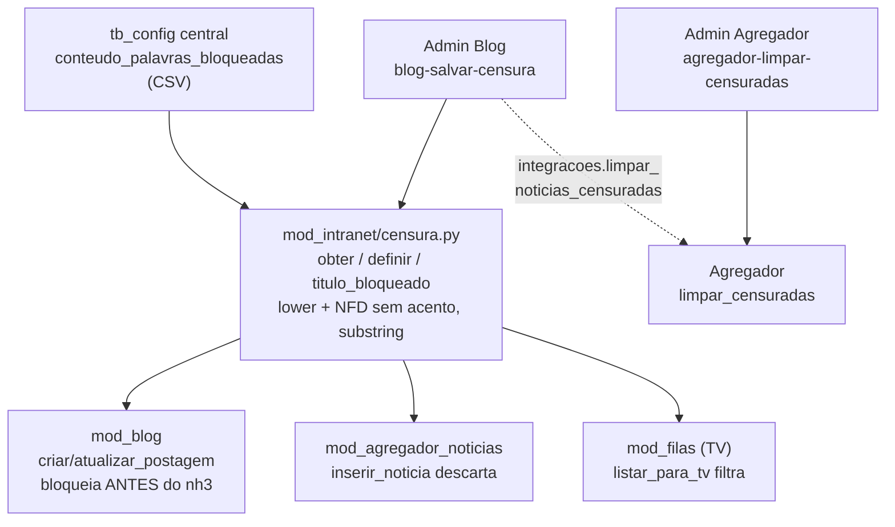

# Agregador de Notícias — `mod_agregador_noticias`

> News aggregator: routes `/agregador-noticias` + `/agregador-noticias-puro` (pure Noticia style) (key `agregador_noticias`) · own database `db_mod_agregador_noticias.db` · table `tb_noticia` (title/source/theme/url/image/fonte_icon/description/dates, `fonte_icon_url` 16×16 faviconV2 + `imagem_url` 30×30, **daily recycle at 06:00 configurable `hora_reinicio` via `reiniciar_banco` DELETE + `CronTrigger`**, **no backup** `MAPA_BACKUPS` without `agregador_noticias`) · scrapy-like `httpx+parsel` mirroring `klaytonPrinceMS/Noticia` (Sites gn_brasil/gn_saude + Noticias get_noticiasGN/BBC/JFP/RSS) · interval 10–360 min + habilitado flag + free term via RSS (`/rss/search` — HTML `/search` gives 429/captcha) + configurable sources (15 default: 3 + 8 RSS V1 + 4 coverage V2, V1/V2 migration) + polite collection (`UA_COLETA`, `CORTEZIA_SEG` 1.5s+jitter, 30min 429 cooldown) · deduplication by URL (`SELECT url`) + normalized title (`_norm_tit` NFKD lower) before `INSERT OR IGNORE` · real post time via `_parse_data_pub` (`email.utils.parsedate_to_datetime` + ISO/RSS fallback) ordered by `COALESCE(data_publicacao, data_coleta) DESC` · **bar tema filter + busca input side-by-side** (`agregador-filtro-tema` + `agregador-busca` `debounce 300` NFKD, `placeholder "Buscar palavra…"`, `clearable`, tooltip, no Coleta badge) · **pagination 12 + busca** (`pagina` state `por_pagina=12` `total_pag` `offset`, `busca` global in-memory 500 NFKD title/desc/fonte/tema (ignores tema filter), `ORDER BY COALESCE(...) DESC` newest→oldest, buttons `Primeira/Anterior/Próxima/Última` with `data-testid=agregador-primeira/anterior/proxima/ultima`) · grid responsivo **3 colunas desktop → 2 tablet (max-width 1024px) → 1 celular (max-width 640px) via `.grid-noticias {display:grid; grid-template-columns: repeat(3,1fr)}` + media queries, cards **`height: 300px` FIXED** (260px mobile — never `min/max-height`, so every card of the row is identical)** · cards **redesigned 25/09/2026 (fixed-height card): thumbnail `120×120` `cover` (was `30×30`) whose click/ENTER/SPACE opens an ENLARGEMENT in the standard `dialogo_card` with the image at 60vw×60vh `object-fit: contain` (closes via ESC/click-outside/"Fechar", dialog memoized per card and mounted only on the 1st click) + the source logo as a `32×32` WATERMARK in the image footer (bottom-right, `opacity .65`, `pointer-events: none`, dark+light `drop-shadow`; falls back to a 16×16 icon next to the badge only when the news has no image) + badge theme + title as `ui.link(new_tab=True)` + FULL description in a fixed-height box with `overflow-y: auto` (no longer truncated as `desc[:180] + "…"`) + relative time `_tempo_relativo` using real `data_publicacao`, no button — title click suffices, no TV card, absolute date replaced, busca NFKD; the thumbnail frame is a SIBLING of the title link and the click uses the native `.stop` modifier, so enlarging never navigates to the original site; the grid `<style>` moved out of `@ui.refreshable` (it was duplicated on every search/pagination)** · **seed `Folha de S.Paulo` URL repaired (`https:/s.folha...` → `https://s.folha...`, one slash only caused `Request URL is missing an 'http://' or 'https://' protocol`) + idempotent migration in `init_db` that rewrites any malformed-scheme URL already persisted in `tb_config` without touching user-customized sources** · **pure screen** `telas_puro.py:mostrar_tela_pura` (`/agregador-noticias-puro`) copying `klaytonPrinceMS/Noticia` `intro-overlay` + `about` `info-list` with current cards (3 cols, `fonte_icon 16×16` + `imagem 30×30`, relative time) + original `assets/noticia/` (`base.css`, `vendor.css`, `main.css`, `font-awesome`, `micons`, `fonts/lora/poppins`, `images/bg/intro`, `js/modernizr/pace/jquery/plugins/main.js`, `favicon.png`) served via `main.py` `@app.get("/assets/noticia/{caminho:path}")` + button `Ver puro Noticia` `data-testid=agregador-ver-puro` · admin: habilitado, intervalo, termo, fontes, temas, **hora_reinicio `06:00` + reinício diário `reiniciar_banco`** · TV filas `listar_para_tv` carousel (7s rotate, 120s reload, `fonte_icon` included) · `assets/noticia/` 4.9M served via static route · `mod_filas/midia/` (`PASTA_MIDIA` `/midia_filas`) · audit only **who changed what** (`definir_*` + `reiniciar_banco`, no audit for localized posts).

---

# Agregador de Notícias — `mod_agregador_noticias`

> Agregador de notícias: rotas `/agregador-noticias` + `/agregador-noticias-puro` (pura estilo Noticia, ver [análise da tela pura](analise_mod_agregador_noticias_puro.md)) (chave `agregador_noticias`) · **atualizado 25/09/2026**: censura compartilhada orquestrada pelo núcleo via `integracoes.limpar_noticias_censuradas()` · banco próprio `db_mod_agregador_noticias.db` · tabela `tb_noticia` (título/fonte/tema/url/imagem/ícone_fonte/descrição/datas, `fonte_icon_url` 16×16 faviconV2 + `imagem_url` 30×30, **banco reciclado diariamente às `06:00` configurável `hora_reinicio` via `reiniciar_banco` `DELETE` + `CronTrigger`, sem backup** `MAPA_BACKUPS` sem `agregador_noticias`) · scrapy-like `httpx+parsel` espelhando `klaytonPrinceMS/Noticia` (Sites gn_brasil/gn_saude + Noticias get_noticiasGN/BBC/JFP/RSS) · intervalo 10–360 min + flag habilitado + termo livre via RSS (`/rss/search` — HTML `/search` dá 429/captcha) + fontes configuráveis (15: 3 + 8 RSS V1 + 4 cobertura V2, migração V1/V2) + coleta educada (`UA_COLETA`, `CORTEZIA_SEG` 1.5s+jitter, cooldown 30 min) · deduplicação por URL (`SELECT url`) + título normalizado (`_norm_tit` NFKD lower) antes de `INSERT OR IGNORE` · tempo real da postagem via `_parse_data_pub` (`email.utils.parsedate_to_datetime` + fallback ISO/RSS) ordenado por `COALESCE(data_publicacao, data_coleta) DESC` · **barra filtro tema + busca lado a lado** (`agregador-filtro-tema` + `agregador-busca` `debounce 300` NFKD, `placeholder "Buscar palavra…"`, `clearable`, tooltip, sem badge `Coleta:`) · **paginação 12 + busca** (`pagina` `por_pagina=12` `total_pag` `offset`, busca **global** em memória 500 NFKD título/descrição/fonte/tema (ignora filtro de tema), ordenação `COALESCE(...) DESC` mais atual→mais antiga, botões `Primeira/Anterior/Próxima/Última` `data-testid=agregador-primeira/anterior/proxima/ultima`) · grid responsivo **3 colunas desktop → 2 tablet (max-width 1024px) → 1 celular (max-width 640px) via `.grid-noticias {display:grid; grid-template-columns: repeat(3,1fr)}` + media queries, cards **`height: 300px` FIXO** (260px no celular — nunca `min/max-height`, para todos os cards da linha ficarem idênticos)** · cards **redesenho 25/09/2026 (card de altura fixa): miniatura `120×120` `cover` (era `30×30`) cujo clique/ENTER/ESPAÇO abre a AMPLIAÇÃO no `dialogo_card` padronizado com a imagem em 60vw×60vh `object-fit: contain` (fecha por ESC/clique fora/botão "Fechar"; diálogo memoizado por card e montado só no 1º clique) + o logo da fonte como MARCA D'ÁGUA de `32×32` no rodapé da imagem (inferior direito, `opacity .65`, `pointer-events: none`, `drop-shadow` claro+escuro; só vira ícone `16×16` ao lado do badge quando a notícia não tem imagem) + badge tema + título como `ui.link(new_tab=True)` + descrição COMPLETA em caixa de altura fixa com `overflow-y: auto` (não é mais truncada como `desc[:180] + "…"`) + tempo relativo `_tempo_relativo` usando `data_publicacao` real, sem botão — título clicável basta, sem card TV, data absoluta substituída, busca NFKD; a moldura da miniatura é IRMÃ do link do título e o clique usa o modificador nativo `.stop`, então ampliar nunca navega para o site original; o `<style>` do grid saiu de dentro do `@ui.refreshable` (era duplicado a cada busca/paginação)** · **URL do seed `Folha de S.Paulo` reparada (`https:/s.folha...` → `https://s.folha...`, uma barra só causava `Request URL is missing an 'http://' or 'https://' protocol`) + migração idempotente no `init_db` que reescreve qualquer URL com esquema malformado já persistida em `tb_config` sem tocar nas fontes customizadas do usuário** · **tela pura** `telas_puro.py:mostrar_tela_pura` (`/agregador-noticias-puro`) copiando padrão `klaytonPrinceMS/Noticia` `intro-overlay` + `about` `info-list` com cards atuais (3 colunas, `fonte_icon 16×16` + `imagem 30×30`, tempo relativo) + originais `assets/noticia/` (`base.css`, `vendor.css`, `main.css`, `font-awesome`, `micons`, `fonts/lora/poppins`, `images/bg/intro`, `js/modernizr/pace/jquery/plugins/main.js`, `favicon.png`) servidos via `main.py` `@app.get("/assets/noticia/{caminho:path}")` + botão `Ver puro Noticia` `data-testid=agregador-ver-puro` · admin: habilitado, intervalo, termo, fontes, temas, **hora `06:00` + reinício `reiniciar_banco`** · TV filas `listar_para_tv` carrossel (7s rotação, 120s recarrega, `fonte_icon` incluso) · `assets/noticia/` 4.9M servido via rota estática · `mod_filas/midia/` (`PASTA_MIDIA` `mod_filas/midia` → `/midia_filas`) · auditoria só **quem alterou o quê** (`definir_*` + `reiniciar_banco`, sem postagens).

## Propósito

Módulo que **agrega notícias multi-fonte** para a rede interna, com **conteúdo de pesquisa configurável pelo admin** (termo livre) e **previsão de não apenas Google News, mas outras fontes** (`BBC`, `JFP`, `RSS`). Coleta **scrapy-like** (`httpx` + `parsel`) espelhando `https://github.com/klaytonPrinceMS/Noticia` — `Sites` (`gn_brasil`, `gn_saude` etc) + `Noticias.get_noticiasGN/BBC/JFP/RSS` — investigando a cada **10 min–6 h** (clamp) quando **habilitado**. Banco **reciclado diariamente às horas da manhã** (padrão `06:00` configurável `obter_hora_reinicio`/`definir_hora_reinicio`, `reiniciar_banco` `DELETE` + `CronTrigger` em `rotinas.py`, **sem backup** `MAPA_BACKUPS` sem `agregador_noticias`; `telas_administracao` sem `painel_backup`, card `Reinício diário — banco reciclado` com `Zerar agora`). **Deduplicação** por URL e por título normalizado (`_norm_tit` NFKD lower, `join`) impede notícia já incluída com mesmo título (case-insensitive, sem acentos) ou mesma URL antes de `INSERT OR IGNORE`. **Timer com tempo real**: `data_publicacao` extraída da postagem (`time[datetime]`, `pubDate`/`dc:date`) via `_parse_data_pub` (`email.utils.parsedate_to_datetime` + fallback ISO/RSS) e ordenação por `COALESCE(data_publicacao, data_coleta) DESC`; `_tempo_relativo` usa `data_pub` real ou `data_coleta` fallback. Visual em **grid responsivo 3→2→1 colunas (desktop 3, tablet 2 max-width 1024px, celular 1 max-width 640px) paginado 12** com card **sem fonte textual e sem botão** — **miniatura `120×120` (`object-fit: cover`, era `30×30`) CLICÁVEL que abre a ampliação em diálogo (60vw×60vh `object-fit: contain`) + logo da fonte como marca d'água `32×32` no rodapé da imagem + badge tema + título como `ui.link(target=href, new_tab=True)` + descrição COMPLETA com scroll + tempo relativo** (`_tempo_relativo` → `agora`/`X minuto(s)/hora(s)/dia(s)/semana(s)/mês(es)/ano(s) atrás`, data absoluta substituída) e **título clicável basta — botão "Abrir notícia" removido 19/09/2026**, **paginação `12` com botões `Primeira/Anterior/Próxima/Última` (`data-testid=agregador-primeira/anterior/proxima/ultima`) mais atual→mais antiga `COALESCE DESC` + grid `.grid-noticias` + cards `.card-noticia` de ALTURA FIXA `height 300px` (`260px` no celular — nunca `min/max-height`, para todos os cards da linha ficarem idênticos)**. **Card "Integração TV — Filas" removido da tela agregador**. Integra a **TV do `mod_filas`** (`/tv`) com **carrossel título+descrição** via `listar_para_tv` (`timer 7s` rotação + `120s` recarrega). **Auditoria só quem alterou o quê** (`definir_habilitado/intervalo/termo/fontes/temas/hora_reinicio/reiniciar_banco` com `_audit`), **sem auditar postagens localizadas** (removido `_audit` de `coletar_todas`, `limpar_antigas`, `limpar_censuradas`).

## Banco próprio

Conexão WAL + `foreign_keys=ON` via `mod_intranet/banco_conexao.conexao("agregador_noticias")` (backend duplo SQLite/PostgreSQL). Criador vigente: `init_db()` em `bd_manipulador.py:209-250`, executado no import (`bd_manipulador.py:705` `init_db()`) e pelo bootstrap central (`mod_intranet/bd_criador.py:67` `init_agregador`).

**`tb_noticia`**:

| Coluna | Observação |
|:---|:---|
| `id` | PK AUTOINCREMENT |
| `titulo` | TEXT NOT NULL (`[:500]` em `inserir_noticia`, dedup via `_norm_tit` NFKD lower) |
| `fonte` | TEXT NOT NULL (`[:100]` — ex.: `Google News - Brasil`, `BBC`, `JFP Notícias`, `RSS`) |
| `tema` | TEXT NOT NULL DEFAULT `Geral` (`[:50]` — ex.: `Brasil`, `Saúde`, `Economia`) |
| `url` | TEXT NOT NULL UNIQUE (`[:2000]`, normalizada `/`→ `https://news.google.com` + `/`) — `SELECT url` + `INSERT OR IGNORE` deduplica |
| `imagem_url` | TEXT DEFAULT `''` (`[:2000]` — `img::attr(src)`/`data-src`/`media:content`/`lh3.googleusercontent` — **`"/api/attachments"` filtrado para `""` em `inserir_noticia` (`bd_manipulador.py:481-493` só relativo/localhost → `""`; absoluto preservado), evita URL quebrada Trello/Notion; fallback `main.py:820` `/api/attachments` → `favicon.png` se `-w280-h168-p-df/.png/.jpg` senão `404` silencioso**, miniatura `120×120` `cover` clicável com ampliação em diálogo) |
| `fonte_icon_url` | TEXT DEFAULT `''` (`[:2000]` — `faviconV2` extraído via `//img[contains(@src,'faviconV2')]/@src` ancestral `div[1..3]`, `try` fail-soft, migração idempotente `ALTER TABLE ADD COLUMN` — **`"/api/attachments"` relativo/localhost também filtrado para `""` (absoluto `news.google.com/api/attachments` preservado)**; na tela principal vira **marca d'água `32×32` no rodapé da miniatura** (opacidade `.65`, `pointer-events: none`) e só aparece como ícone `16×16` `contain` ao lado do badge quando a notícia **não tem** imagem) |
| `descricao` | TEXT DEFAULT `''` (`[:1000]` — `description::text` RSS ou `txt` Google/BBC/JFP) |
| `data_publicacao` | DATETIME (`COALESCE(?, datetime('now'))` — preenchido via `_parse_data_pub` com tempo real da postagem ou `now` fallback, ordenação `COALESCE(data_publicacao, data_coleta) DESC`) |
| `data_coleta` | DATETIME DEFAULT `CURRENT_TIMESTAMP` (`ORDER BY COALESCE(data_publicacao, data_coleta) DESC, data_coleta DESC`) |

Índices `idx_noticia_tema(tema)`, `idx_noticia_fonte(fonte)`, `idx_noticia_data(data_coleta)`.

**Temas padrão** (`TEMAS_PADRAO` — `bd_manipulador.py:24`): `["Brasil","Internacional","Economia","Saúde","Ciência e Tecnologia","Entretenimento","Esporte","Monte Santo de Minas","Geral"]` — 9 temas, semente `temas_json` em `tb_config` central (`json.dumps`).

**Fontes padrão — 15** (`FONTES_PADRAO` — `bd_manipulador.py:35-59`: `_FONTES_PADRAO_LEGADO` 3 + `_FONTES_PADRAO_V1` 8 RSS + 4 cobertura V2 20/09/2026; espelho `Sites` `gn_brasil`/`gn_saude` + RSS oficiais verificados 20/09/2026; migração `init_db` promove LEGADO/V1 → atual quem nunca customizou):

| `tipo` | `nome` | `url` | `tema` |
|:---|:---|:---|:---|
| `google` | Google News - Brasil | `https://news.google.com/topics/CAAqJQgKIh9DQkFTRVFvSUwyMHZNREUxWm5JU0JYQjBMVUpTS0FBUAE?hl=pt-BR&gl=BR&ceid=BR%3Apt-419` | `Brasil` |
| `bbc` | BBC - Brasil | `https://www.bbc.com/portuguese/topics/cz74k717pw5t` | `Brasil` |
| `google` | Google News - Saúde | `https://news.google.com/topics/CAAqJQgKIh9DQkFTRVFvSUwyMHZNR3QwTlRFU0JYQjBMVUpTS0FBUAE?hl=pt-BR&gl=BR&ceid=BR%3Apt-419` | `Saúde` |
| `rss` | Agência Brasil | `https://agenciabrasil.ebc.com.br/rss/ultimasnoticias.xml` | `Brasil` |
| `rss` | Senado Federal | `https://www12.senado.leg.br/noticias/rss` | `Brasil` |
| `rss` | G1 - Últimas | `https://g1.globo.com/rss/g1/` | `Geral` |
| `rss` | G1 - Economia | `https://g1.globo.com/rss/g1/economia/` | `Economia` |
| `rss` | G1 - Saúde | `https://g1.globo.com/rss/g1/saude/` | `Saúde` |
| `rss` | G1 - Tecnologia | `https://g1.globo.com/rss/g1/tecnologia/` | `Ciência e Tecnologia` |
| `rss` | Poder9360 | `https://www.poder9360.com.br/` | `Brasil` |
| `rss` | Folha de S.Paulo | `https://s.folha.uol.com.br/emcimadahora/rss091.xml` (**URL corrigida 25/09/2026** — o seed tinha `https:/s.folha...`, com uma barra só) | `Brasil` |
| `rss` | G1 - Mundo | `https://g1.globo.com/rss/g1/mundo/` | `Internacional` |
| `rss` | G1 - Pop e Arte | `https://g1.globo.com/rss/g1/pop-arte/` | `Entretenimento` |
| `rss` | GE - Esporte | `https://ge.globo.com/rss/ge/` | `Esporte` |
| `rss` | JFP - Monte Santo de Minas | `https://jfpnoticias.com.br` (**sem `/feed/`** — o caminho do feed não existe no site; o coletor cai no `except` e a fonte não traz notícia) | `Monte Santo de Minas` |

Seeds `tb_config` central incluem `agregador_noticias_hora_reinicio` `06:00` (`HH:MM` validado `re.match`).

⚠️ `bd_criador.py` legado/morto.

## Fluxo da tela

- Gate `_pode_ver` (`telas.py:37-44`): `administrador_geral` ou `validar_acesso_modulo(user,"agregador_noticias")`; sem acesso → `block` 64px + "Acesso restrito".
- `mostrar_tela(user_nome, perfil_global)` (`telas.py:46-437`, 392 linhas): `ler_tema("agregador_noticias", cor_botao="#000000", texto_header="Notícias agregadas de múltiplas fontes — 3 colunas, clique abre no site original. Para TV do Filas, carrossel título+descrição.")` + `ui.colors(primary)` + `cabecalho(... chave_modulo="agregador_noticias")` + `estado={"tema":"","busca":"","pagina":1}` + `temas=temas_config()` + helper **`_tempo_relativo(data_str)` (`telas.py:65-107`)** — converte ISO flexível (`YYYY-MM-DD HH:MM:SS`/`YYYY-MM-DD HH:MM`/`YYYY-MM-DD`, normaliza `T`/`Z`/fração `.\d+`, `re.split`, `strptime` por formato, `now - dt` → `total_seconds` → `agora` (<60 s) / `X minuto(s) atrás` (<3600) / `X hora(s) atrás` (<86400) / `X dia(s) atrás` (<604800) / `X semana(s) atrás` (<2592000) / `X mês(es) atrás` (<31536000) / `X ano(s) atrás`, `delta<0→0`, fallback `[:16]`), **usa `data_publicacao` real da postagem (extraída via `_parse_data_pub` de `time[datetime]`/`pubDate`) com fallback `data_coleta`, ordenação `COALESCE(data_publicacao, data_coleta) DESC` garante "3 minutos atrás, 25 minutos atrás, 2 semanas..." com tempo real**.
  - **Barra** (`telas.py:119-148`): `newspaper` icon + `sel_tema` (`data-testid=agregador-filtro-tema`, `Todos os temas` + `temas`, `min-w-[200px]`) **+ `inp_busca` (`data-testid=agregador-busca`, `Buscar palavra…` `debounce 300` `min-w-[220px] flex-1`, `placeholder "Buscar palavra…"` `outlined dense clearable debounce='300'`, `tooltip "Pesquisar em todos os temas por palavra no título/descrição/fonte" (busca global — ignora filtro de tema)`, `on_value_change→estado["busca"]=val, pagina=1, grid.refresh()`) lado a lado (`flex-wrap` `gap-3` `bg-white rounded-lg shadow-sm px-3 py-2`)** — **badge `Coleta: ativa/desabilitada` removido a169c9a** + `botao Atualizar` (`data-testid=agregador-atualizar`, `texto`, `grid.refresh()`) + `botao Coletar agora` (`data-testid=agregador-coletar`, `primario`, só `administrador_geral`/`eh_admin_do_modulo` → **`async _coletar` com `run.io_bound(lambda: ag.coletar_todas(ator=user_nome, forcar=True))`, spinner `aria-label=Coletando notícias`, trava `ocupado`, `notificar` + `grid.refresh()` — anti-disconnect**) (**botão Ver puro Noticia `agregador-ver-puro` removido de `telas.py` 20/09/2026 — `/agregador-noticias-puro` por URL direta**).
  - **Redesenho do card 25/09/2026 — altura fixa, miniatura `120×120` ampliável, marca d'água da fonte e resumo com scroll.** O card deixou de usar `min-height`/`max-height` (que produziam alturas diferentes entre linhas) e passou a ter **`height` FIXA**; a miniatura deixou de ser um elemento de `30×30` ao lado do título e virou um **elemento clicável de `120×120`**; a descrição deixou de ser truncada (`desc[:180] + "…"`) e passou a ser **o texto completo numa caixa de altura fixa com scroll**; e o logo da fonte deixou de ser um ícone decorativo ao lado do título e virou **marca d'água sobre a própria imagem**. Os helpers novos são:
    - **`_desempacotar_noticia(n)`** (`telas.py:109-129`) — substitui o `if/elif` de compat por posição dentro de `_noticia_card`. Normaliza a linha do `bd_manipulador` numa tupla de **sempre 10 campos** (`id, titulo, fonte, tema, url, imagem_url, fonte_icon_url, descricao, data_publicacao, data_coleta`): `>=10` → `tuple(campos[:10])`; `==9` (registro antigo sem `fonte_icon_url`) → insere `""` na posição 6; menor/maior → completa com `""`. Linha ilegível vira registro vazio, com `log.warning` (**fail-soft**, nunca levanta).
    - **`_criar_dialogo_noticia(img, titulo, fonte)`** (`telas.py:131-162`) — **cria (sem abrir)** o diálogo de ampliação e devolve o `ui.dialog` (ou `None`). Usa o `dialogo_card` padronizado do projeto (`mod_intranet/ui_comum.py:294` — cartão com o estilo do módulo, **fecha por ESC e por clique fora**), com `titulo` truncado em 90 chars, `largura="w-full max-w-[94vw] mx-4"` e `max_altura=False` (a imagem define a altura). Dentro: `ui.image(img).classes("dlg-noticia__img").props("fit=contain")` → **60vw × 60vh** (`88vw × 58vh` no celular), `alt`/`aria-label` descritivos passados pelo **dicionário de props** (o texto pode conter aspas, e o dicionário dispensa escape), rótulo da fonte com `aria-label` e botão "Fechar" (`icone="close"`, `primario`, `compacto`) sempre visível. Falha ao montar → `log.exception` + `notificar(... type="negative")` + devolve `None` (**nunca derruba o cliente**, AGENTS.md §3.2).
    - **`_abrir_dialogo_noticia(cache, img, titulo, fonte)`** (`telas.py:164-180`) — **abre** a ampliação **memoizando o diálogo no `cache` do card**: o `ui.image` grande só é baixado/montado no **PRIMEIRO clique** (evita puxar 12 imagens grandes por página) e o mesmo `dlg` é reaberto nos cliques seguintes, sem acumular diálogos no DOM. Falha → `log.exception` + `notificar`.
    - **`_midia_noticia(img, fonte_icon, titulo, fonte, testeid="")`** (`telas.py:182-226`) — monta a **moldura clicável** da miniatura: `ui.element("div").classes("card-noticia__midia").style("cursor: zoom-in")` com `role="button"`, `tabindex="0"`, `aria-label="Ampliar imagem da notícia: <título>"` e `data-testid` estável (`agregador-ampliar-<id>`, ou `agregador-ampliar` quando o id não é alfanumérico). Dentro: `ui.image(img).classes("card-noticia__foto").props("fit=cover")` (**120×120**, `object-fit: cover`; se a miniatura for inválida, cai num `🖼` com `log.warning`) e o **logo da fonte como marca d'água** `ui.image(fonte_icon).classes("card-noticia__marca")` — **32×32, canto inferior direito (`right:4px; bottom:4px`), `opacity: .65`, `pointer-events: none` (não rouba o clique), `z-index: 2` e `drop-shadow` claro+escuro** para destacar sobre qualquer foto (auditoria de direitos). Eventos: `on("click.stop", _ampliar)`, `on("keydown.enter", _ampliar)`, `on("keydown.space", _ampliar)` + `tooltip("Ampliar imagem")`. Os modificadores **`.stop`/`.enter`/`.space` são os nativos do NiceGUI** (`Vue.withModifiers`/`withKeys` — **nada de JavaScript escrito à mão**).
    - **`_noticia_card(n)`** (`telas.py:228-292`) — monta o card com `ui.card().classes("w-full hover:shadow-lg transition-shadow card-noticia")` (sem `cursor-pointer` no card inteiro, sem `break-inside:avoid` de masonry). Duas `card_section`: **topo** (`card-noticia__topo`, `flex 0 0 auto`) com o **badge do tema** (`badge(tema_n or "Geral", "blue-grey-2") outline dense`) + o **ícone `16×16` da fonte SÓ quando a notícia não tem imagem** (`fonte_icon and not img` — com imagem o logo vira marca d'água) e o **tempo relativo** `ui.label(_tempo_relativo(data_pub or data_col)).classes("text-caption text-grey-5")`; **corpo** (`card-noticia__corpo`, `flex 1 1 auto`, `row`) com a **miniatura `120×120` ampliável** (via `_midia_noticia`, só quando há `imagem_url`) ao lado da coluna de texto (`card-noticia__texto`) com o **título** `ui.link(texto, target=href, new_tab=True).classes("card-noticia__titulo hover:text-primary")` (`try` → `ui.label` fallback) e o **resumo**: `ui.label(str(desc)).classes("card-noticia__resumo")` com o **texto completo** quando há descrição distinta do título, senão `"Sem resumo disponível."` em `text-grey-5`. `texto` nunca fica vazio (`"Notícia sem título"`); título vazio cai no `try`/`label`. `href = url or "#"`. Todo o corpo está em `try/except` → `log.exception` + `notificar("Não foi possível montar o card desta notícia.", type="negative")`.
    - **Dois detalhes que impedem o clique na imagem de disparar a navegação**: (a) a moldura da miniatura é **IRMÃ** do link do título, nunca ancestral dele; (b) o `click` usa o modificador **`.stop`**, que interrompe a propagação. Antes o clique na miniatura era absorvido pelo `<a>` do título.
    - **Sem botão "Abrir notícia"** (removido 19/09/2026) — o **título** é o link externo (`new_tab=True`) e o **clique na imagem** é a ampliação; são dois alvos, não um só.
    - ⚠️ **Divergência conhecida (25/09/2026)**: os cinco helpers acima
      (`_desempacotar_noticia`, `_criar_dialogo_noticia`, `_abrir_dialogo_noticia`,
      `_midia_noticia`, `_noticia_card`) foram escritos com docstring **só em PT-BR**,
      contrariando o padrão do repositório (**EN no topo, PT-BR abaixo**). O **docstring
      de módulo** de `telas.py` está correto e bilíngue (`EN:` no topo, `PT-BR:` abaixo).
      A correção é em `mod_*/`, fora do escopo deste lote de documentação.
      `_tempo_relativo` (pré-existente, `telas.py:65-107`) está na mesma condição.
      O padrão correto pode ser visto nas duas formas aceitas no repositório:
      **rótulos explícitos** — `bloco_nomes_fila` (`mod_filas/telas.py:267-269`) — e
      **frase EN → linha em branco → parágrafo PT-BR** — `_resetar_cota`
      (`mod_solicita_impressao/telas.py:2583-2585`).
  - **`grid()`** (`@ui.refreshable`, `telas.py:357-436`): `estado {"tema":"","busca":"","pagina":1}` → `tema_f=estado["tema"] or None`, `busca=(estado["busca"] or "").strip()` → se `busca`: `todas=ag.listar_noticias(tema=None, limite=500) (busca global — ignora filtro de tema, termo livre cai em "Geral")` → `filtradas=[n for n in todas if busca_n in titulo[1]/descricao[7]/fonte[2]/tema[3]]` via `_norm` `NFKD lower` `ascii ignore` (`_camp` helper, `busca_n=_norm(busca)`) → `total=len(filtradas)` senão `total=contar_noticias(tema_f)` → `por_pagina=12` → `total_pag = max(1, (total+12-1)//12)` → clamp `pagina` `1..total_pag` → `offset=(pagina-1)*12` → **se busca: `noticias=filtradas[offset:offset+12]` senão `ag.listar_noticias(tema_f, limite=12, offset=offset)` `ORDER BY COALESCE(data_publicacao, data_coleta) DESC`** → ``.grid-noticias` `display:grid` responsivo 3→2→1 com `gap:1rem` + `.card-noticia` `height 300px`; vazio → `article 48px` + `"Nenhuma notícia ainda. Ative a coleta nas Configurações."` + tema se filtrado. **Paginação rodapé** `row w-full items-center justify-between mt-3 flex-wrap gap-2` com `ui.button icon=first_page` `data-testid=agregador-primeira` → `pagina=1` + `chevron_left` `agregador-anterior` → `max(1,pagina-1)` + `label Página X de Y • N notícias` + `chevron_right` `agregador-proxima` → `min(total_pag,pagina+1)` + `last_page` `agregador-ultima` → `total_pag` + `label Exibindo len de total` + `ui.label Exibindo len de total`. **Sem busca:** `contar_noticias` direto; **com busca:** em memória 500 NFKD. **Card "Integração TV — Filas" removido (antes `telas.py:184-187` `card bg-blue-50` — grid agora termina com paginação + busca).** `on_tema` + `on_busca` (`inp_busca.on_value_change`) ambos resetam `pagina=1` e `grid.refresh()` (**sem badge `Coleta:`**).
  - **CSS do grid injetado FORA do `@ui.refreshable`** (`telas.py:320-354`, `ui.add_head_html`): o bloco `<style>` ficava dentro de `grid()` e era **duplicado a cada busca e a cada paginação**, acumulando cópias da folha de estilo no `<head>`. Agora é emitido **uma única vez por página**, logo acima da definição de `grid()`.
  - **Sem card TV nesta tela** — integração TV permanece via `mod_filas/tv` + `listar_para_tv`.
  - **Tela pura Noticia** (`telas_puro.py:mostrar_tela_pura`, `telas_puro.py:48-145`): gate `validar_acesso_modulo(user, "agregador_noticias")` + `ui.add_head_html` `base.css`/`vendor.css`/`main.css`/`font-awesome`/`micons` + `favicon.png` + `modernizr.js`/`pace.min.js` via `main.py:818` `@app.get("/assets/noticia/{caminho:path}")` (`normpath` + `startswith(base)` anti-traversal + `mimetypes.guess_type` → `FileResponse`, `404` se fora) + `ler_tema("agregador_noticias")` + `section intro-overlay` (`background:#111417`) + `intro-content` `PRINCE. K,B.` + `DTI - Notícias` + `Pref. Municipal — Agregador puro` + `Início` (`/agregador-noticias`) / `Fim` (`window.scrollTo`) + `section about` `Principais notícias` + `row about-content` `col-six tab-full` `ul.info-list` com **12 notícias `listar_noticias(limite=12)` `COALESCE DESC`** `li.border-b py-3` (`fonte_icon 16×16` + `badge tema` + `tempo _tempo_relativo` + `fonte ml-auto` + `imagem 30×30` + `ui.link titulo new_tab` + `descricao[:160]` + `href[:60] font-mono` + `<a>Abrir no site original →</a>`) + `footer bg-grey-900` `© Copyright DTI` + `js/jquery-2.1.3/plugins/main`; helper `_tempo_relativo(s)` `T/Z/fração` `strptime` → `agora`/minutos/horas/dias/semanas, acesso por URL direta `/agregador-noticias-puro` (botão `agregador-ver-puro` removido 20/09/2026).
- Responsividade: `w-full p-6 gap-4`, `flex-wrap`, `.grid-noticias {display:grid; grid-template-columns: repeat(3,1fr); gap:1rem}` desktop 3 → tablet 2 `max-width 1024px` → celular 1 `max-width 640px` + **`.card-noticia {height: 300px}` (celular `260px`) — altura FIXA, nunca `min/max-height`**, `.dlg-noticia__img {width: 60vw; height: 60vh}` (celular `88vw × 58vh`) + `min-width: 0` em `.card-noticia__texto` / `.card-noticia__titulo`. O prefixo `.card-noticia` nos seletores das seções vence o `.column` do Quasar (mesma especificidade) sem depender da ordem de injeção dos `<style>`.
- **Admin** (`telas_administracao.py:15-241`): `bloco_aparencia` + `card "Coleta"` (switch `data-testid=agregador-habilitado` + select `agregador-intervalo` 10/30/60/120/180/360 + input `agregador-termo` + **input `agregador-hora-reinicio` `06:00` + `rodape data-testid=agregador-salvar-coleta` + `Coletar agora` + `Limpar antigas`**) + `card "Fontes"` (`data-testid agregador-fonte-tipo/nome/tema/url`, `estado_fontes` + `render_fontes` + `Adicionar fonte` `data-testid=agregador-add-fonte` + `rodape data-testid=agregador-salvar-fontes`) + `card "Temas"` (`data-testid=agregador-temas`, `rodape data-testid=agregador-salvar-temas`) + **`card "Censura"` + `card "Reinício diário — banco reciclado"` (substitui `painel_backup`, `data-testid=agregador-reiniciar-agora` `Zerar agora`)**.

## Regras de negócio relevantes

- **Habilitado** (`habilitado()`/`definir_habilitado(bool,ator)` — `bd_manipulador.py:77-85`): `get_config("agregador_noticias_habilitado","0")=="1"`; `set_config` + `audit configurar habilitado`; `init_db` semente `0` (desabilitado).
- **Intervalo** (`intervalo_min()`/`definir_intervalo(min,ator)` — `bd_manipulador.py:88-101`): `int(get_config("agregador_noticias_intervalo_min","60"))` com `try` fallback `60` + `clamp max(10,min(360,v))`; `definir_intervalo` `clamp 10–360` + `audit` + `return ok,v` (`v` clampado).
- **Termo** (`termo_pesquisa()`/`definir_termo(termo,ator)` — `bd_manipulador.py:104-112`): `get_config("agregador_noticias_termo_pesquisa","").strip()`; `definir_termo` `strip` + `audit`.
- **Fontes** (`fontes_config()`/`definir_fontes(list,ator)` — `bd_manipulador.py:115-138`): `json.loads(get_config("agregador_noticias_fontes_json",""))` → `list` se `isinstance(list) and dados` senão `FONTES_PADRAO`; `definir_fontes` `json.dumps(ensure_ascii=False)` + `set_config` + `audit configurar fontes_json N fontes`.
- **Temas** (`temas_config()`/`definir_temas(list, ator)` (dedupe `vistos`/`unicos` 20/09/2026) — `bd_manipulador.py:140-157`): `json.loads(temas_json)` → dedupe preservando ordem (`vistos`/`unicos`, `strip`) senão `TEMAS_PADRAO`; `definir_temas` dedupe (`vistos`/`unicos` `strip`) + `audit`.
- **Hora reinício** (`obter_hora_reinicio()`/`definir_hora_reinicio(hora_str,ator)` — `bd_manipulador.py:160-186`): `get_config("agregador_noticias_hora_reinicio","06:00")` validado `re.match HH:MM` `00–23:00–59` → `f"{h:02d}:{mi:02d}"` ou `06:00` fallback; `definir` valida `HH:MM`, normaliza, `audit configurar hora_reinicio`, `return False+msg` se inválido.
- **Reiniciar banco** (`reiniciar_banco(ator)` — `bd_manipulador.py:189-204`): `SELECT COUNT(*)` + `DELETE FROM tb_noticia` + `commit` + `log info` + **`audit reiniciar_banco N notícias + hora`**; job diário `agregador_reinicio` `CronTrigger` às `hora_reinicio`.
- **Tempo real da postagem** (`_parse_data_pub(raw)` — `bd_manipulador.py:267-311`): tenta `email.utils.parsedate_to_datetime` (robusto RFC822 `Tue, 19 Sep 2026 12:34:56 GMT`) → `astimezone().replace(tzinfo=None)` → `YYYY-MM-DD HH:MM:SS`; fallback ISO/RSS (`%Y-%m-%dT%H:%M:%S%z`, `%Y-%m-%dT%H:%M:%S.%f%z`, `%Y-%m-%dT%H:%M:%S`, `%Y-%m-%d %H:%M:%S`, `%a, %d %b %Y %H:%M:%S %z/%Z`, `%d/%m/%Y %H:%M`, normaliza `Z`→`+00:00`, `+00:00`→`+0000`, regex `YYYY-MM-DD[ T]HH:MM:SS`) → `None` se falhar; usado em `_coletar_google/bbc/jfp/rss` para extrair `time[datetime]`/`pubDate`/`dc:date` real e passar para `inserir_noticia`.
- **Relativo** (`_parse_relativo_para_absoluto(texto)` — `bd_manipulador.py:523-551`): `"Ontem"`, `"3 horas atrás"` → `now - delta` → `YYYY-MM-DD HH:MM:SS` usado em `_coletar_google` fallback.
- **Inserir** (`inserir_noticia` — `bd_manipulador.py:399-443`): `titulo[:500]`, `url[:2000]`, `url "/"→"https://news.google.com"+url` (relativa Google), `fonte[:100]`, `tema[:50] or Geral`, `imagem[:2000]`, `desc[:1000]`, **deduplicação: `SELECT 1 WHERE url=?` (UNIQUE) + loop `SELECT titulo` com `_norm_tit` (`unicodedata.normalize NFKD → ascii ignore → lower → " ".join(split)`) — evita notícia já incluída com mesmo título case-insensitive sem acentos ou mesma URL antes de `INSERT OR IGNORE` + `COALESCE(data_pub, datetime('now'))`**, censura `titulo_bloqueado` descarta → `return rowcount>0`.
- **Listar** (`listar_noticias(tema,limite,offset)` — `bd_manipulador.py:314-325`): `SELECT ... WHERE tema=? ORDER BY COALESCE(data_publicacao, data_coleta) DESC, data_coleta DESC LIMIT ? OFFSET ?` / `ORDER BY COALESCE(...) DESC LIMIT/OFFSET` sem tema; **paginação 12** `por_pagina=12` `total_pag` `offset` com botões `Primeira/Anterior/Próxima/Última` `data-testid=agregador-*` no `grid()`; `contar_noticias(tema?)` (`bd_manipulador.py:254-264`); `listar_para_tv(limite=10)` (`bd_manipulador.py:330-352` `SELECT titulo,descricao,url,imagem_url,fonte,tema ORDER BY COALESCE(data_publicacao, data_coleta) DESC, data_coleta DESC LIMIT ?*3` filtrando censuradas via `titulo_bloqueado` → `[{"titulo","descricao":desc or titulo,"url","imagem","fonte","tema"}]`).
- **Limpar** (`limpar_antigas(horas=24)` — `bd_manipulador.py:384-397`): `DELETE WHERE data_coleta < datetime('now','-N hours')` (portável: `banco_conexao` traduz `datetime('now','-24 hours')` → `LOCALTIMESTAMP`/`CURRENT_TIMESTAMP` no Postgres proxy) + `rowcount n` + `log info` **sem `audit`** (postagens não auditadas); chamada ao fim de `coletar_todas`.
- **Limpar censuradas** (`limpar_censuradas()` — `bd_manipulador.py:354-381`): `SELECT id,titulo` → `titulo_bloqueado` → `DELETE WHERE id=?` + `log info` **sem audit**; chamada ao salvar censura.
- **Reiniciar** (`reiniciar_banco(ator)` — `bd_manipulador.py:189-204`): `DELETE FROM tb_noticia` (zera todas) + **`audit reiniciar_banco`** (quem alterou); usado pelo `CronTrigger` diário `06:00` + botão `Zerar agora`.
- **Coleta** (`coletar_todas(ator, forcar=False)` — `bd_manipulador.py:910-946`): `if not forcar and not habilitado(): 0` + `fontes_config()` + `termo_pesquisa()` → `total=0` + loop `for f in fontes: tipo=(tipo or google).lower(), url, tema or Geral, nome or url[:30]; tipo google→_coletar_google, bbc→_coletar_bbc, jfp→_coletar_jfp, rss→_coletar_rss, else→_coletar_google` (fail-soft `warning`) + `termo → _coletar_pesquisa_google(termo,Geral)` (via **RSS** `/rss/search`, HTML `/search` dá 429/captcha) + `limpar_antigas(24)` (`try` **sem audit**) + `log info` **sem `_audit coletar`** (auditoria só quem alterou config).
- **`_get_html(url,timeout=12)`** (`bd_manipulador.py:447-455`): `httpx.get(url, timeout, follow_redirects=True, headers={"User-Agent": `UA_COLETA` (`Mozilla/5.0 Chrome/126` comum, `bd_manipulador.py:531`)})` → `r.text` se `200` senão `""` (`warning` em exceção; `429` em HTML `news.google.com` não-RSS arma cooldown 30 min `COOLDOWN_429_SEG` e `_coletar_google` pula). **Coleta educada 20/09/2026**: `_aguardar_cortezia()` (`CORTEZIA_SEG=1.5s` + jitter 0–1s, nunca rajada) antes de cada requisição, `_url_ja_coletada(url)` evita `og:image` de repetida, sem retry agressivo (Google 429/captcha por IP — RSS oficial é a via).
- **Parsers** (`parsel.Selector`): Google `".gPFEn, .JtKRv, .a7P8L, article"` + `a::text`/`href` (`.`/`/`→ `https://news.google.com`) + `img::attr(src/data-src)` + **normalização `_normalizar_imagem_url` (`//`→`https:`, `/`→`base news.google.com`, `srcset`→1ª URL, 20/09/2026)** + `time[datetime]`→`_parse_data_pub` (20, cooldown 429 pula coleta); BBC `".bbc-uk8dsi, .bbc-19j92fr, article, a[href*='/portuguese/articles']"` (`/`→ `https://www.bbc.com`) + `time[datetime]` (15); JFP `".td-module-title"` + `time[datetime]`/`.td-post-date` (15); RSS `type="xml"` `item` → `title` + `link` + `description ::text` todos os nós (CDATA/HTML) + fallback `content:encoded` + limpeza HTML (`unescape`+strip tags) + supressão de resumo redundante (NFKD `desc==titulo`/prefixo→`""`) + `pubDate`/`dc:date`/`published`→`_parse_data_pub` + `media:content` + `media:thumbnail` (BBC) + `enclosure` + fonte real `<source>` + favicon `s2` + pré-checagem `_url_ja_coletada` + `_og_image` fail-soft 6s (20/09/2026) (15); pesquisa Google via RSS `https://news.google.com/rss/search?q={quote(termo)}&hl=pt-BR&gl=BR&ceid=BR:pt-419` → `_coletar_rss` (HTML `/search` dá 429/captcha).
- **LGPD**: notícias públicas sem vínculo por usuário; sem `remover_vinculos` ainda (futuro se necessário).
- **Censura**: `inserir_noticia` descarta bloqueadas, `listar_para_tv` filtra `LIMIT*3` com `titulo_bloqueado`, `limpar_censuradas` remove já coletadas (`bd_manipulador.py:306-396`).

## Censura de conteúdo — palavras bloqueadas (central `mod_intranet/censura.py`)

Funcionalidade compartilhada Blog ↔ Agregador (chave única `conteudo_palavras_bloqueadas` em `tb_config` central):

- **Núcleo** (`censura.py:1-95`): `CHAVE_CONFIG="conteudo_palavras_bloqueadas"` · `obter_palavras_bloqueadas()` (split `,;\n` + JSON fallback, `lower`) · `definir_palavras_bloqueadas(lista, ator)` (normaliza `lower` dedup, grava CSV via `set_config`, `audit_log` `censura/palavras_bloqueadas`) · `titulo_bloqueado(titulo, palavras=None)` / `filtrar_titulo` → `(bloqueado, palavra)` com `_normalizar` `lower+NFD` sem acentos (`suicidio` bloqueia `suicídio`, substring insensível) — docstring bilíngue EN/PT-BR.
- **Agregador** (`bd_manipulador.py:399-443` `inserir_noticia` descarta censurada; `328-352` `listar_para_tv` filtra `LIMIT*3` → `titulo_bloqueado`; `354-381` `limpar_censuradas()` remove já coletadas censuradas).
- **Blog** (`bd_manipulador.py:646-703`): `criar/atualizar` bloqueiam título censurado.
- **Admin Agregador** (`telas_administracao.py:187-241`): card `Censura de conteúdo — palavras bloqueadas` (`block`, `data-testid=agregador-palavras-bloqueadas`, `textarea` CSV/;/linha, `Salvar censura` `data-testid=agregador-salvar-censura` + `Restaurar`, ao salvar `definir_palavras_bloqueadas` + `limpar_censuradas`) + botão `Remover já censuradas agora` (`data-testid=agregador-limpar-censuradas`).
- **Admin Blog** (`mod_blog/telas_administracao.py:72-106`): mesmo card (`data-testid=blog-palavras-bloqueadas`); ao salvar dispara a purga via **`integracoes.limpar_noticias_censuradas()`** (25/09/2026) — o Blog **não** importa `mod_agregador_noticias` direto (AGENTS.md §2). Ver *Atualização 25/09/2026 — censura compartilhada orquestrada pelo núcleo* abaixo.
- **Normalização**: `lower` + `NFD` remove `Mn` → `suicidio` bloqueia `suicídio`; substring (não exige palavra inteira).
- **RNF**: persistência `banco_conexao` WAL por módulo, auditoria `censura/palavras_bloqueadas`, segurança `lower+NFD` substring, performance `limpar_censuradas` sem travar TV (TV filtra em `LIMIT*3`), usabilidade textarea CSV/;/linha.

## Integrações com o núcleo

Importa `autenticacao.validar_acesso_modulo`/`perfil_global_de`/`eh_admin_do_modulo`, `banco_conexao.conexao`/`get_config`/`set_config`, `tema_modulo.ler_tema`/`notificar`/`bloco_aparencia`, `ui_comum.botao`/`card_admin`/`rodape_salvar_restaurar`, `observabilidade.get_logger`. Grava via `audit_log` → `tb_auditoria_agregador_noticias` (**só quem alterou o quê**: `definir_habilitado/intervalo/termo/fontes/temas/hora_reinicio/reiniciar_banco` auditam `configurar`/`reiniciar_banco`; `coletar_todas`/`limpar_antigas`/`limpar_censuradas` **sem audit**). Agendadores `rotinas._job_agregador_coleta` (`interval minutes` + `CronTrigger` hora) + `_job_agregador_reinicio` (`CronTrigger hora_reinicio` `06:00` default → `reiniciar_banco` `DELETE`) + `reconfigurar_agregador_noticias()` (`pause/resume`+`reschedule minutes`+`reschedule CronTrigger`). **Sem backup**: `MAPA_BACKUPS` sem `agregador_noticias`, `painel_backup` removido, card `Reinício diário — banco reciclado` com `Zerar agora` `data-testid=agregador-reiniciar-agora`. `PREFIXO_POR_CHAVE`/`PADROES_TEMA`/`MODULOS_SISTEMA`/`MODULOS_BD` com `agregador_noticias`. `bd_criador.py` init_agregador no `mod_intranet/bd_criador.py`. TV `mod_filas` consome `listar_para_tv`.

## Atualização 25/09/2026 — censura compartilhada orquestrada pelo núcleo

> A lista de **palavras bloqueadas** é a **mesma** para o Blog, o Agregador e a
> TV de Filas (uma chave só). Em 25/09/2026, o `telas_administracao.py` do
> **Blog** deixou de importar `mod_agregador_noticias` para fazer a purga e
> passou a chamá-la pela fachada `mod_intranet.integracoes`
> (AGENTS.md §2). Commit `624c9d5`.

### Quem orquestra a purga — e por que o Blog

O **Blog** é o módulo que tem a tela de **administração da lista de censura** com
o card "Censura de conteúdo — palavras bloqueadas" (`mod_blog/telas_administracao.py:72-106`,
`data-testid=blog-palavras-bloqueadas`). Ao salvar a lista, ele dispara a purga
das notícias **já coletadas** cujo título passou a estar bloqueado:

```python
# ANTES — Blog importava o Agregador diretamente (violava AGENTS.md §2)
from mod_agregador_noticias.bd_manipulador import limpar_censuradas
n = limpar_censuradas()

# DEPOIS — quem costura é o núcleo
from mod_intranet import integracoes
n = integracoes.limpar_noticias_censuradas()
if n:
    notificar(f"{n} notícias censuradas removidas do agregador", type="info")
```

!!! note "O Agregador também tem o seu próprio botão de purga"
    `mod_agregador_noticias/telas_administracao.py:226` e `:246` chamam
    `limpar_censuradas()` **de dentro do próprio módulo** (intracomponente, o que
    é permitido). São **dois pontos de entrada** para a mesma rotina — o botão
    "Remover já censuradas agora" (`data-testid=agregador-limpar-censuradas`) no
    Agregador e o disparo automático ao salvar a censura no Blog.

### `mod_intranet/censura.py` — o núcleo compartilhado

Chave **única** em `tb_config` **central**: `conteudo_palavras_bloqueadas`.

| Função | Comportamento |
|:---|:---|
| `obter_palavras_bloqueadas()` | Lê a chave, faz `split` por `,` / `;` / `\n`, com **fallback para JSON**, e normaliza em `lower` |
| `definir_palavras_bloqueadas(lista, ator)` | Normaliza (`lower`), **deduplica**, grava o CSV via `set_config` e audita (`audit_log` → `censura/palavras_bloqueadas`) |
| `titulo_bloqueado(titulo, palavras=None)` | Devolve `(bloqueado, palavra)` — tupla, para o chamador **saber qual** palavra bloqueou |
| `filtrar_titulo(...)` | Variante de filtragem direta |

**Normalização (o ponto que importa)** — `_normalizar` aplica **`lower` + NFD
removendo os diacríticos (`Mn`)**:

| Entrada gravada | Título testado | Bloqueia? |
|:---|:---|:---:|
| `suicidio` | `suicídio` | ✔ (o acento é ignorado) |
| `SAÚDE` | `saúde pública` | ✔ (case-insensitive) |
| `violencia` | `violência no trânsito` | ✔ (**substring** — não exige palavra inteira) |

!!! warning "A comparação é por **substring**, não por palavra inteira"
    Bloquear `vaca` também bloquearia `vacinação`. A lista de censura precisa ser
    montada com termos **longos e específicos** para não produzir falsos
    positivos.

### Os três consumidores

| Consumidor | Ponto de aplicação | Comportamento |
|:---|:---|:---|
| **Blog** | `bd_manipulador.py:criar_postagem` / `atualizar_postagem` | `titulo_bloqueado(titulo)` **antes** do `nh3`. Se bloqueado → retorno `None`/`False` + `warning` no log + `notificar("Título contém palavra bloqueada: ...")` — **não sanitiza e não grava** |
| **Agregador** | `bd_manipulador.py:inserir_noticia` | Descarta a notícia na **coleta** — o banco nunca chega a receber o título censurado |
| **Agregador → TV** | `bd_manipulador.py:listar_para_tv` | Filtra **na origem da TV**: busca `LIMIT × 3` e descarta as censuradas, devolvendo até `limite` itens válidos (assim a TV nunca fica sem notícia por causa de censura) |
| **Agregador (pago)** | `bd_manipulador.py:limpar_censuradas` | Remove as **já coletadas** que ficaram censuradas depois da alteração da lista; retorna `n` |

### Diagrama da censura compartilhada



### Complemento — coleta multi-fonte, grid, tela pura e limpeza 24 h

#### Coleta multi-fonte (`httpx` + `parsel`)

O coletor é **scrapy-like** e espelha o repositório `klaytonPrinceMS/Noticia`
(`Sites` + `Noticias.get_noticiasGN/BBC/JFP/RSS`). Quatro despachantes, escolhidos
pelo campo `tipo` de cada fonte:

| `tipo` | Despachante | Alvo |
|:---|:---|:---|
| `google` | `_coletar_google` | Google News por tema (`gn_brasil`, `gn_saude`, …) |
| `bbc` | `_coletar_bbc` | BBC Português |
| `jfp` | `_coletar_jfp` | JFP Notícias (Monte Santo de Minas) |
| `rss` | `_coletar_rss` | RSS oficial (12 das 15 fontes padrão) |
| *(outro)* | `_coletar_google` | Fallback |

**15 fontes padrão** (`FONTES_PADRAO`): 3 legadas (Google Brasil, Google Saúde,
BBC) + 8 RSS V1 (Agência Brasil, Senado, G1 Últimas/Economia/Saúde/Tecnologia,
Poder360, Folha) + 4 de cobertura V2 (G1 Mundo→`Internacional`, G1 Pop e
Arte→`Entretenimento`, GE Esporte, JFP→`Monte Santo de Minas`). O `init_db`
promove LEGADO/V1 → atual **apenas** para quem nunca customizou.

**Coleta educada (anti-ban)** — o Google bloqueia por IP e por padrão
robotizado (429/captcha comprovado com `httpx` **e** Chromium real):

| Mecanismo | Valor |
|:---|:---|
| `UA_COLETA` | `Mozilla/5.0 … Chrome/126` (User-Agent comum) |
| `_aguardar_cortezia()` | `CORTEZIA_SEG = 1.5` s + jitter de 0–1 s **antes de cada** requisição — nunca rajada |
| Cooldown de 429 | `COOLDOWN_429_SEG = 1800` (30 min); `_GOOGLE_HTML_BLOQUEADO_ATE` faz `_coletar_google` pular |
| Sem retry agressivo | RSS oficial é a via viável; `Scrapy`/`Playwright`/`Selenium` não burlam o bloqueio |
| Termo livre | `_coletar_pesquisa_google` usa `news.google.com/**rss/search**` (o HTML `/search` dá 429/captcha) |
| Pré-checagem | `_url_ja_coletada(url)` evita re-buscar `og:image` de URL já coletada |
| Timeout | 12 s no HTML, 6 s no `og:image` (fail-soft) |

**Deduplicação em duas camadas** (`inserir_noticia`): `SELECT 1 WHERE url=?`
(`url` é `UNIQUE`) **e** um laço `SELECT titulo` com `_norm_tit`
(`NFKD` → ascii → `lower` → `join`) — evita duplicata com **mesmo título**,
case-insensitive e sem acento, antes do `INSERT` (que vira
`ON CONFLICT DO NOTHING` no Postgres pelo proxy de `banco_conexao`).

#### Grid responsivo 3 → 2 → 1, card de altura fixa e paginação 12

| Elemento | Implementação |
|:---|:---|
| **Colunas** | `.grid-noticias { display:grid; grid-template-columns: repeat(3,1fr); gap:1rem }` + media queries `max-width:1024px → 2`, `max-width:640px → 1` |
| **Altura do card** | `.card-noticia { height: 300px }` (celular `260px`) — **altura FIXA, nunca `min/max-height`**: é isso que garante que todos os cards de uma linha fiquem idênticos. Antes, `min-height:160px; max-height:220px` deixava a altura depender do conteúdo, e a página ficava irregular. O valor é uma escolha de layout, não um número derivado da média de notícias |
| **Miniatura** | `120×120` (`flex: 0 0 120px`, `align-self: flex-start`, `border-radius: 8px`, `box-shadow: inset 0 0 0 1px rgba(0,0,0,.10)`) com `object-fit: cover` (era `30×30`); moldura com `cursor: zoom-in`, `role="button"`, `tabindex="0"`, `aria-label`, `data-testid=agregador-ampliar-<id>` e `tooltip("Ampliar imagem")` |
| **Ampliação** | `dialogo_card` (`ui_comum.py:294`, fecha por ESC/clique fora) com `ui.image` em **60vw × 60vh** (`88vw × 58vh` no celular), `object-fit: contain` (**não distorce nem corta**), `alt` descritivo e botão "Fechar". Diálogo **memoizado por card** e montado **só no 1º clique** |
| **Marca d'água** | Logo da fonte (`fonte_icon_url`) em `32×32` no rodapé direito da miniatura (`right:4px; bottom:4px`), `opacity: .65`, `pointer-events: none`, `z-index: 2` e `drop-shadow` claro+escuro. Sem imagem, o mesmo logo vira ícone `16×16` `contain` ao lado do badge do tema |
| **Resumo** | Texto **completo** (nunca `desc[:180] + "…"`): `flex: 1 1 auto; min-height: 0; overflow-y: auto; overflow-x: hidden` + `scrollbar-width: thin` e `::-webkit-scrollbar` de 5px. Sem descrição (ou igual ao título) → `"Sem resumo disponível."` em `text-grey-5` |
| **Título** | `ui.link(texto, target=href, new_tab=True)` em `card-noticia__titulo` — `font-weight:700`, `line-height:1.25`, `word-break: break-word` e `-webkit-line-clamp: 3` (no máximo 3 linhas; o **resumo** é que rola) |
| **Paginação** | `por_pagina = 12`; `total_pag = max(1, (total+11)//12)`; `offset = (pagina-1)*12`; botões `Primeira` / `Anterior` / `Próxima` / `Última` (`data-testid=agregador-primeira` / `-anterior` / `-proxima` / `-ultima`) + rótulo `Página X de Y • N notícias` |
| **Ordenação** | `ORDER BY COALESCE(data_publicacao, data_coleta) DESC, data_coleta DESC` — **mais atual → mais antiga**, com o tempo real da postagem (`_parse_data_pub`, RFC822/ISO) e não o horário da coleta |
| **Busca** | **Global** (ignora o filtro de tema): `listar_noticias(tema=None, limite=500)` filtrado em memória com `NFKD` sobre título/descrição/fonte/tema; `debounce 300`; digitar **reseta** para a página 1 |
| **Injeção do CSS** | `ui.add_head_html` **fora** do `@ui.refreshable` (`telas.py:320-354`): dentro, o `<style>` era reemitido a cada busca/paginação |

!!! warning "Acessibilidade do clique na miniatura"
    O clique na imagem **não** pode Herdar a navegação do link do título. A solução
    adotada tem **duas** camadas: a moldura da miniatura é **irmã** do link do título
    (nunca é filho nem ancestral dele), e o `click.stop` usa o **modificador nativo** do NiceGUI
    (`Vue.withModifiers`, sem JavaScript à mão). O `role="button"` + `tabindex="0"` +
    `keydown.enter`/`keydown.space` + `aria-label` + `focus-visible` com outline fazem o
    alvo operável por teclado; `pointer-events: none` na marca d'água garante que ela não
    roube o clique.

#### Tela pura (`telas_puro.py`)

Rota `/agregador-noticias-puro` — 145 linhas, **sem paginação** (12 fixas), sem
filtro/busca, com o layout do modelo `Noticia` (`intro-overlay` + `about` +
`info-list`) e o CSS/JS original servido por `main.py:818`
`@app.get("/assets/noticia/{caminho:path}")` (anti path-traversal com `normpath` +
`startswith(base)`). Acesso **por URL direta** — o botão `agregador-ver-puro` foi
removido de `/agregador-noticias` em 20/09/2026. Análise completa em
[Tela Pura de Notícias — análise](analise_mod_agregador_noticias_puro.md).

#### `listar_para_tv` — o carrossel da TV de Filas

```python
# mod_agregador_noticias/bd_manipulador.py
SELECT titulo, descricao, url, imagem_url, fonte, tema
  FROM tb_noticia
 ORDER BY COALESCE(data_publicacao, data_coleta) DESC, data_coleta DESC
 LIMIT ? * 3          # pede 3x e filtra a censura no Python
```

| Garantia | Detalhe |
|:---|:---|
| **Censura já aplicada** | Busca `LIMIT × 3` e descarta censuradas com `titulo_bloqueado` — a TV **nunca** exibe título bloqueado e **nunca** fica sem notícia por causa da censura |
| **`descricao or titulo`** | A TV nunca mostra um card vazio |
| **Desabilitado** | `integracoes.agregador_habilitado()` falso → a TV cai num *placeholder* de pausa, não em erro |
| **Consumo na TV** | `mod_filas/telas.py`: `carregar_noticias(limite=200)` + `_mostrar_noticia` com `ui.timer 15.0` (rotação) e `ui.timer 120.0` (recarga) no rodapé escuro |

#### Limpeza 24 h e reciclagem diária

| Mecanismo | Gatilho | O que faz |
|:---|:---|:---|
| `limpar_antigas(horas=24)` | Fim de **cada** `coletar_todas` | `DELETE WHERE data_coleta < datetime('now','-24 hours')` — portável: o proxy de `banco_conexao` traduz para `LOCALTIMESTAMP`/`CURRENT_TIMESTAMP` no Postgres. Log `info` + **`sem audit`** (postagens não são auditadas) |
| `rotinas._job_agregador_coleta` | `interval minutes` (10–360, clamp) | `coletar_todas()` quando habilitado; `pause`/`resume` + `reschedule` por `reconfigurar_agregador_noticias()` sem reiniciar o sistema |
| `rotinas._job_agregador_reinicio` | **`CronTrigger` diário** na `hora_reinicio` (padrão `06:00`, `HH:MM` validado) | `reiniciar_banco(ator)` → `DELETE FROM tb_noticia` + `audit reiniciar_banco N notícias + hora` |
| **Sem backup** | — | `MAPA_BACKUPS` **não** tem `agregador_noticias` e o admin **não** tem `painel_backup`: o banco é **reciclado**, não preservado. No admin, o card "Reinício diário — banco reciclado" com `Zerar agora` (`agregador-reiniciar-agora`) substitui o card de backup |

!!! note "Por que reciclar em vez de fazer backup"
    Notícias são **efêmeras** por natureza: a tela mostra as 12 mais recentes e o
    carrossel da TV renova a cada 15 s. Guardar cópias não agrega valor e só
    consome espaço — recriar a base às 06:00 garante o mesmo resultado com
    I/O zero.

## Pontos de atenção

- **RESOLVIDO (era PENDÊNCIA de 22/09/2026) — `models/__init__.py` não é mais stub**: o arquivo agora compila e traz o `dataclass Noticia` **completo** (10 campos: `id, titulo, fonte, tema, url, imagem_url, fonte_icon_url, descricao, data_publicacao, data_coleta`) com docstring bilíngue. Ele continua sendo **espelho de leitura, sem acesso a banco** (docstring do módulo: "NÃO é importado em runtime e NÃO abre conexão" — evita cross-query entre bancos, AGENTS.md §2). **Resta** a propagação do padrão imperativo do AGENTS.md §3.1: os outros `models/` (`mod_filas`, `mod_lista_telefonica`, `mod_tecnico`) já usam `Table` + `dataclass` + `map_imperatively()`, e o do agregador ainda **não** — só a dataclass, sem `map_imperatively()`. Como ele não é importado em runtime, isso não é bug; é dívida de padrão.
- Habilitado default `0` — sem coleta até admin habilitar; `reconfigurar_agregador_noticias()` (`rotinas.py:256`) `pause` quando desabilitado, `resume+reschedule` quando habilitado + `CronTrigger` hora (sem restart).
- Intervalo `clamp 10–360` — `intervalo_min()` e `definir_intervalo` garantem faixa; admin select limita a 6 opções, API aceita qualquer `10–360`.
- **Hora `06:00` configurável + reinício diário `CronTrigger` + sem backup**: `obter_hora_reinicio()`/`definir_hora_reinicio(HH:MM)` validam `00–23:00–59`, normalizam `06:00`, auditam, `reconfigurar_agregador_noticias()` reaplica `CronTrigger(hour=H, minute=M)` sem restart; `reiniciar_banco(ator)` `DELETE` + `audit` + `Zerar agora` `data-testid=agregador-reiniciar-agora`; `MAPA_BACKUPS` sem `agregador_noticias`, `telas_administracao` sem `painel_backup` — banco reciclado.
- **Auditoria só quem alterou o quê**: `definir_*` + `reiniciar_banco` auditam; `coletar_todas`/`limpar_*` **sem audit** (postagens não auditadas).
- **Paginação 12 + grid responsivo 3→2→1 + card de ALTURA FIXA — mais atual → mais antiga**: `estado pagina=1` `por_pagina=12` `total_pag=max(1,(total+12-1)//12)` `offset=(pagina-1)*12` `listar_noticias(tema_f, limite=12, offset=offset)` `ORDER BY COALESCE(data_publicacao, data_coleta) DESC`; botões `agregador-primeira/anterior/proxima/ultima` + label `Página X de Y • N notícias` + `Exibindo len de total`; `.grid-noticias {display:grid; grid-template-columns: repeat(3,1fr)}` + `@media 1024px→2 640px→1` + **`.card-noticia {height: 300px}` (celular `260px`) — altura FIXA, nunca `min/max-height`**, miniatura `120×120` ampliável antes do título, sem fonte textual/botão/card-TV.
- **Deduplicação por URL + título normalizado** (`inserir_noticia` + `_norm_tit` NFKD lower): `SELECT 1 WHERE url=?` (UNIQUE) + `SELECT titulo` loop com `_norm_tit` (`NFKD → ascii ignore → lower → join`) — evita duplicata com mesmo título case-insensitive sem acentos ou mesma URL; `INSERT OR IGNORE` vira `ON CONFLICT DO NOTHING` no Postgres via `_CursorPostgres`.
- **Timer com tempo real** (`_parse_data_pub` + `COALESCE(data_publicacao, data_coleta) DESC` + `_tempo_relativo`): `_parse_data_pub` reescrito via `email.utils.parsedate_to_datetime` + fallback ISO/RSS → `YYYY-MM-DD HH:MM:SS` usado em todos os coletores (`time[datetime]`, `pubDate`) para `data_publicacao` real; `listar_noticias`/`listar_para_tv` ordenam por `COALESCE(data_publicacao, data_coleta) DESC`; `telas.py _tempo_relativo` usa `data_pub` real ou `data_col` fallback (`agora`/<60s, minutos/<60m, horas/<24h, dias/<7d, semanas/<30d, meses/<365d, anos, `delta<0→0`, `T`/`Z`/fração, fallback `[:16]`).
- `datetime('now','-N hours')` portável — `banco_conexao` traduz para `LOCALTIMESTAMP` no Postgres (`_CursorPostgres._preparar` + `_ddl_postgres`).
- `httpx`+`parsel` (`requirements.txt`); sem internet coleta `0` (fail-soft); `User-Agent` comum `UA_COLETA` Chrome/126; timeout `12s` HTML / `6s` `og:image`; `try/except` com `warning` em cada coletor; `CORTEZIA_SEG=1.5s`+jitter, cooldown 30 min após 429, `_url_ja_coletada` pré-checagem (20/09/2026).
- `url` relativa Google normalizada em `inserir_noticia` + `_coletar_google` (`./`/`/`→`https://news.google.com`).
- `listar_para_tv` `descricao or titulo` — TV nunca mostra vazio; `habilitado()==False` → placeholder desabilitado; vazio → placeholder aguarde.
- **Card sem fonte textual e sem botão, com tempo relativo + miniatura `120×120` ampliável + marca d'água da fonte + resumo com scroll, grid responsivo 3→2→1 + paginação 12 + card de ALTURA FIXA, sem card TV** (`telas.py:65-107` `_tempo_relativo` + `telas.py:109-226` `_desempacotar_noticia`/`_criar_dialogo_noticia`/`_abrir_dialogo_noticia`/`_midia_noticia` + `telas.py:228-292` `_noticia_card` + `357-436` `grid()`): `tb_noticia.fonte` continua gravada (útil para `listar_para_tv` e auditoria) mas **não é renderizada como texto no card** — vira **marca d'água `32×32`** sobre a miniatura; `data_pub` real via `_parse_data_pub` ou `data_col` fallback com `[:16]` absoluto substituído por relativo `agora`/minutos/horas/dias/semanas/meses/anos (parse flexível `T`/`Z`/fração, `delta<0→agora`); **miniatura `120×120` (`120px object-cover` `fit=cover`) clicável que abre a ampliação em `dialogo_card` (60vw×60vh `contain`, ESC/botão "Fechar") + `badge tema` + `titulo` `ui.link(target=href, new_tab=True)` + `descricao` COMPLETA com `overflow-y: auto`** (antes `descricao[:180]…`); **botão "Abrir notícia" removido 19/09/2026 + card TV `bg-blue-50` removido, substituído por paginação 12 com 4 botões**, mantém **grid responsivo `.grid-noticias` 3→2→1 + `.card-noticia {height: 300px}` + paginação `Página X de Y`**.

- **Coleta educada anti-ban + termo via RSS (20/09/2026)**: `UA_COLETA` `Mozilla/5.0 Chrome/126` comum + `_aguardar_cortezia()` (`CORTEZIA_SEG=1.5s` + jitter 0–1s, nunca rajada) antes de cada `_get_html`/`_og_image` + sem retry agressivo + `429` em HTML `news.google.com` (não-RSS) arma `_GOOGLE_HTML_BLOQUEADO_ATE` = now + `COOLDOWN_429_SEG=1800` (30 min) e `_coletar_google` pula com `warning`; `_url_ja_coletada(url)` (`SELECT 1 WHERE url`) evita `og:image` de repetida. Motivo: Google bloqueia por IP + padrão robotizado (429/captcha no `/search` comprovado com httpx E Chromium real; Scrapy/Playwright/Selenium não burlam — via viável é RSS oficial + tráfego "regular"). Termo livre via `_coletar_pesquisa_google` → `https://news.google.com/rss/search?q=...` → `_coletar_rss` (nunca HTML `/search`).
- **Enriquecimento RSS (20/09/2026)**: `description ::text` todos os nós (CDATA/HTML) + fallback `content:encoded` + limpeza HTML do Google RSS (`unescape` + strip tags) + supressão de resumo redundante (NFKD `desc==titulo`/prefixo → `""`, card oculta `desc` vazia) + `media:content` + `media:thumbnail` (BBC) + `enclosure` (jpg/png/webp) + fonte real `<source>` + favicon `s2` (`google.com/s2/favicons?domain=<dom>&sz=32`, domínio de `source@url` ou do link) + `_og_image` (`og:image`/`twitter:image`, timeout 6s, fail-soft) quando sem imagem. Imagem relativa normalizada via `_normalizar_imagem_url` (`//`→`https:`, `/api/attachments` relativo→absoluto `news.google.com`, `srcset`→1ª URL); `inserir_noticia` só zera `/api/attachments` relativo/localhost — absoluto `news.google.com/api/attachments` é thumbnail real e é preservado.
- **15 fontes + migração V1/V2 + busca global + temas dedupe + sem botão puro (20/09/2026)**: `FONTES_PADRAO` 15 (`_FONTES_PADRAO_LEGADO` 3 + `_FONTES_PADRAO_V1` 8 RSS: Agência Brasil, Senado, G1 Últimas/Economia/Saúde/Tecnologia, Poder360, Folha + 4 V2: G1 Mundo→`Internacional`, G1 Pop→`Entretenimento`, GE→`Esporte`, JFP→`Monte Santo de Minas`); `init_db` promove LEGADO/V1 → atual quem nunca customizou (`json == LEGADO ou == V1`); busca global ignora filtro de tema (`listar_noticias(tema=None, limite=500)` — termo livre cai em `Geral`); `temas_config`/`definir_temas` dedupem preservando ordem (`vistos`/`unicos`); botão `Ver puro Noticia` (`agregador-ver-puro`) removido de `telas.py` — `/agregador-noticias-puro` por URL direta (mesmo gate).
- **URL com esquema malformado no seed (25/09/2026) — `Folha de S.Paulo`**: o seed tinha `https:/s.folha.uol.com.br/...` (**uma barra só**), e a coleta morria com `Request URL is missing an 'http://' or 'https://' protocol`. O `try/except Exception` do coletor engolia o erro, então o sintoma era apenas *"aquela fonte nunca traz notícia"* — sem rastro. Duas correções: (a) o seed foi corrigido; (b) o `init_db` ganhou uma **migração idempotente** que lê `agregador_noticias_fontes_json`, aplica `re.sub(r"^(https?:)/(?!/)", r"\1//", url, count=1)` em cada fonte e regrava a config **só se algo mudou** (com `log.warning` por fonte reparada). O regex é ancorado e tem lookahead `(?!/)`, então **URLs válidas não são tocadas** e **fontes customizadas do usuário nunca são sobrescritas** — a migração só repara o que está de fato quebrado.

## Status

| Item | Situação |
|:---|:---|
| Banco WAL `tb_noticia` + `fonte_icon_url` `16×16` + `TEMAS/FONTES_PADRAO` + seeds `tb_config` + deduplicação `_norm_tit` NFKD + `COALESCE(data_publicacao, data_coleta)` + **`hora_reinicio 06:00` + `reiniciar_banco` + sem backup** | Implementado (`init_db()` CREATE TABLE fonte_icon_url + ALTER TABLE ADD COLUMN migração + `inserir_noticia` SELECT url + SELECT titulo _norm_tit + _parse_data_pub + fonte_icon/imagem extração faviconV2/api-attachments + obter_hora_reinicio/definir_hora_reinicio/reiniciar_banco + MAPA_BACKUPS sem agregador_noticias) |
| Coleta scrapy-like `httpx+parsel` Google/BBC/JFP/RSS + pesquisa termo + tempo real `_parse_data_pub` (`time[datetime]`/`pubDate`→`data_publicacao`) | Implementado (`_coletar_google/bbc/jfp/rss/pesquisa` + `coletar_todas` + `_parse_data_pub` RFC822/ISO) |
| Habilitado flag + intervalo 10–360 clamp + termo livre + fontes/temas `json` + **hora `06:00` + reinício diário** | Implementado (`habilitado/definir_habilitado`, `intervalo_min/definir_intervalo`, `termo/definir_termo`, `fontes/temas_config`, `obter_hora_reinicio`/`definir_hora_reinicio` + audit, `reiniciar_banco` + audit) |
| **Sem backup — banco reciclado** `MAPA_BACKUPS` sem `agregador_noticias` + card `Reinício diário` + `Zerar agora` | Implementado (`rotinas.py:19-30` MAPA sem agregador, `telas_administracao.py:235-241` card `restart_alt` com `reiniciar_banco`) |
| **Paginação 12 + busca + grid responsivo 3→2→1 + card de ALTURA FIXA** `pagina` `por_pagina=12` `total_pag` `offset` `COALESCE DESC` + **busca lado a lado `agregador-busca` `debounce 300` NFKD 500 + remoção badge `Coleta:` + marca d'água da fonte `32×32` + miniatura `120×120` ampliável + grid `.grid-noticias` 3→2→1 (`1024px`/`640px`) + `.card-noticia {height: 300px}` (celular `260px`)** + botões `Primeira/Anterior/Próxima/Última` `data-testid=agregador-primeira/anterior/proxima/ultima` + mais atual→mais antiga | Implementado (`telas.py:357-436` estado tema/busca/pagina + `por_pagina=12` + total com busca filtradas 500 NFKD vs `contar_noticias` + 4 botões + `inp_busca` `agregador-busca` `debounce 300` lado a lado `sel_tema` + `grid-noticias` `display:grid 3→2→1` + `card-noticia` `height 300px` + `fonte_icon` como marca d'água `32×32` + `imagem` `120×120` ampliável antes do título) |
| **Redesenho do card (25/09/2026)** card de **altura fixa** (300px/260px, nunca `min/max-height`) + **miniatura `120×120`** (era `30×30`) com **ampliação em diálogo** (`dialogo_card`, 60vw×60vh `contain`, ESC/"Fechar", diálogo memoizado por card e montado só no 1º clique, `data-testid=agregador-ampliar-<id>`, `.stop`/`.enter`/`.space` nativos) + **logo da fonte como marca d'água** `32×32` no rodapé direito da imagem (`opacity .65`, `pointer-events: none`, `drop-shadow`; ícone `16×16` ao lado do badge só quando não há imagem) + **descrição completa com scroll** (`overflow-y: auto` em caixa de altura fixa; antes `desc[:180] + "…"`) + `<style>` do grid **fora** do `@ui.refreshable` | Implementado (`telas.py:109-129` `_desempacotar_noticia` + `131-162` `_criar_dialogo_noticia` + `164-180` `_abrir_dialogo_noticia` + `182-226` `_midia_noticia` + `228-292` `_noticia_card` + `320-354` `add_head_html` CSS) |
| **Seed `Folha de S.Paulo` com URL reparada + migração idempotente (25/09/2026)** `https:/s.folha.uol.com.br/...` → `https://s.folha.uol.com.br/...` (uma barra só fazia a coleta falhar com `Request URL is missing an 'http://' or 'https://' protocol`); `init_db` reescreve **apenas** URL com esquema malformado já persistida em `tb_config`, sem tocar em fontes customizadas, e só chama `set_config` se algo mudou | Implementado (`bd_manipulador.py:48` seed corrigido + bloco de migração no fim de `init_db()` com `re.sub(r"^(https?:)/(?!/)", r"\1//", ...)` + `log.warning` por fonte reparada) |
| Grid responsivo `display:grid` 3→2→1 (`grid-noticias` 1024px/640px) + card de altura fixa com **miniatura `120×120` ampliável + marca d'água `32×32` da fonte + resumo com scroll** + badge tema + título `ui.link(new_tab=True)` + tempo relativo `_tempo_relativo` (`agora`/`X atrás`, `data_publicacao` real + `COALESCE` fallback, **busca NFKD**) **sem botão — título clicável basta + sem card TV + paginação 12 + busca + `.card-noticia {height: 300px}`** (**sem fonte textual**, data `[:16]` substituída, `gap:1rem` + `hover:shadow-lg`, **sem badge `Coleta:`**) | Implementado (`telas.py _tempo_relativo` real + `_noticia_card` `card-noticia` + `_midia_noticia` miniatura 120×120/marca d'água + `_criar_dialogo_noticia`/`_abrir_dialogo_noticia` ampliação + `ui.link` + grid `grid-noticias` 3→2→1 paginado 12 + altura fixa 300px + busca `agregador-busca` debounce 300 lado a lado `sel_tema`, botão removido 19/09/2026, card TV removido 19/09/2026, paginação 12 20/09/2026, grid responsivo 20/09/2026, **redesenho do card 25/09/2026**) |
| Filtro tema + **busca `agregador-busca` `debounce 300` NFKD lado a lado + sem badge `Coleta:`** + `Coletar agora` async | Implementado (`sel_tema` + `inp_busca` `agregador-busca` `debounce 300` NFKD lado a lado, `on_busca` pagina=1 + `grid.refresh` com `pagina=1` + `async _coletar` `run.io_bound` + `spinner` `ocupado` + `forcar=True`, badge `Coleta:` removido a169c9a) |
| Admin: switch habilitado + select intervalo + input termo + **input hora `06:00`** + card fontes + card temas + **censura + reinício diário** (5 cards, sem `painel_backup`) | Implementado (`telas_administracao.py` 241 linhas, `data-testid` QA incluindo `agregador-hora-reinicio` + `agregador-reiniciar-agora`) |
| `listar_para_tv` + TV `mod_filas` carrossel 15s/120s até 200 (ordena `COALESCE` + filtra censuradas) | Implementado (`listar_para_tv(limite=200)` + `titulo_bloqueado` + `mod_filas/telas.py mostrar_tv` `carregar_noticias` + `_mostrar_noticia` `15.0` + `120.0`, fallback elegante nunca vazio) |
| `MODULOS_SISTEMA`/`MODULOS_BD`/`PADROES_TEMA`/`PREFIXO_POR_CHAVE` **+ `MAPA_BACKUPS` sem agregador** | Implementado (`autenticacao.py:25`, `repositorio.py:68`, `tema_modulo.py:82`, `rotinas.py:19-30` sem `agregador_noticias`) |
| Agendadores `agregador_coleta` (`interval minutes`) + **`agregador_reinicio` (`CronTrigger 06:00` + `reiniciar_banco` `DELETE`)** + `reconfigurar_agregador_noticias()` (`pause/resume`+`reschedule`+`CronTrigger`) | Implementado (`rotinas.py:228-285` + `483` `CronTrigger` + `reconfigurar` com `CronTrigger` hora) |
| `main.py` `/agregador-noticias` + `/admin/agregador_noticias` + `bd_criador init_agregador` | Implementado (`main.py:766-777`, `896-906`, `bd_criador.py:67`) |
| Auditoria só **quem alterou o quê** (`configurar` `habilitado`/`intervalo_min`/`termo_pesquisa`/`fontes_json`/`temas_json`/`hora_reinicio`/`reiniciar_banco`) **sem postagens** | Implementado (`bd_manipulador.py:77-204` `definir_*` + `reiniciar_banco` com `_audit`; `coletar_todas`/`limpar_*` sem `_audit`) |
| **15 fontes + migração V1/V2 (20/09/2026)** `_FONTES_PADRAO_LEGADO` 3 + `_FONTES_PADRAO_V1` 8 RSS (Agência Brasil, Senado, G1 ×4, Poder360, Folha) + 4 cobertura (G1 Mundo→`Internacional`, G1 Pop→`Entretenimento`, GE→`Esporte`, JFP→`Monte Santo de Minas`); `init_db` promove LEGADO/V1 → atual quem nunca customizou | Implementado (`bd_manipulador.py:35-59` + migração `init_db` `json == LEGADO ou == V1` → `set_config` atual) |
| **Termo livre via RSS + coleta educada anti-ban (20/09/2026)** `_coletar_pesquisa_google` → `/rss/search` → `_coletar_rss` (HTML `/search` dá 429/captcha); `UA_COLETA` Chrome/126 + `CORTEZIA_SEG=1.5s`+jitter + cooldown 30 min após 429 (`_GOOGLE_HTML_BLOQUEADO_ATE`) + `_url_ja_coletada` pré-checagem | Implementado (`bd_manipulador.py:524-576` cortezia + `_get_html` UA/cooldown + `897-907` pesquisa RSS) |
| **Enriquecimento RSS + `inserir_noticia` preserva thumbnail absoluto (20/09/2026)** `description ::text`+`content:encoded`+limpeza HTML+supressão redundante+`media:thumbnail`+fonte `<source>`+favicon `s2`+`_og_image` fail-soft; `_normalizar_imagem_url` (`//`, `/`, `srcset`); `/api/attachments` relativo/localhost→`""`, absoluto `news.google.com` preservado | Implementado (`bd_manipulador.py:580-594` normaliza + `785-894` RSS/`_og_image` + `481-493` filtro relativo) |
| **Busca global + dedupe temas + botão puro removido (20/09/2026)** busca ignora filtro de tema (`tema=None`, termo livre cai em `Geral`); `temas_config`/`definir_temas` dedupe `vistos`/`unicos`; `agregador-ver-puro` removido de `telas.py` (`/agregador-noticias-puro` por URL direta) | Implementado (`telas.py:157` tooltip global + `195` `tema=None` + `bd_manipulador.py:168-199` dedupe; botão removido) |
