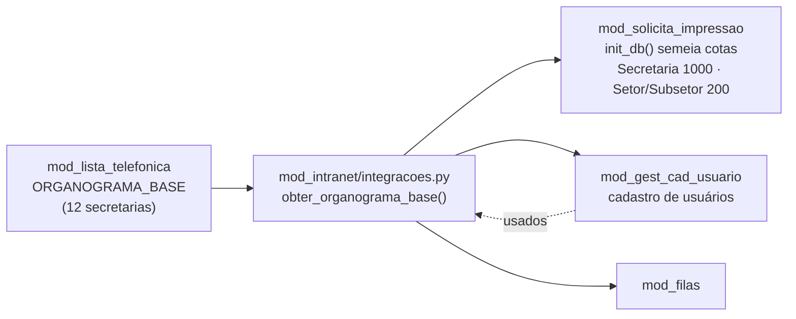

# Lista Telefônica — `mod_lista_telefonica`

> Phone directory / expandable organogram: route `/lista-telefonica` (key `lista_telefonica`) · own database `db_mod_lista_telefonica.db` · hierarchy Secretaria→Setor→Subsetor (generic 12 secretarias) · contacts alphabetically ordered · search by name/phone · tel: clickable on mobile · admin: branch delete, move, elevate/relegate, reorder/swap, transfer, appearance.

---

# Lista Telefônica — `mod_lista_telefonica`

> Lista telefônica / organograma expansível: rota `/lista-telefonica` (chave `lista_telefonica`) · banco próprio `db_mod_lista_telefonica.db` · **atualizado 25/09/2026**: usuários passaram a vir pela fachada `mod_intranet.integracoes` (AGENTS.md §2) · hierarquia Secretaria→Setor→Subsetor (12 secretarias genéricas) · contatos em ordem alfabética · busca por nome/telefone · telefone clicável `tel:` no celular · admin: excluir ramo, mover, elevar/rebaixar, ordenar/comutar, transferir, aparência.

## Propósito

Módulo de **organograma expansível** com lista telefônica interna. O organograma base (`ORGANOGRAMA_BASE` — `bd_manipulador.py:21-75`) traz **12 secretarias genéricas** desacopladas de vínculo territorial, cada uma com setores e subsetores, servindo como semente editável. O usuário navega por Secretaria → Setor → Subsetor via selects em cascata e visualiza contatos da unidade selecionada sempre em **ordem alfabética**. A busca global localiza unidades e contatos por nome/telefone com normalização sem acentos. No celular, o telefone é **clicável** (`tel:`) com diálogo "Ligar agora".

O administrador gerencia todo o organograma (criar, mover entre ramos, elevar `setor→secretaria` e rebaixar inverso, ordenar/comutar irmãs, excluir ramo em cascata) e os contatos (incluir vinculado à base de usuários ou externo, editar, transferir entre unidades, excluir), além do cupê de aparência.

## Banco próprio

Conexão WAL + `foreign_keys=ON` via `mod_intranet/banco_conexao.conexao("lista_telefonica")`. Criador vigente: `init_db()` em `bd_manipulador.py:106-157`, executado no import (`bd_manipulador.py:603` `init_db()`) e pelo bootstrap central (`mod_intranet/bd_criador.py:64` `init_lista`).

**`tb_unidade`**:

| Coluna | Observação |
|:---|:---|
| `id` | PK AUTOINCREMENT |
| `nome` | TEXT NOT NULL |
| `tipo` | `CHECK(tipo IN ('secretaria','setor','subsetor'))` |
| `parent_id` | `REFERENCES tb_unidade(id) ON DELETE CASCADE` — NULL para secretaria (raiz) |
| `ordem` | `INTEGER DEFAULT 0` — posição entre irmãs |
| `telefone` | `TEXT DEFAULT ''` |
| `ativo` | `INTEGER DEFAULT 1` |

Índice `idx_unidade_parent(parent_id)`.

**`tb_contato`**:

| Coluna | Observação |
|:---|:---|
| `id` | PK AUTOINCREMENT |
| `unidade_id` | `REFERENCES tb_unidade(id) ON DELETE CASCADE` |
| `nome` | TEXT NOT NULL |
| `telefone` | TEXT NOT NULL DEFAULT '' |
| `user_nome` | TEXT — login vinculado da base `gest_cad_usuario` (opcional) |
| `tipo` | `CHECK(tipo IN ('vinculado','externo'))` DEFAULT `externo` — `vinculado` quando `user_nome` preenchido |
| `data_criacao` | `DATETIME DEFAULT CURRENT_TIMESTAMP` |

Índices `idx_contato_unidade(unidade_id)`, `idx_contato_nome(nome)`.

**Semente** (`bd_manipulador.py:135-155`): idempotente — `SELECT COUNT(*) FROM tb_unidade` → se 0, itera `ORGANOGRAMA_BASE` semeando secretarias (`ordem_sec` 1..12, `tipo='secretaria'`, `parent NULL`), setores (`tipo='setor'`, `parent=sec_id`, `ordem_set`) e subsetores (`tipo='subsetor'`, `parent=set_id`, `ordem_sub`). Log `info "Organograma base semeado: 12 secretarias"`.

`ORGANOGRAMA_BASE` genérico: Gabinete (Assessoria[Comunicação,Jurídico], Controle Interno), Administração (RH[Folha,Capacitação], Patrimônio e Almoxarifado[Compras,Licitações], T.I.[Suporte,Redes]), Finanças (Contabilidade, Tesouraria, Tributação[Cadastro,Fiscalização]), Saúde (Atenção Primária[ESF,Vigilância Sanitária], Assistência Farmacêutica, Regulação[Transporte Sanitário]), Educação (Pedagógico[Ensino Infantil,Fundamental], Transporte Escolar, Merenda), Obras e Infraestrutura (Engenharia[Projetos,Fiscalização], Serviços Urbanos[Limpeza,Iluminação]), Agricultura (Assistência Rural, Abastecimento), Meio Ambiente (Licenciamento, Fiscalização Ambiental), Assistência Social (CRAS, CREAS, Conselho Tutelar), Cultura (Biblioteca, Eventos), Esporte e Lazer (Esportes, Juventude), Planejamento (Projetos, Convênios).

⚠️ `bd_criador.py` é **código legado/morto**: não é importado; não executar.

## Fluxo da tela

- Gate `_pode_ver` (`telas.py:19-25`): `administrador_geral` sempre; senão `autenticacao.validar_acesso_modulo(user, "lista_telefonica")`; sem acesso → coluna `block` 64px + "Acesso restrito".
- `mostrar_tela(user_nome, perfil_global)` (`telas.py:32-224`): `ler_tema("lista_telefonica", cor_botao="#000000", texto_header="Organograma expansível — navegue por Secretaria, Setor e Subsetor. Contatos em ordem alfabética.")` + `ui.colors(primary)` + `cabecalho(... chave_modulo="lista_telefonica")` + `estado = {secretaria,setor,subsetor,busca}`.
  - **Barra de busca** (`telas.py:49-63`): `campo_busca("🔍 Buscar — nome, telefone, unidade", ao_buscar, tooltip="Pesquisa em unidades e contatos (sem acentos)")` `data-testid=lista-busca` + `estado["busca"]` + `render_busca.refresh()`.
  - **Navegação expansível** (`telas.py:65-189`): `card` com label + selects `sel_sec` (`data-testid=lista-select-secretaria`, `with_input=True`, `outlined dense clearable w-full`), `sel_set`/`sel_sub` desabilitados até o pai; `secretarias = listar_unidades(parent_id=None, tipo="secretaria")`; `ao_sec` reseta `set/sub`, popula `set` via `listar_unidades(parent_id=e.value, tipo="setor")`; `ao_set` popula `sub`; `ao_sub` só `render_contatos()`; `unidade_selecionada()` prefere `sub > set > sec`; `wrap_contatos` (`column w-full gap-2 mt-2`) + `render_contatos()` que limpa e mostra `Contatos — Nome (tipo)` + `Telefone da unidade` + `N contatos — ordem alfabética` + `column gap-1` de `row border rounded px-3 py-2 hover:bg-blue-50/50` com ícone, nome como `ui.link(target="tel:tel_limpo")` + telefone `font-mono` + `@user_n` + `botao_icone("phone", _acao_tel, data-testid=lista-ligar)` → `_dlg_ligar` (`dialogo_card` 380px, `tel` sanitizado, `ui.run_javascript("window.location.href='tel:...'")` fail-soft, botão `Ligar agora` `call`).
  - **Busca** (`@ui.refreshable render_busca` — `telas.py:192-224`): se `termo`, `buscar_unidades(termo)` + `buscar_contatos(termo)` → `card p-4` com até 10 unidades (`account_tree` + `nome (tipo)` + `tel` + `caminho`) e 20 contatos (`nome` + `tel` `font-mono` + `Ligar` `tel:` link).
  - Helper `_caminho_unidade(uid)` (`telas.py:227-243`): sobe `parent_id` até raiz e `join " > "`.
- Responsividade: `w-full p-6 gap-4`, `flex-nowrap bg-white rounded-lg shadow-sm`, `min-width:0`, `hover:bg-blue-50/50`.

## Regras de negócio relevantes

- **Hierarquia estrita** (validada em `criar_unidade` `bd_manipulador.py:206-247` e `mover_unidade` `bd_manipulador.py:303-350`): `secretaria` nunca tem pai; `setor` exige pai `secretaria`; `subsetor` exige pai `setor`; nome ≥2, duplicado no mesmo `parent+tipo` bloqueia; ordem = `MAX+1` entre irmãs.
- **Mover** (`mover_unidade`): valida novo pai por tipo; evita `uid==novo_parent` e **ciclo** subindo `parent_id` do destino até raiz (se encontrar `uid` → bloqueia "criaria ciclo"); atualiza `parent_id` + `ordem = MAX+1` no destino; audita `mover_unidade`.
- **Elevar/rebaixar** (`elevar_rebaixar` — `bd_manipulador.py:353-404`): `setor→secretaria` (parent NULL), `subsetor→setor` (parent = avô), `secretaria→setor` e `setor→subsetor` exigem `Mover` (mensagem orienta); troca `tipo` + `parent_id` após checar duplicado no destino; audita `elevar_rebaixar`.
- **Excluir ramo (cascata)** (`excluir_ramo` — `bd_manipulador.py:272-290`): coleta recursiva `_coletar_ramo_ids(cur, uid)` (`SELECT id WHERE parent_id=?` + recursão) + `ids.append(uid)` + `DELETE FROM tb_unidade WHERE id=?` (FK CASCADE apaga filhos e `tb_contato`); audita `excluir_ramo` com `ids`.
- **Reordenar/comutar** (`reordenar_unidades` — `bd_manipulador.py:407-421`): `UPDATE tb_unidade SET ordem=? WHERE id=? AND coalesce(parent_id,-1)=coalesce(?, -1)` por `idx` 1-based; audita `reordenar`.
- **Contatos alfabéticos** (`listar_contatos` — `bd_manipulador.py:443-451`): `ORDER BY nome COLLATE NOCASE ASC`; `criar_contato` (`bd_manipulador.py:472-497`) valida nome ≥2, tel ≥8, unidade existe, duplicado `nome` na unidade bloqueia, tipo `vinculado` se `user_nome` senão `externo`; `editar_contato` (`500-523`), `excluir_contato` (`526-539`), `transferir_contato` (`542-565`) valida destino, evita mesma unidade, bloqueia duplicado no destino, audita com `old→new`.
- **Busca normalizada** (`_norm` — `bd_manipulador.py:101-103`): `NFKD` → ascii → lower → `re.findall(r"[a-z0-9]+", s)` → `join " "`; `buscar_unidades`/`buscar_contatos` filtram em memória com `termo_n in _norm(campo)` sobre `nome`/`telefone`/`user_nome`; índice de unidade busca também `telefone`.
- **Sanitização de telefone para `tel:`** (`telas.py:117`): `re.sub(r"[^0-9+]", "", tel or "")` — preserva `+` inicial e dígitos; `tel_limpo` usado em `ui.link(target="tel:...")` e `window.location.href='tel:...'`.
- **Integração usuários** (`telas_administracao.py:288-340`, corrigido 19/09/2026): criação de contato pode vincular `user_nome` da base `mod_gest_cad_usuario` via **campo `Buscar usuário na base`** (`inp_busca_user`, `data-testid=admin-contato-busca`, `clearable`) + **select `Usuário encontrado`** (`sel_user`, `data-testid=admin-contato-user`, `clearable`). `inp_busca_user.on_value_change(ao_buscar_user)` filtra **em tempo real** `gest.listar_usuarios()` por **`login` + `nome_completo` (`r[9]`) + `e-mail` (`r[4]`)** com `_norm` (`NFKD` sem acentos → lower, `termo_n in _norm(campo)`), **exclui deletados** (`not r[8]`), mostra **20 primeiros quando vazio** (`todos[:20]`) e **até 30 filtrados** (`filtrados[:30]` → `opts[login]= "nome_trat (@login • perfil)"` com `nome_trat=(r[9] or r[1])`); `sel_user.set_options(opts)` + `update()` a cada digitação + carga inicial `ao_buscar_user("")`. Botão `Usar usuário` preenche `Nome`/`Telefone` a partir de `gest.obter_usuario(sel_user.value)` (`row[9]` nome completo + `row[5]` telefone). `criar_contato` grava `user_nome` e `tipo='vinculado'`; `renomear_usuario`/`remover_vinculos` LGPD em `bd_manipulador.py:592-600`.
- **LGPD**: `remover_vinculos_usuario(user_nome)` (`578-589`) → `DELETE FROM tb_contato WHERE user_nome=?` + `audit remover_vinculos_lista`; `renomear_usuario(nome_atual, novo_nome)` (`592-600`) → `UPDATE tb_contato SET user_nome/nome WHERE user_nome/nome AND tipo='vinculado'`.

## Integrações com o núcleo

Importa `autenticacao.validar_acesso_modulo`/`eh_admin_do_modulo`, `banco_conexao.conexao`, `tema_modulo.ler_tema`/`notificar`/`bloco_aparencia`, `ui_comum.botao`/`botao_icone`/`card_admin`/`dialogo_card`/`rodape_salvar_restaurar`, `observabilidade.get_logger`. Grava via `audit_log` → `tb_auditoria_lista_telefonica`. Backup via `rotinas.painel_backup`/`MAPA_BACKUPS` (`lista_telefonica: db_mod_lista_telefonica.db`). `PREFIXO_POR_CHAVE`/`PADROES_TEMA`/`MODULOS_SISTEMA`/`MODULOS_BD` com `lista_telefonica`.

**Fonte compartilhada de cotas** (25/09/2026): `ORGANOGRAMA_BASE` é exposto ao
restante do sistema **apenas** por
`mod_intranet/integracoes.py:obter_organograma_base()` — consumida por
`mod_solicita_impressao/bd_manipulador.py:init_db()` para semear as cotas
(Secretaria **1000**, Setor/Subsetor **200**). A Lista Telefônica **não** importa
ninguém fora do núcleo, e nenhum outro módulo importa `mod_lista_telefonica`
diretamente.

**Usuários**: desde 25/09/2026 o módulo **não** importa mais
`mod_gest_cad_usuario` — usa `integracoes.obter_usuario_gestao()` /
`integracoes.listar_usuarios_gestao()` (ver a seção
*Correção 25/09/2026* abaixo).

## Correção 25/09/2026 — usuários via fachada `mod_intranet.integracoes` (AGENTS.md §2)

> `mod_lista_telefonica/telas_administracao.py` importava
> `mod_gest_cad_usuario` **diretamente** em **dois pontos** do mesmo formulário
> de vínculo de contato. Isso violava a regra de ouro do AGENTS.md §2 ("nunca
> faça cross-query entre bancos" / cada módulo fala só com o núcleo). Commit
> `624c9d5`.

### Os dois pontos corrigidos

| # | Local | Antes (import direto) | Depois (fachada do núcleo) |
|:--|:---|:---|:---|
| 1 | Busca do usuário no formulário de contato (`telas_administracao.py:684-690`) | `from mod_gest_cad_usuario import bd_manipulador as gest`<br>`todos = gest.listar_usuarios()` | `from mod_intranet import integracoes`<br>`todos = integracoes.listar_usuarios_gestao()` |
| 2 | Preenchimento automático ao escolher o usuário (`:738-746`) | `from mod_gest_cad_usuario import bd_manipulador as gest`<br>`row = gest.obter_usuario(sel_user.value)` | `from mod_intranet import integracoes`<br>`row = integracoes.obter_usuario_gestao(sel_user.value)` |

```python
# 1) busca em tempo real
try:
    # Cadastro via API pública do núcleo (AGENTS.md §2: a
    # Lista Telefônica não importa a Gestão de Usuários).
    from mod_intranet import integracoes
    todos = integracoes.listar_usuarios_gestao()
    ...
except Exception:
    todos = []

# 2) botão "Usar usuário" — nome completo (row[9]) + telefone (row[5])
try:
    from mod_intranet import integracoes
    row = integracoes.obter_usuario_gestao(sel_user.value)
    if row:
        inp_nome.value = row[9] or sel_user.value
        ...
except Exception:
    pass
```

### Por que a fachada e não um import

| Razão | Detalhe |
|:---|:---|
| **AGENTS.md §2** | Cada módulo tem o **próprio** banco; a comunicação passa pela API pública do núcleo. O acoplamento pertence ao `mod_intranet`, não ao módulo de negócio |
| **Fail-soft garantido** | `integracoes.py` é *fail-soft por construção*: cada função envolve o import **lazy** + chamada em `try/except`, e devolve **valor neutro** (`None` / `[]` / `0` / `False`) com `logger.warning`. Se o módulo de Gestão de Usuários estiver ausente, desabilitado ou lançar, a tela da Lista Telefônica **continua funcionando** — com a busca vazia, sem quebrar |
| **Sem ciclo de import de topo** | Os imports da fachada são **lazy** (dentro das funções) de propósito: um import de topo de um módulo de negócio ali fecharia um ciclo com o `main.py`. Por isso o `assets/test/check_integridade.py` reporta esses ciclos como **AVISO** de runtime, nunca como falha |
| **Contrato estável** | A Lista Telefônica depende de `obter_usuario_gestao` / `listar_usuarios_gestao`, não de `listar_usuarios` / `obter_usuario`. Se a Gestão mudar a assinatura interna, a fachada absorve |
| **Verificável** | `check_integridade.py` (bloco A) passa a **13/13**; o par `mod_lista_telefonica → mod_gest_cad_usuario` sumiu do grafo de imports |

!!! note "Os mesmos dois pontos existiam em `mod_filas`"
    `_ator_eh_dono_ou_admin` e `liberar_acesso` em `mod_filas/bd_manipulador.py` e
    `bloco_liberar_acesso` em `mod_filas/telas.py` faziam exatamente o mesmo
    import direto. Foram corrigidos na mesma sessão — ver
    [Filas — Correção 25/09/2026](analise_mod_filas.md#correcao-25092026-dois-bugs-reais-de-consulta-na-lista-de-nomes).

### Contrato das funções consumidas (`mod_intranet/integracoes.py`)

```python
def obter_usuario_gestao(user_nome: str):
    """EN: One user row from the user registry, or None.

    PT-BR: Uma linha do cadastro de usuários pelo nome, ou None. Usado por
    Filas e Lista Telefônica sem que eles conheçam o módulo de gestão."""

def listar_usuarios_gestao(filtro_ativo=None) -> list:
    """EN: User rows from the registry (per-module access aggregated).

    PT-BR: Linhas do cadastro de usuários (acesso por módulo agregado). Lista
    vazia em qualquer falha — a tela que chama decide o que fazer."""
```

| Chamador | Uso |
|:---|:---|
| `mod_lista_telefonica/telas_administracao.py` | `listar_usuarios_gestao()` (busca por `login`/`nome_completo` `r[9]`/`e-mail` `r[4]`, excluindo deletados `not r[8]`, 20 iniciais / 30 filtrados) e `obter_usuario_gestao(...)` (preenche `Nome` = `row[9]` + `Telefone` = `row[5]`) |
| `mod_filas/bd_manipulador.py` | `obter_usuario_gestao(ator)` em `_ator_eh_dono_ou_admin` (perfil do ator) e em `liberar_acesso` (valida que o usuário existe) |
| `mod_filas/telas.py` | `listar_usuarios_gestao(filtro_ativo=True)` em `bloco_liberar_acesso` |

### Complemento — organograma, busca, `tel:` e administração

#### `ORGANOGRAMA_BASE` é a **fonte compartilhada** de cotas do sistema

O organograma semeado pelo módulo **não é um detalhe do Lista Telefônica**: ele é
consumido por **outro módulo de negócio** para semear as cotas de impressão.



| Consumidor | Caminho | Cotas |
|:---|:---|:---|
| **Solicitação de Impressão** | `mod_intranet/integracoes.py:obter_organograma_base()` → `mod_solicita_impressao/bd_manipulador.py:init_db()` (semente idempotente por sigla/nome) | **Secretaria 1000** páginas/mês · **Setor e Subsetor 200** cada |
| **Lista Telefônica** (dono) | `bd_manipulador.py:init_db()` semeia `tb_unidade` quando a tabela está vazia | 12 secretarias + setores + subsetores |

Antes de 25/09/2026 a Solicitação fazia
`from mod_lista_telefonica.bd_manipulador import ORGANOGRAMA_BASE` direto. Hoje
usa a fachada, e **mantém um *fallback* local** (Gabinete, Administração, …)
quando o organograma não responde — a semeadura das cotas continua funcionando
mesmo com o módulo da Lista Telefônica ausente. Isso preserva a regra do AGENTS.md
§2 sem criar um novo ponto de falha.

!!! warning "Consequência de manter: os subsetores são achatados"
    Como a impressão só tem **Secretaria → Setor**, os subsetores do organograma
    são achatados em `tb_setores` com **200** cópias cada. Alterar a estrutura do
    `ORGANOGRAMA_BASE` impacta as cotas de impressão — mudança de organograma é
    mudança de cota.

#### Hierarquia e navegação

| Nível | `tipo` | Regra |
|:---:|:---|:---|
| 1 | `secretaria` | **Nunca** tem pai (`parent_id` NULL) — raiz |
| 2 | `setor` | Exige pai `secretaria` |
| 3 | `subsetor` | Exige pai `setor` |

- 12 secretarias genéricas, **desacopladas de vínculo territorial**, com setores e
  subsetores (Gabinete, Administração, Finanças, Saúde, Educação, Obras e
  Infraestrutura, Agricultura, Meio Ambiente, Assistência Social, Cultura, Esporte
  e Lazer, Planejamento).
- Semente **idempotente**: só roda quando `tb_unidade` está vazia — bancos já
  semeados **nunca** são sobrescritos pelo `init_db`.
- Navegação em **selects em cascata** (`lista-select-secretaria` → setor →
  subsetor), com `clearable` e `disable` nos filhos até o pai estar escolhido;
  `unidade_selecionada()` prefere `subsetor > setor > secretaria`.

#### Contatos e busca

| Regra | Onde | Detalhe |
|:---|:---|:---|
| **Ordem alfabética** | `listar_contatos` | `ORDER BY nome COLLATE NOCASE ASC` — sempre alfabética, sem exceção, independentemente da ordem de inserção |
| **Busca sem acentos** | `_norm` (`NFKD` → ascii → lower → `re.findall(r"[a-z0-9]+", s)`) | `buscar_unidades` / `buscar_contatos` filtram **em memória** com `termo_n in _norm(campo)` sobre `nome` / `telefone` / `user_nome` — "saude" encontra "Saúde", "saude" |
| **Telefone clicável** | `telas.py` | `re.sub(r"[^0-9+]", "", tel)` → `ui.link(target="tel:<limpo>")`; no clique, diálogo `_dlg_ligar` com `ui.run_javascript("window.location.href='tel:…'")` (fail-soft) e botão `Ligar agora` |
| **Vínculo com usuários** | `criar_contato` | `tipo='vinculado'` quando `user_nome` está preenchido, senão `'externo'`; nome ≥ 2, telefone ≥ 8, sem `nome` duplicado na unidade |

#### Administração (`telas_administracao.py`)

| Operação | Função | Garantia |
|:---|:---|:---|
| **Excluir ramo** | `excluir_ramo` | Cascata real: `_coletar_ramo_ids` recursiva → `DELETE` → FK `ON DELETE CASCADE` apaga filhos **e** os contatos da unidade; auditado com a lista de `ids` |
| **Mover** | `mover_unidade` | Valida o novo pai pelo tipo; bloqueia `uid == novo_parent` e **ciclo** (sobe `parent_id` do destino até a raiz; se encontrar `uid`, cancela); reordena no destino (`ordem = MAX+1`) |
| **Elevar / rebaixar** | `elevar_rebaixar` | `setor→secretaria` (parent NULL) e `subsetor→setor` (parent = avô) são diretos; `secretaria→setor` e `setor→subsetor` **exigem** mover antes, com mensagem que orienta; checa duplicado no destino |
| **Ordenar / comutar** | `reordenar_unidades` | `UPDATE ... SET ordem=? WHERE id=? AND coalesce(parent_id,-1)=coalesce(?,-1)` — o `coalesce` trata `NULL` (raiz) sem `IS NULL` dinâmico |
| **Transferir contato** | `transferir_contato` | Valida o destino, recusa a **mesma** unidade e bloqueia `nome` duplicado lá; audita `old→new` |
| **LGPD** | `remover_vinculos_usuario` / `renomear_usuario` | Remove os contatos vinculados ao login; propaga `user_nome` **e** `nome` quando o login é renomeado |


## Pontos de atenção

- Organograma genérico e desacoplado — semente só quando `tb_unidade` vazia (bancos já semeados não são sobrescritos).
- `subsetor` não é usado como unidade de impressão — em `mod_solicita_impressao` os subsetores são achatados como `tb_setores` (200 cópias cada) para manter o modelo Secretaria→Setor da impressão.
- `telephone` como texto livre (não validado por regex rígida, só ≥8 chars); `tel:` usa `re.sub` para extrair dígitos/`+`.
- `_coletar_ramo_ids` é recursiva em Python (não `WITH RECURSIVE` SQL) — organograma de ~12 secretarias é pequeno, recursion depth seguro.
- `reordenar_unidades` usa `coalesce(parent_id,-1)` para tratar `NULL` (secretarias raiz) sem `IS NULL` dinâmico.
- `bd_criador.py` morto — nunca executar; schema real é `init_db()` do `bd_manipulador`.

## Status

| Item | Situação |
|:---|:---|
| Banco WAL + `tb_unidade`/`tb_contato` + semente 12 secretarias | Implementado (`init_db` + `ORGANOGRAMA_BASE`) |
| Organograma expansível Secretaria→Setor→Subsetor (cascata) | Implementado (`telas.py` selects `clearable` + `disable` + `render_contatos`) |
| Contatos alfabéticos (`COLLATE NOCASE`) + `tel:` clicável | Implementado (`listar_contatos` + `ui.link tel:` + `_dlg_ligar`) |
| Busca por nome/telefone (sem acentos) | Implementado (`_norm` + `buscar_*`) |
| Admin: criar/mover/elevar/excluir ramo/reordenar/comutar/transferir | Implementado (`telas_administracao.py` 398 linhas + `bd_manipulador` 603 linhas) |
| Vínculo a usuários (vinculado/externo) + LGPD | Implementado (`criar_contato` + `remover/renomear`) |
| Aparência + backup | Implementado (`bloco_aparencia` + `painel_backup`) |
| Integração `solicita_impressao` (ORGANOGRAMA_BASE → 1000/200) | Implementado (`mod_solicita_impressao/bd_manipulador.py:364`) |
