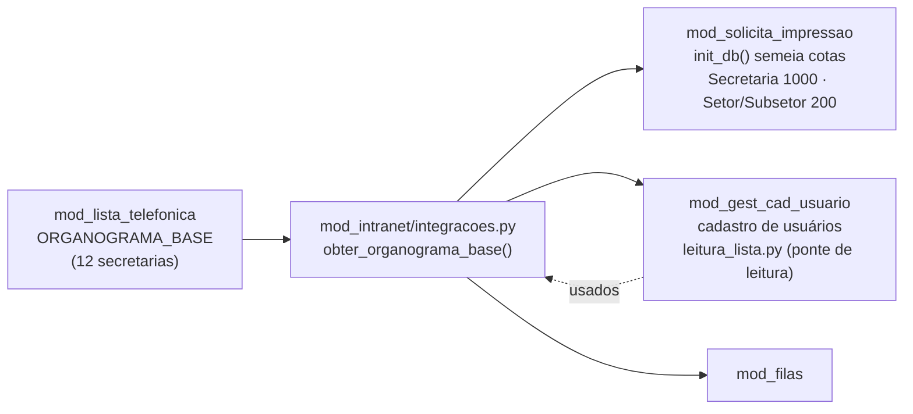

# Lista Telefônica — `mod_lista_telefonica`

> Phone directory / expandable organogram: route `/lista-telefonica` (key `lista_telefonica`) · own database `db_mod_lista_telefonica.db` · **one single search field** (`lista-busca-termo`, matches name, phone **or** unit) plus **three cascading `ui.select`s** (`lista-cascata-1/2/3`) — **no `lista-nav-*` button exists** · contacts in a **single continuous 3+ column grid** of fixed-height cards, phone **without `+55`** · **recursive** organogram tree (depth cap 20) · printing (PDF download + browser print) · multiple phones per user in `mod_gest_cad_usuario` with the read bridge `leitura_lista.py`.

---

# Lista Telefônica — `mod_lista_telefonica`

> Lista telefônica / organograma expansível: rota `/lista-telefonica` (chave `lista_telefonica`) · banco próprio `db_mod_lista_telefonica.db` · **atualizado 27/09/2026**: **um único campo de busca** (`lista-busca-termo`, filtro **OU** entre nome, telefone e unidade) e **três `ui.select` em cascata** para o recorte do organograma (`lista-cascata-1/2/3`, Unidade / Subunidade / Sub-subunidade) — **não existe mais nenhum `lista-nav-*`**, e a busca em três campos (`lista-busca-nome`/`-telefone`/`-unidade`) **não existe mais** · contatos em **uma grade contínua de 3+ colunas** com cartões de altura fixa e telefone **sem `+55`** · **árvore recursiva** com teto de profundidade 20 · **telefone múltiplo por usuário** (`tb_telefone_usuario`) com a ponte `mod_gest_cad_usuario/leitura_lista.py` · CRUD do admin na própria tela e impressão (PDF + navegador). A referência viva está em [docs/modulos/lista_telefonica.md](modulos/lista_telefonica.md).

!!! warning "O que **não** existe no código (documentação antiga)"
    - `lista-nav-todas`, `lista-nav-secretaria-<id>`, `lista-nav-setor-<id>`,
      `lista-nav-subsetor-<id>` — **não existe** botão de navegação. O
      recorte é pelos três `lista-cascata-{1,2,3}`.
    - `lista-busca-nome`, `lista-busca-telefone`, `lista-busca-unidade` —
      **não existem**. A busca é o `lista-busca-termo` **único**, com
      comparação **OU**.
    - `_barra_navegacao` e `_botao_nav` — **não existem** em `telas.py`. O
      resíduo é `_escolher(uid)` (`telas.py:544`), que **ninguém chama**.
    - `sel_sec`/`sel_set`/`sel_sub`, `render_busca`, `render_contatos`,
      `wrap_contatos`, `unidade_selecionada()` — **não existem**; a
      listagem é o `@ui.refreshable render_organograma`.
    - O seletor `[data-testid^="lista-nav"]` que sobrou em `CSS_IMPRESSAO`
      (`telas.py:48`) é **inerte**: esconde algo que não está lá.

## Propósito

Módulo de **organograma expansível** com lista telefônica interna. O organograma base (`ORGANOGRAMA_BASE` — `bd_manipulador.py:30`) traz **12 secretarias genéricas** desacopladas de vínculo territorial, cada uma com setores e subsetores, servindo como semente editável. O usuário recorta a listagem por **três selects em cascata** e vê os contatos **sempre em ordem alfabética**. A busca é **um campo só** que casa nome, telefone **ou** unidade, sem acento. No celular, o telefone é **clicável** (`tel:`) com diálogo "Ligar agora".

O administrador gerencia todo o organograma (criar, mover entre ramos, elevar `setor→secretaria` e rebaixar inverso, ordenar/comutar irmãs, excluir ramo em cascata) e os contatos (incluir vinculado à base de usuários ou externo, editar, transferir entre unidades, excluir), além do cupê de aparência.

## Banco próprio

Conexão WAL + `foreign_keys=ON` via `mod_intranet/banco_conexao.conexao("lista_telefonica")`. Criador vigente: `init_db()` em `bd_manipulador.py:207`, executado no import (`bd_manipulador.py:1223` `init_db()`) e pelo bootstrap central (`mod_intranet/bd_criador.py`).

**`tb_unidade`**:

| Coluna | Observação |
|:---|:---|
| `id` | PK AUTOINCREMENT |
| `nome` | TEXT NOT NULL |
| `tipo` | `CHECK(tipo IN ('secretaria','setor','subsetor'))` |
| `parent_id` | `REFERENCES tb_unidade(id) ON DELETE CASCADE` — NULL para secretaria (raiz) |
| `ordem` | `INTEGER DEFAULT 0` — posição entre irmãs |
| `telefone` | `TEXT DEFAULT ''` |
| `ativo` | `INTEGER DEFAULT 1` |

Índice `idx_unidade_parent(parent_id)`.

**`tb_contato`**:

| Coluna | Observação |
|:---|:---|
| `id` | PK AUTOINCREMENT |
| `unidade_id` | `REFERENCES tb_unidade(id) ON DELETE CASCADE` |
| `nome` | TEXT NOT NULL |
| `telefone` | TEXT NOT NULL DEFAULT '' |
| `user_nome` | TEXT — login vinculado da base `gest_cad_usuario` (opcional) |
| `tipo` | `CHECK(tipo IN ('vinculado','externo'))` DEFAULT `externo` — `vinculado` quando `user_nome` preenchido |
| `data_criacao` | `DATETIME DEFAULT CURRENT_TIMESTAMP` |

Índices `idx_contato_unidade(unidade_id)`, `idx_contato_nome(nome)`.

**Semente** (`bd_manipulador.py:238-259`): idempotente — `SELECT COUNT(*) FROM tb_unidade` → se 0, itera `ORGANOGRAMA_BASE` semeando secretarias (`ordem_sec` 1..12, `tipo='secretaria'`, `parent NULL`), setores (`tipo='setor'`, `parent=sec_id`, `ordem_set`) e subsetores (`tipo='subsetor'`, `parent=set_id`, `ordem_sub`). Log `info "Organograma base semeado: 12 secretarias"`.

`ORGANOGRAMA_BASE` genérico: Gabinete (Assessoria[Comunicação,Jurídico], Controle Interno), Administração (RH[Folha,Capacitação], Patrimônio e Almoxarifado[Compras,Licitações], T.I.[Suporte,Redes]), Finanças (Contabilidade, Tesouraria, Tributação[Cadastro,Fiscalização]), Saúde (Atenção Primária[ESF,Vigilância Sanitária], Assistência Farmacêutica, Regulação[Transporte Sanitário]), Educação (Pedagógico[Ensino Infantil,Fundamental], Transporte Escolar, Merenda), Obras e Infraestrutura (Engenharia[Projetos,Fiscalização], Serviços Urbanos[Limpeza,Iluminação]), Agricultura (Assistência Rural, Abastecimento), Meio Ambiente (Licenciamento, Fiscalização Ambiental), Assistência Social (CRAS, CREAS, Conselho Tutelar), Cultura (Biblioteca, Eventos), Esporte e Lazer (Esportes, Juventude), Planejamento (Projetos, Convênios).

⚠️ `bd_criador.py` é **código legado/morto**: não é importado; não executar.

### Árvore recursiva (`listar_arvore_contatos`, `bd_manipulador.py:836`)

| Aspecto | Detalhe |
|:---|:---|
| Forma | `{"id", "nome", "tipo", "nivel", "telefone", "ativo", "contatos", "filhos"}` — `nivel` é 0 na raiz |
| Recursão | `montar(u, prof)` percorre `filhos_por_pai` **sem limite de negócio**: a estrutura é `parent_id`, então mais de 3 níveis é natural |
| Teto | `_PROFUNDIDADE_MAXIMA = 20` (`bd_manipulador.py:833`) — proteção contra **ciclo de `parent_id`**, não limite de organograma. Ao estourar: `warning "…profundidade %s excedeu o teto na unidade %s - suspeita de ciclo em parent_id"` e o nó volta com `filhos: []` |
| Ordem | Alfabética em Python com `casefold()` — portátil SQLite↔PostgreSQL (`COLLATE NOCASE` é SQLite-only e quebra no PG pelo proxy) |
| `raiz_id` | Recorta a árvore numa unidade e nos descendentes (impressão de um trecho só) |
| `termo` | Filtra contatos por nome, telefone ou usuário vinculado, normalizado; **mantém as unidades vazias** no organograma, para não desalinhar a leitura |

O `CHECK(tipo IN (...))` do banco e a validação em `criar_unidade`/`mover_unidade`/`elevar_rebaixar` seguem limitando a **escrita** a 3 tipos: a recursão é da **leitura**.

### Telefone múltiplo por usuário (dados de `mod_gest_cad_usuario`, 27/09/2026)

Antes cabia **um** telefone em `tb_usuarios.user_fone`, e a lista telefônica só conseguia mostrar esse. Um servidor tem, no mínimo, celular particular, celular da empresa e fixo da empresa — e é o telefone **da empresa** que pode entrar na lista.

| Onde | O que |
|:---|:---|
| `mod_gest_cad_usuario/bd_manipulador.py:237-247` | `tb_telefone_usuario` — `user_nome` FK CASCADE, `numero`, `papel` (`empresa`\|`pessoal`), `tipo` (`celular`\|`fixo`), `principal` (um por usuário), `data_cadastro` |
| `mod_gest_cad_usuario/bd_manipulador.py:256-261` | `tb_usuarios.unidade`, `.lotacao`, `.cargo` (`ALTER TABLE` guardado por `PRAGMA table_info`, idempotente) |
| `mod_gest_cad_usuario/bd_manipulador.py:568 / :593 / :606` | `listar_telefones`, `telefone_empresa_principal`, `adicionar_telefone` |

`matricula` não é coluna: o próprio **`user_nome` é a matrícula** (é o `@user_nome` do cartão).

### Ponte de leitura — `mod_gest_cad_usuario/leitura_lista.py`

Arquivo próprio, fora de `bd_manipulador.py`, por dois motivos registrados no próprio código: (1) `obter_usuario`/`listar_usuarios` devolvem **tuplas de tamanho fixo** lidas **por índice** em vários pontos do sistema — acrescentar colunas mudaria a forma do retorno; a ponte devolve **dicionário**; (2) a ponte entre os dois módulos é pequena e óbvia.

| Função | Devolve |
|:---|:---|
| `nome_para_exibicao(nome_completo)` | Primeiro + último: `"Ana Beatriz Souza Rocha"` → `"Ana Rocha"` (a lista é diretório, não prontuário) |
| `obter_usuario_para_lista(user_nome)` | `user_nome`, `nome_completo`, `nome_exibicao`, `cargo`, `unidade`, `lotacao`, `ativo`, `telefone` (empresa principal, ou o primeiro da empresa), ou `None` |
| `buscar_usuarios_para_lista(termo, limite=50)` | Filtra por nome (com/sem acento), matrícula, cargo, unidade, lotação; **só ativo e não excluído**; ordenado por nome de exibição |
| `listar_para_vinculo(limite=20)` | Ativos, para a lista de escolha do diálogo de vínculo |

!!! info "A ponte não importa outro módulo — e ainda não é consumida"
    A normalização `_norm` (duas linhas) fica **local**, de propósito: o banco
    é do `mod_gest_cad_usuario` e não pode depender do organograma (isolamento
    do AGENTS.md §2), a função é curta, e o outro módulo pode mudar a sua sem
    quebrar este. O único import é o **próprio** `bd_manipulador` do módulo.

    **Estado real em 27/09/2026:** nenhum arquivo de produção importa
    `leitura_lista`. A ponte está pronta, mas a tela ainda lê o telefone pelo
    **contato** em `tb_contato`. Por isso a lista telefônica **não depende**
    do cadastro de usuários: servidor sem telefone de empresa fica sem
    número, o que é honesto. O telefone **particular** (`papel='pessoal'`)
    nunca sai da ponte.

## Fluxo da tela (`telas.py`, atual em 27/09/2026)

- Gate `_pode_ver` (`telas.py:73`): `administrador_geral` sempre; senão `autenticacao.validar_acesso_modulo(user, "lista_telefonica")`; sem acesso → coluna `block` 64px + "Acesso restrito" (`telas.py:354-358`). `_eh_admin` (`:84`) decide o CRUD.
- **Estado** (`:380`): `{"unidade", "busca", "nivel_1", "nivel_2", "nivel_3"}`.
- **Folha de impressão** (`:45`, `CSS_IMPRESSAO`) entra via `ui.add_head_html` **antes** de qualquer elemento da lista — é ela que esconde cabeçalho, busca e botões no papel.
- **Card de busca** (`:1076-1114`), `data-testid=lista-busca role="search"`, **fora** do `refreshable` (os campos precisam manter foco e valor enquanto a lista é redesenhada a cada tecla):
  - **Um campo** `campo_busca("🔍 Buscar — nome, telefone ou unidade", …)` + `data-testid=lista-busca-termo` (`:1088`); `debounce='150'`; `_ao_filtrar("busca", e)` → `render_organograma.refresh()`.
  - **Três selects** em cascata (`:1092-1106`): rótulos **Unidade** / **Subunidade** / **Sub-subunidade**, `data-testid=lista-cascata-1/2/3`, `outlined dense clearable`, `with_input=True`. Nascem **desabilitados**; `_preencher_cascata(None)` roda antes do primeiro desenho, senão o 1º select nascia vazio e desligado.
  - Botão **Limpar** (`lista-limpar-busca`).
- **Cascata** — `_preencher_cascata(nivel_escolhido)` (`:489`): zera `nivel_2`/`nivel_3`, popula o 1º com `_opcoes_nivel(0, arv)` (nível 0 = raízes) e cada seguinte com os **`filhos` do escolhido** (`_caminho_do_id` → `no["filhos"]`); o select **sem o que mostrar fica vazio e desabilitado** (`sel.disable()`). `_ao_mudar_nivel` (`:521`) grava o nível e redesenha.
- **Listagem** — `render_organograma` (`:1034`, `@ui.refreshable`):
  1. `arvore = _carregar_arvore()` → `listar_arvore_contatos(raiz_id=None)`, **sem filtro** (o recorte é a cascata, não o texto);
  2. `filtrada = impressao.filtrar_arvore(arvore, termo=estado["busca"])` — filtro **OU**;
  3. `recorte` = subárvore do **nível mais fundo escolhido** (`nivel_3 > nivel_2 > nivel_1`) via `_recortar`/`_no_por_id`;
  4. `_cabecalho_recorte` (`:555`) — título (nome da unidade ou "Todas as unidades"), caminho, telefone da unidade, "N contato(s) — ordem alfabética", botão **Baixar PDF** (`lista-pdf-baixar`) e **Imprimir** (`lista-imprimir`), mais as ações de admin;
  5. vazio → "Nenhum contato neste recorte com os filtros atuais." + "Ajuste a busca ou escolha outro nível do organograma." (ou "Nenhum contato encontrado." sem filtro);
  6. `_desenhar_blocos` (`:638`) → **uma** `div.lista-grade` (`data-testid=lista-grade role="list"`, `CSS_GRADE`) preenchida por `_preencher_grade` (`:663`).
- **Grade** (`:39`): `display: grid; grid-template-columns: repeat(auto-fill, minmax(200px, 1fr)); gap: 0.75rem; align-items: stretch;`. Antes cada unidade abria a **sua** grade e, como quase toda unidade tem um contato só, a grade de 3 colunas nunca aparecia. `ALTURA_CARTAO = "5.9rem"` (`:41`) + `align-items: stretch` é o que dá o mesmo tamanho a todos os cartões. `ui.row()` não serve (é flex e não quebra em colunas).
- **Cartão** (`_cartao_contato`, `:700`): coluna de 3 linhas — (1) ícone do tipo + nome como `ui.link(target=f"tel:{_tel_limpo(telefone)}")` com `truncate` + botões **só nesta linha**; (2) telefone em `font-mono`, largura inteira; (3) `@user_nome` + **caminho da unidade** com `tooltip`. As ações na primeira linha porque, como irmãos de uma coluna de texto, espremiam a largura em todas as linhas e o telefone `(35) 3591-5101` quebrava no meio.
- **Unidade sem contato**: faixa de seção `grid-column: 1 / -1` com `lista-secao no-print` (só sem filtro ligado) — some no papel.
- **Telefone exibido** (`_tel_exibicao`, `:181`): **sem `+55`**, formatado pelos dígitos (11 dígitos → `(DD) 9XXXX-XXXX`; 10 → `(DD) XXXX-XXXX`; abaixo disso, o que estiver gravado). O `+55` é tirado de propósito: no cartão de ~216px ele empurrava o telefone para duas linhas e cortava o nome. A formatação é feita aqui, e não por `telefone.formatar_para_exibicao`, que num número parcial devolveria sem separadores (resultado inconsistente entre `(35) 3591-5101` e `35915104` lado a lado). O link `tel:` **não** muda: `_tel_limpo` (`:166`) monta o número completo.
- **Impressão**: `lista-pdf-baixar` é um `ui.link` para `GET /lista-telefonica/pdf?recorte=<nível mais fundo>&termo=<busca>` (`_url_pdf`, `:329`; recorte lido do **mesmo** estado da tela — ler o estado antigo gerava um PDF diferente do que a tela mostra). `lista-imprimir` → `ui.run_javascript("window.print()")` e a folha `@media print` faz o resto.
- Responsividade: `w-full p-6 gap-4`; campo `w-full sm:w-[320px]`, selects `w-full sm:w-[210px]`, `min-width: 0`, `shrink-0`, `flex-wrap` com `style("gap: …")` (nada de `gap-*` em `ui.row()`).

## Regras de negócio relevantes

- **Hierarquia estrita na escrita** (validada em `criar_unidade` `bd_manipulador.py:379` e `mover_unidade` `:558`): `secretaria` nunca tem pai; `setor` exige pai `secretaria`; `subsetor` exige pai `setor`; nome ≥2, duplicado no mesmo `parent+tipo` bloqueia; ordem = `MAX+1` entre irmãs.
- **Leitura recursiva, escrita em 3 tipos**: a árvore sai com quantos níveis existirem; o `CHECK` do banco e as validações acima continuam barrando um quarto `tipo`.
- **Mover** (`mover_unidade`): valida novo pai por tipo; evita `uid==novo_parent` e **ciclo** subindo `parent_id` do destino até raiz (se encontrar `uid` → bloqueia "criaria ciclo"); atualiza `parent_id` + `ordem = MAX+1` no destino; audita `mover_unidade`.
- **Elevar/rebaixar** (`elevar_rebaixar` — `:625`): `setor→secretaria` (parent NULL), `subsetor→setor` (parent = avô); `secretaria→setor` e `setor→subsetor` exigem `Mover` (mensagem orienta); troca `tipo` + `parent_id` após checar duplicado no destino; audita `elevar_rebaixar`.
- **Excluir ramo (cascata)** (`excluir_ramo` — `:479`): coleta recursiva `_coletar_ramo_ids(cur, uid)` (`:533`) + `ids.append(uid)` + `DELETE FROM tb_unidade WHERE id=?` (FK CASCADE apaga filhos e `tb_contato`); audita `excluir_ramo` com `ids`.
- **Reordenar/comutar** (`reordenar_unidades` — `:696`): `UPDATE tb_unidade SET ordem=? WHERE id=? AND coalesce(parent_id,-1)=coalesce(?, -1)` por `idx` 1-based; audita `reordenar`.
- **Contatos alfabéticos** (`listar_contatos` — `:763`): `ORDER BY nome COLLATE NOCASE ASC`; `criar_contato` (`:976`) valida nome ≥2, tel ≥8, unidade existe, duplicado `nome` na unidade bloqueia, tipo `vinculado` se `user_nome` senão `externo`; `editar_contato` (`:1021`), `excluir_contato` (`:1064`), `transferir_contato` (`:1097`) validam destino, evitam mesma unidade, bloqueiam duplicado no destino, auditam com `old→new`.
- **Busca normalizada** (`_norm` — `bd_manipulador.py:202`): `NFKD` → ascii → lower → `re.findall(r"[a-z0-9]+", s)` → `join " "`; `buscar_unidades` (`:730`) / `buscar_contatos` (`:797`) filtram em memória com `termo_n in _norm(campo)`.
- **Filtro da tela** (`impressao.filtrar_arvore`, `impressao.py:511`): `termo` (o campo único) tem **precedência** e casa com nome, telefone ou caminho da unidade em **OU** (`_filtrar_termo`, `:547`); `nome`/`telefone`/`unidade` continuam aceitos e se combinam em **E** (`_filtrar`, `:582`). A comparação de telefone é sobre os **dígitos** (`_digitos`, `:574`), então `3591` acha `(35) 3591-5101`. A unidade **permanece** na árvore mesmo sem contato casado, para o diretório não "pular" a secretaria e deixar o usuário sem contexto.
- **Sanitização de telefone para `tel:`** (`telas.py:166`): `re.sub(r"[^0-9+]", "", tel or "")` como fallback — preserva `+` e dígitos; usado em `ui.link(target="tel:…")` e `window.location.href='tel:…'`.
- **Integração usuários** (`telas_administracao.py:659-812`): criação de contato pode vincular `user_nome` da base via **campo `Buscar usuário na base`** (`admin-contato-busca`, `clearable`) + **select `Usuário encontrado`** (`admin-contato-user`), alimentados por `mod_intranet.integracoes` (`listar_usuarios_gestao`/`obter_usuario_gestao`) — nunca por import direto do `mod_gest_cad_usuario`.
- **LGPD**: `remover_vinculos_usuario(user_nome)` (`:1164`) → `DELETE FROM tb_contato WHERE user_nome=?` + `audit remover_vinculos_lista`; `renomear_usuario(nome_atual, novo_nome)` (`:1195`) → `UPDATE tb_contato SET user_nome/nome WHERE user_nome/nome AND tipo='vinculado'`.
- **Privacidade do telefone**: da ponte de leitura sai **só o telefone da empresa**; o particular existe no cadastro e não atravessa.

## Integrações com o núcleo

Importa `autenticacao.validar_acesso_modulo`/`eh_admin_do_modulo`, `banco_conexao.conexao`, `aba_modulo.cabecalho`/`campo_busca`, `tema_modulo.ler_tema`/`notificar`/`bloco_aparencia`, `ui_comum.botao`/`botao_icone`/`card_admin`/`dialogo_card`/`rodape_salvar_restaurar`, `telefone.*`, `integracoes.*` (só no painel), `observabilidade.get_logger`. Grava via `audit_log` → `tb_auditoria_lista_telefonica`. Backup via `rotinas.painel_backup`/`MAPA_BACKUPS` (`lista_telefonica: db_mod_lista_telefonica.db`). `PREFIXO_POR_CHAVE`/`PADROES_TEMA`/`MODULOS_SISTEMA`/`MODULOS_BD` com `lista_telefonica`.

**Fonte compartilhada de cotas** (25/09/2026): `ORGANOGRAMA_BASE` é exposto ao restante do sistema **apenas** por `mod_intranet/integracoes.py:obter_organograma_base()` — consumida por `mod_solicita_impressao/bd_manipulador.py:408` (`init_db()`) para semear as cotas (Secretaria **1000**, Setor/Subsetor **200**).

**Usuários**: desde 25/09/2026 o módulo **não** importa `mod_gest_cad_usuario` — usa `integracoes.obter_usuario_gestao()` / `integracoes.listar_usuarios_gestao()` (ver a seção *Correção 25/09/2026* abaixo). A única exceção é a **ponte de leitura do lado do outro módulo**: `leitura_lista.py` vive em `mod_gest_cad_usuario`, é a parte *dele* da ponte, e **não é importada por este módulo** (por isso ainda não muda nada no grafo de imports).

## Correção 25/09/2026 — usuários via fachada `mod_intranet.integracoes` (AGENTS.md §2)

> `mod_lista_telefonica/telas_administracao.py` importava
> `mod_gest_cad_usuario` **diretamente** em **dois pontos** do mesmo formulário
> de vínculo de contato. Isso violava a regra de ouro do AGENTS.md §2 ("nunca
> faça cross-query entre bancos" / cada módulo fala só com o núcleo). Commit
> `624c9d5`.

### Os dois pontos corrigidos

| # | Local | Antes (import direto) | Depois (fachada do núcleo) |
|:--|:---|:---|:---|
| 1 | Busca do usuário no formulário de contato (`telas_administracao.py`, card de contatos) | `from mod_gest_cad_usuario import bd_manipulador as gest`<br>`todos = gest.listar_usuarios()` | `from mod_intranet import integracoes`<br>`todos = integracoes.listar_usuarios_gestao()` |
| 2 | Preenchimento automático ao escolher o usuário | `from mod_gest_cad_usuario import bd_manipulador as gest`<br>`row = gest.obter_usuario(sel_user.value)` | `from mod_intranet import integracoes`<br>`row = integracoes.obter_usuario_gestao(sel_user.value)` |

```python
# 1) busca em tempo real
try:
    # Cadastro via API pública do núcleo (AGENTS.md §2: a
    # Lista Telefônica não importa a Gestão de Usuários).
    from mod_intranet import integracoes
    todos = integracoes.listar_usuarios_gestao()
    ...
except Exception:
    todos = []

# 2) botão "Usar usuário" — nome completo + telefone
try:
    from mod_intranet import integracoes
    row = integracoes.obter_usuario_gestao(sel_user.value)
    if row:
        inp_nome.value = row[9] or sel_user.value
        ...
except Exception:
    pass
```

### Por que a fachada e não um import

| Razão | Detalhe |
|:---|:---|
| **AGENTS.md §2** | Cada módulo tem o **próprio** banco; a comunicação passa pela API pública do núcleo. O acoplamento pertence ao `mod_intranet`, não ao módulo de negócio |
| **Fail-soft garantido** | `integracoes.py` é *fail-soft por construção*: cada função envolve o import **lazy** + chamada em `try/except`, e devolve **valor neutro** (`None` / `[]` / `0` / `False`) com `logger.warning`. Se o módulo de Gestão de Usuários estiver ausente, desabilitado ou lançar, a tela da Lista Telefônica **continua funcionando** — com a busca vazia, sem quebrar |
| **Sem ciclo de import de topo** | Os imports da fachada são **lazy** (dentro das funções) de propósito: um import de topo de um módulo de negócio ali fecharia um ciclo com o `main.py`. Por isso o `assets/test/check_integridade.py` reporta esses ciclos como **AVISO** de runtime, nunca como falha |
| **Contrato estável** | A Lista Telefônica depende de `obter_usuario_gestao` / `listar_usuarios_gestao`, não de `listar_usuarios` / `obter_usuario`. Se a Gestão mudar a assinatura interna, a fachada absorve |
| **Verificável** | `check_integridade.py` (bloco A) passa; o par `mod_lista_telefonica → mod_gest_cad_usuario` some do grafo de imports |

!!! note "Os mesmos dois pontos existiam em `mod_filas`"
    `_ator_eh_dono_ou_admin` e `liberar_acesso` em `mod_filas/bd_manipulador.py` e
    `bloco_liberar_acesso` em `mod_filas/telas.py` faziam exatamente o mesmo
    import direto. Foram corrigidos na mesma sessão — ver
    [Filas — Correção 25/09/2026](analise_mod_filas.md).

### Contrato das funções consumidas (`mod_intranet/integracoes.py`)

```python
def obter_usuario_gestao(user_nome: str):
    """EN: One user row from the user registry, or None.

    PT-BR: Uma linha do cadastro de usuários pelo nome, ou None. Usado por
    Filas e Lista Telefônica sem que eles conheçam o módulo de gestão."""

def listar_usuarios_gestao(filtro_ativo=None) -> list:
    """EN: User rows from the registry (per-module access aggregated).

    PT-BR: Linhas do cadastro de usuários (acesso por módulo agregado). Lista
    vazia em qualquer falha — a tela que chama decide o que fazer."""
```

| Chamador | Uso |
|:---|:---|
| `mod_lista_telefonica/telas_administracao.py` | `listar_usuarios_gestao()` (busca por `login`/`nome_completo`/e-mail, excluindo deletados, 20 iniciais / 30 filtrados) e `obter_usuario_gestao(...)` (preenche `Nome` + `Telefone`) |
| `mod_filas/bd_manipulador.py` | `obter_usuario_gestao(ator)` em `_ator_eh_dono_ou_admin` (perfil do ator) e em `liberar_acesso` (valida que o usuário existe) |
| `mod_filas/telas.py` | `listar_usuarios_gestao(filtro_ativo=True)` em `bloco_liberar_acesso` |
| `mod_solicita_impressao/bd_manipulador.py` | `obter_organograma_base()` para semear cotas |

### Complemento — organograma, busca, `tel:` e administração

#### `ORGANOGRAMA_BASE` é a **fonte compartilhada** de cotas do sistema

O organograma semeado pelo módulo **não** é um detalhe do Lista Telefônica: ele é
consumido por **outro módulo de negócio** para semear as cotas de impressão.


```mermaid
graph LR
  LT["mod_lista_telefonica<br/>ORGANOGRAMA_BASE<br/>(12 secretarias)"]
  NUC["mod_intranet/integracoes.py<br/>obter_organograma_base()"]
  SI["mod_solicita_impressao<br/>init_db() semeia cotas<br/>Secretaria 1000 · Setor/Subsetor 200"]
  GEST["mod_gest_cad_usuario<br/>cadastro de usuários<br/>leitura_lista.py (ponte de leitura)"]
  F["mod_filas"]

  LT --> NUC
  NUC --> SI
  NUC --> GEST
  NUC --> F
  GEST -.->|usados| NUC
```

| Consumidor | Caminho | Cotas |
|:---|:---|:---|
| **Solicitação de Impressão** | `mod_intranet/integracoes.py:obter_organograma_base()` → `mod_solicita_impressao/bd_manipulador.py:408` (semente idempotente por sigla/nome) | **Secretaria 1000** páginas/mês · **Setor e Subsetor 200** cada |
| **Lista Telefônica** (dono) | `bd_manipulador.py:init_db()` semeia `tb_unidade` quando a tabela está vazia | 12 secretarias + setores + subsetores |

Antes de 25/09/2026 a Solicitação fazia
`from mod_lista_telefonica.bd_manipulador import ORGANOGRAMA_BASE` direto. Hoje
usa a fachada, e **mantém um *fallback* local** (Gabinete, Administração, …)
quando o organograma não responde — a semeadura das cotas continua funcionando
mesmo com o módulo da Lista Telefônica ausente. Isso preserva a regra do AGENTS.md
§2 sem criar um novo ponto de falha.

!!! warning "Consequência de manter: os subsetores são achatados"
    Como a impressão só tem **Secretaria → Setor**, os subsetores do organograma
    são achatados em `tb_setores` com **200** cópias cada. Alterar a estrutura do
    `ORGANOGRAMA_BASE` impacta as cotas de impressão — mudança de organograma é
    mudança de cota.

#### Hierarquia e navegação

| Nível | `tipo` | Regra |
|:---:|:---|:---|
| 1 | `secretaria` | **Nunca** tem pai (`parent_id` NULL) — raiz |
| 2 | `setor` | Exige pai `secretaria` |
| 3 | `subsetor` | Exige pai `setor` |

- 12 secretarias genéricas, **desacopladas de vínculo territorial**, com setores e
  subsetores (Gabinete, Administração, Finanças, Saúde, Educação, Obras e
  Infraestrutura, Agricultura, Meio Ambiente, Assistência Social, Cultura, Esporte
  e Lazer, Planejamento).
- Semente **idempotente**: só roda quando `tb_unidade` está vazia — bancos já
  semeados **nunca** são sobrescritos pelo `init_db`.
- **Recorte por três selects em cascata** (`lista-cascata-1/2/3`): escolher a
  unidade popula o select seguinte com os **filhos** dela; o select sem o que
  mostrar fica vazio e **desabilitado**. O recorte efetivo é o do **nível mais
  fundo** escolhido, que já traz os descendentes.

#### Contatos e busca

| Regra | Onde | Detalhe |
|:---|:---|:---|
| **Ordem alfabética** | `listar_contatos` | `ORDER BY nome COLLATE NOCASE ASC` — sempre alfabética, sem exceção, independentemente da ordem de inserção |
| **Busca sem acentos** | `_norm` (`NFKD` → ascii → lower → `re.findall(r"[a-z0-9]+", s)`) | `filtrar_arvore(termo=…)` casa nome, telefone ou caminho da unidade em **OU**; `buscar_unidades` / `buscar_contatos` filtram **em memória** com `termo_n in _norm(campo)` |
| **Telefone clicável** | `telas.py` | `_tel_limpo` → `re.sub(r"[^0-9+]", "", tel)` → `ui.link(target="tel:<limpo>")`; no clique, diálogo `_dlg_ligar` com `ui.run_javascript("window.location.href='tel:…'")` (fail-soft) e botão `Ligar agora` |
| **Telefone sem `+55` no cartão** | `_tel_exibicao` | Decisão de espaço na coluna de ~216px; o `tel:` continua com o número completo |
| **Vínculo com usuários** | `criar_contato` | `tipo='vinculado'` quando `user_nome` está preenchido, senão `'externo'`; nome ≥ 2, telefone ≥ 8, sem `nome` duplicado na unidade |

#### Administração (`telas_administracao.py`)

| Operação | Função | Garantia |
|:---|:---|:---|
| **Excluir ramo** | `excluir_ramo` | Cascata real: `_coletar_ramo_ids` recursiva → `DELETE` → FK `ON DELETE CASCADE` apaga filhos **e** os contatos da unidade; auditado com a lista de `ids` |
| **Mover** | `mover_unidade` | Valida o novo pai pelo tipo; bloqueia `uid == novo_parent` e **ciclo** (sobe `parent_id` do destino até a raiz; se encontrar `uid`, cancela); reordena no destino (`ordem = MAX+1`) |
| **Elevar / rebaixar** | `elevar_rebaixar` | `setor→secretaria` (parent NULL) e `subsetor→setor` (parent = avô) são diretos; `secretaria→setor` e `setor→subsetor` **exigem** mover antes, com mensagem que orienta; checa duplicado no destino |
| **Ordenar / comutar** | `reordenar_unidades` | `UPDATE ... SET ordem=? WHERE id=? AND coalesce(parent_id,-1)=coalesce(?,-1)` — o `coalesce` trata `NULL` (raiz) sem `IS NULL` dinâmico |
| **Transferir contato** | `transferir_contato` | Valida o destino, recusa a **mesma** unidade e bloqueia `nome` duplicado lá; audita `old→new` |
| **LGPD** | `remover_vinculos_usuario` / `renomear_usuario` | Remove os contatos vinculados ao login; propaga `user_nome` **e** `nome` quando o login é renomeado |


## Pontos de atenção

- **Navegação por botão não existe.** Qualquer doc/teste que cite `lista-nav-*` ou os três `lista-busca-*` descreve uma versão que nunca esteve no código atual: o recorte é pelos `lista-cascata-{1,2,3}` e a busca é o `lista-busca-termo` **único**, com filtro **OU**.
- **`_escolher(uid)` é resíduo morto** (`telas.py:544`): existia para a navegação por botões e **não é chamada** por nada. O recorte real vem de `nivel_3/nivel_2/nivel_1`.
- **Organograma genérico e desacoplado** — semente só quando `tb_unidade` vazia (bancos já semeados não são sobrescritos).
- **Leitura recursiva ≠ escrita irrestrita**: a árvore aceita quantos níveis existirem, com teto 20 só contra ciclo de `parent_id`; o `CHECK` do banco e as validações de escrita continuam em 3 tipos.
- **`subsetor` não é usado como unidade de impressão** — em `mod_solicita_impressao` os subsetores são achatados como `tb_setores` (200 cópias cada) para manter o modelo Secretaria→Setor da impressão.
- **`+55` fora do cartão, dentro do `tel:`** — as duas coisas são coerentes por desenho: o texto é enxuto para caber na coluna estreita; o link usa o número completo.
- **Altura fixa (`5.9rem`) + `align-items: stretch`** são o requisito de "cartões do mesmo tamanho", não enfeite; `minmax(200px, 1fr)` é o que garante 3 colunas no contentor estreito do desktop.
- **`lista-busca` é o invólucro, `lista-busca-termo` é o input** — o `no-print` da folha de impressão vai no invólucro, senão a caixa sai em branco no papel.
- `telephone` como texto livre (não validado por regex rígida, só ≥8 chars); `tel:` usa `re.sub` para extrair dígitos/`+`.
- `_coletar_ramo_ids` é recursiva em Python (não `WITH RECURSIVE` SQL) — organograma de ~12 secretarias é pequeno, recursion depth seguro.
- `reordenar_unidades` usa `coalesce(parent_id,-1)` para tratar `NULL` (secretarias raiz) sem `IS NULL` dinâmico.
- **`leitura_lista.py` está pronta e não ligada** — nenhum arquivo de produção a importa; a lista ainda mostra o telefone do **contato**, não o telefone de empresa do servidor. Nenhum dos dois lados ganhou dependência nova: a ponte é do módulo de gestão e não importa este.
- **Botão "Limpar" — divergência corrigida em 27/09/2026.** `_limpar_busca` repopulava o primeiro select com `_opcoes_nivel(1)` enquanto a carga inicial (`_preencher_cascata`) usa `_opcoes_nivel(0)`; como a raiz é o nível 0, limpar a busca listava uma unidade abaixo. Hoje (`telas.py:424`) usa `_opcoes_nivel(0, _carregar_arvore())`.
- **Docstrings do código ficaram atrás da tela** (ler o arquivo não como fonte da verdade): `telas.py:1-7` ainda diz *"3-field search"*; `_limpar_busca` (`:402-404`) ainda diz *"os três campos"*; `_opcoes_nivel` (`:455-462`) promete o **caminho completo** no rótulo e devolve só `n["nome"]` (`:465`), então dois subsetores homônimos em secretarias diferentes ficam indistinguíveis na cascata; `listar_arvore_contatos` (`bd_manipulador.py:854-855`) ainda diz que `filhos` só vem preenchido no nível de secretaria; `render_organograma` (`telas.py:1036`) ainda diz "Botões + recorte". O comportamento real está em [Módulo Lista Telefônica](modulos/lista_telefonica.md).
- `bd_criador.py` morto — nunca executar; schema real é `init_db()` do `bd_manipulador`.

## Status

| Item | Situação |
|:---|:---|
| Banco WAL + `tb_unidade`/`tb_contato` + semente 12 secretarias | Implementado (`init_db` + `ORGANOGRAMA_BASE`) |
| Árvore **recursiva** com `nivel` e teto de profundidade 20 | Implementado (`listar_arvore_contatos` + `montar` recursivo) |
| Busca em **um campo só** com filtro **OU** (nome/telefone/unidade) | Implementado (`lista-busca-termo` + `filtrar_arvore(termo=…)` + `_filtrar_termo`) |
| Recorte por **três selects em cascata** (Unidade/Subunidade/Sub-subunidade) | Implementado (`lista-cascata-1/2/3` + `_preencher_cascata`) |
| Contatos em **grade contínua** de 3+ colunas, cartões de altura fixa, telefone sem `+55` | Implementado (`CSS_GRADE` + `ALTURA_CARTAO` + `_tel_exibicao`) |
| Contatos alfabéticos (`COLLATE NOCASE`) + `tel:` clicável | Implementado (`listar_contatos` + `ui.link tel:` + `_dlg_ligar`) |
| Impressão: PDF para baixar + navegador | Implementado (`impressao.py` + `GET /lista-telefonica/pdf` + `CSS_IMPRESSAO`) |
| Admin: criar/mover/elevar/excluir ramo/reordenar/comutar/transferir | Implementado (`telas_administracao.py` + `bd_manipulador`) |
| CRUD do admin na própria tela (guarda no servidor) | Implementado (`_guarda_admin` em cada handler de escrita) |
| Vínculo a usuários (vinculado/externo) + LGPD | Implementado (`criar_contato` + `remover/renomear`) |
| Telefone múltiplo por usuário + dados funcionais públicos | Implementado no `mod_gest_cad_usuario` (`tb_telefone_usuario`, `unidade`/`lotacao`/`cargo`) |
| Ponte de leitura para a lista (`leitura_lista.py`) | **Implementada, não ligada** — nenhum módulo de produção a importa |
| Botão "Limpar" repopula a cascata no nível certo | ✅ **Corrigido** (27/09/2026) — `_limpar_busca` usa `_opcoes_nivel(0, _carregar_arvore())` (`telas.py:424`), o mesmo nível da carga inicial |
| Aparência + backup | Implementado (`bloco_aparencia` + `painel_backup`) |
| Integração `solicita_impressao` (ORGANOGRAMA_BASE → 1000/200) | Implementado (`mod_intranet/integracoes.py` + `mod_solicita_impressao/bd_manipulador.py:408`) |

---

# RF e RNF verificados no código (27/09/2026)

> Auditoria de requisitos **funcionais** e **não funcionais**, com evidência
> `arquivo:linha` conferida em 27/09/2026, no mesmo formato dos módulos
> auditados antes.

## Requisitos funcionais (RF) — mapa código ↔ doc

| RF | Descrição | Evidência no código |
|:---|:---|:---|
| RF-LT-01 | Organograma de **3 níveis escritos** — Secretaria → Setor → Subsetor — com a restrição garantida no banco (a **leitura** é recursiva e aceita mais) | `init_db` (`bd_manipulador.py:207`): `tb_unidade.tipo TEXT NOT NULL CHECK(tipo IN ('secretaria','setor','subsetor'))` + `parent_id … ON DELETE CASCADE` |
| RF-LT-02 | Acesso à tela só para `administrador_geral` **ou** usuário com liberação no módulo | `telas.py:73` `_pode_ver`; negação visual em `telas.py:354-358` |
| RF-LT-03 | Administração exige `administrador_geral` **ou** admin do módulo | `telas.py:84` `_eh_admin` (`perfil_global_de` + `autenticacao.eh_admin_do_modulo`) |
| RF-LT-04 | **Recorte por três selects em cascata**: escolher a Unidade abre as Subunidades dela, escolher a Subunidade abre as Sub-subunidades; o nível mais fundo escolhido define a listagem | `telas.py:1092-1106` (`lista-cascata-1/2/3`), `_preencher_cascata` (`:489`), `_ao_mudar_nivel` (`:521`) e o laço `nivel_3 > nivel_2 > nivel_1` + `_recortar` em `render_organograma` (`:1045-1048`) |
| RF-LT-05 | Contatos do órgão em **ordem alfabética**, insensível a acento e a caixa | `listar_contatos` (`:763`); `listar_arvore_contatos` ordena em Python com `casefold()` (`:889-920`); `_norm` (`:202`) remove acento |
| RF-LT-06 | Telefone clicável (`tel:`) com tooltip, e diálogo de ligação | `telas.py:732` `ui.link(nome, target=f"tel:{limpo}")` + `.tooltip("Toque para ligar (celular)")`; `telas.py:738-743` botão `lista-ligar`; `_dlg_ligar` (`:780`) com `ui.run_javascript("window.location.href='tel:…'")` fail-soft |
| RF-LT-07 | Busca global em **um campo só**, casando nome, telefone **ou** unidade, sem acento, com comparação **OU** | `telas.py:1088` `lista-busca-termo` → `impressao.filtrar_arvore(arvore, termo=…)` (`impressao.py:511`) → `_filtrar_termo` (`:547`); `_digitos` (`:574`) para o telefone; `_norm` para o resto |
| RF-LT-08 | Contato **vinculado** a um usuário do cadastro, ou externo | `criar_contato(unidade_id, nome, telefone, user_nome)` (`:976`); `tb_contato.tipo CHECK(tipo IN ('vinculado','externo'))`; painel tem `admin-contato-user` |
| RF-LT-09 | Criar, editar e excluir contato | `criar_contato` (`:976`), `editar_contato` (`:1021`), `excluir_contato` (`:1064`); `admin-criar-contato`, `admin-contato-nome/tel/unidade` e `lista-admin-novo-contato`, `lista-contato-editar-<cid>`, `lista-contato-remover-<cid>` na própria tela |
| RF-LT-10 | Criar/editar/excluir unidade, e **mover** unidade para outro pai | `criar_unidade` (`:379`), `editar_unidade` (`:439`), `excluir_ramo` (`:479`), `mover_unidade` (`:558`) |
| RF-LT-11 | **Excluir ramo** apaga a unidade e toda a descendência de uma vez | `excluir_ramo` (`:479`) com `_coletar_ramo_ids` (`:533`) |
| RF-LT-12 | **Elevar/rebaixar** o nível de uma unidade (subsetor ↔ setor ↔ secretaria) | `elevar_rebaixar(uid, novo_tipo)` (`:625`) |
| RF-LT-13 | Reordenar as unidades de um mesmo pai | `reordenar_unidades(parent_id, ordem_ids)` (`:696`); campo `tb_unidade.ordem` |
| RF-LT-14 | Transferir contato entre unidades | `transferir_contato(cid, nova_unidade_id)` (`:1097`) |
| RF-LT-15 | Exibir o caminho completo da unidade (Secretaria › Setor › Subsetor) no cartão | `_preencher_grade` monta o `prefixo` (`:663-696`) e `_cartao_contato` mostra o `caminho` com `tooltip` (`:768-776`); `_caminho_unidade` (`telas.py:211`) monta o caminho do cabeçalho |
| RF-LT-16 | Aparência e backup no painel | `telas_administracao.py:22` `mostrar_administracao` com `bloco_aparencia` (`:33`) + `painel_backup` (`:984`) |
| RF-LT-17 | Organograma base semeado, e reusado pelo módulo de Solicitação de Impressão | `init_db` (`:207`) semeia `ORGANOGRAMA_BASE` (`:30`) quando `tb_unidade` está vazia; consumidor via `mod_intranet/integracoes.py:obter_organograma_base()` em `mod_solicita_impressao/bd_manipulador.py:408` |
| RF-LT-18 | Rótulos PT-BR e docstrings bilíngue EN (topo) / PT-BR (abaixo) | `bd_manipulador.py:1-11`, `telas.py:1-7`, `telas_administracao.py:1-7`, `impressao.py:1-9`, `mod_gest_cad_usuario/leitura_lista.py:1-22` |
| RF-LT-19 | **Telefone múltiplo por usuário**, com papel (empresa/pessoal), tipo (celular/fixo) e um principal por usuário | `mod_gest_cad_usuario/bd_manipulador.py:237-247` (`tb_telefone_usuario`), `listar_telefones` (`:568`), `telefone_empresa_principal` (`:593`), `adicionar_telefone` (`:606`) |
| RF-LT-20 | Dados funcionais públicos do servidor (matrícula, nome, secretaria, cargo, lotação) expostos à lista **em dicionário**, sem quebrar as tuplas de tamanho fixo já consumidas | `mod_gest_cad_usuario/leitura_lista.py` — `nome_para_exibicao` (`:57`), `obter_usuario_para_lista` (`:91`), `buscar_usuarios_para_lista` (`:115`), `listar_para_vinculo` (`:153`); colunas `unidade`/`lotacao`/`cargo` em `bd_manipulador.py:256-261` |
| RF-LT-21 | Impressão: **PDF para baixar** e **impressão do navegador** do recorte atual | `impressao.py` — `gerar_pdf_lista` (`:379`), `pdf_bytes` (`:415`), `registrar_rota_pdf` (`:619`, rota `GET /lista-telefonica/pdf`); tela `_botao_pdf` (`telas.py:598`) + `_imprimir` (`:623`) + `CSS_IMPRESSAO` (`:45`) |

## Requisitos não-funcionais (RNF) — garantias técnicas

| RNF | Exigência | Evidência no código |
|:---|:---|:---|
| RNF-LT-PERS-01 | Banco próprio `db_mod_lista_telefonica.db`; tabelas `tb_unidade` e `tb_contato` | `get_connection` (`:156`) |
| RNF-LT-PERS-02 | Integridade referencial no **banco**, não só na UI: `ON DELETE CASCADE` nos dois lados | `init_db` (`:207`) |
| RNF-LT-PERS-03 | Restrição de domínio no banco: o `tipo` só aceita os 3 valores | `CHECK(tipo IN ('secretaria','setor','subsetor'))` e `CHECK(tipo IN ('vinculado','externo'))` |
| RNF-LT-PERS-04 | 3 índices cobrindo as consultas quentes: hierarquia, busca por contato e busca por nome | `idx_unidade_parent`, `idx_contato_unidade`, `idx_contato_nome` (`init_db`) |
| RNF-LT-PERS-05 | `database is locked` é erro tratado, com rollback e **retry** no commit | `_eh_bloqueio_banco` (`:98`), `_rollback_seguro` (`:109`), `_commit_com_retry` (`:121`) |
| RNF-LT-PERS-06 | DDL idempotente e import-safe | `init_db` (`:207`) com `CREATE TABLE IF NOT EXISTS` + seed só quando a tabela está vazia |
| RNF-LT-PERS-07 | **Ciclo de `parent_id` não derruba a listagem**: a recursão tem teto e loga, em vez de estourar | `_PROFUNDIDADE_MAXIMA = 20` (`:833`) + `warning` em `montar` (`:900-910`) |
| RNF-LT-SEG-01 | Autorização verificada **antes** de renderizar, com negação explícita na tela | `_pode_ver` (`:73`) e `_eh_admin` (`:84`), ambos com `except` que devolve `False` em vez de propagar |
| RNF-LT-SEG-02 | Auditoria das escritas de configuração e de exclusão | `_audit` (`:183`) nas operações de unidade e contato |
| RNF-LT-SEG-03 | Telefone sanitizado antes de virar `tel:` | `telas.py:166` `_tel_limpo` (dígitos e `+`), com fallback `re.sub(r"[^0-9+]", …)` |
| RNF-LT-SEG-04 | **Guarda no servidor** em cada handler de escrita da tela (esconder botão não é proteção) | `telas.py:807` `_guarda_admin`, chamada no topo de `_dlg_novo_contato`/`_dlg_editar_contato`/`_dlg_remover_contato`/`_dlg_nova_unidade`/`_dlg_editar_unidade` e nos respectivos `_salvar`/`_confirmar` |
| RNF-LT-SEG-05 | A rota do PDF revalida sessão e acesso ao módulo antes de servir o arquivo | `impressao.py:640-652` (`usuario_logado` + `usuario_existe` + `validar_acesso_modulo`), com `RedirectResponse` em cada falha |
| RNF-LT-SEG-06 | **LGPD no telefone**: da ponte de leitura sai só o telefone **da empresa** | `leitura_lista.py:83` usa `bd.telefone_empresa_principal(...)`; `listar_telefones(..., apenas_empresa=True)`; `papel='pessoal'` nunca é exposto |
| RNF-LT-RES-01 | `try/except` obrigatório em função, com log (AGENTS.md §3.2) | Todo `bd_manipulador` protegido, com `_log()` (`:87`) e `log.exception`; `telas.py:351` envolve o `mostrar_tela` inteiro |
| RNF-LT-RES-02 | Falha de banco em operação destrutiva (`excluir_ramo`, `transferir_contato`) faz rollback e **não** apaga parcialmente | `_rollback_seguro` (`:109`) chamado nos `except` |
| RNF-LT-UX-01 | Anti-disconnect: I/O fora do event-loop nos handlers de escrita | `telas_administracao.py` conduz as mutações por `run.io_bound`, com `ui.spinner` e trava de reentrância |
| RNF-LT-UX-02 | `data-testid` via `.props('data-testid=...')` em todas as ações | Tela: `lista-busca`, `lista-busca-termo`, `lista-cascata-1/2/3`, `lista-limpar-busca`, `lista-grade`, `lista-contato-<cid>`, `lista-ligar`, `lista-pdf-baixar`, `lista-imprimir`, `lista-admin-*`, `lista-contato-editar/remover-<cid>` e os `lista-{novo-contato\|editar-contato\|remover-contato\|nova-unidade\|editar-unidade}-*`. Painel: `admin-criar-unidade`, `admin-unidade-nome/tel/tipo/pai`, `admin-criar-contato`, `admin-contato-nome/tel/unidade/user`, `admin-contato-busca` |
| RNF-LT-UX-03 | **Cartões do mesmo tamanho** na grade (altura fixa + `align-items: stretch`) | `telas.py:39-41` (`CSS_GRADE` com `align-items: stretch` + `ALTURA_CARTAO = "5.9rem"`), aplicado em `telas.py:719` |
| RNF-LT-UX-04 | A cascata **não deixa escolher** um nível que não existe: o select sem filhos fica vazio e **desabilitado** | `telas.py:514-517` (`if opcoes: sel.enable() else: sel.disable()`) em `_preencher_cascata` |
| RNF-LT-UX-05 | A busca **não rouba o foco** enquanto o usuário digita: o card de busca fica fora do `refreshable` | `telas.py:1074-1076` (comentário) + `render_organograma.refresh()` só redesenha a lista |
| RNF-LT-UX-06 | Coluna estreita não quebra o telefone: o cartão é **coluna** e as ações ficam só na 1ª linha | `telas.py:706-711` (comentário) + `_cartao_contato` com `min-width: 0`, `flex: 1 1 0`, `truncate` |
| RNF-LT-PERF-01 | Busca sem varrer a tabela: normaliza e filtra sobre o conjunto já carregado | `_norm` (`:202`) + `buscar_*` (`:730`/`:797`) e `filtrar_arvore` sobre a árvore já em memória |
| RNF-LT-PERF-02 | Recalcular a lista a cada tecla não derruba a tela: filtros e cascata ficam **fora** do `refreshable` | `telas.py:380` (estado), `:1074-1076` (card de busca fora), `:1114-1115` (`_preencher_cascata` antes do 1º desenho) |
| RNF-LT-RESP-01 | Responsividade: campo e selects empilham no celular, a grade cai para 1 coluna | `telas.py:1065` (`w-full p-6 gap-4`), `:1082` (`w-full sm:w-[320px]`), `:1097` (`w-full sm:w-[210px]`), `minmax(200px, 1fr)` |
| RNF-LT-RESP-02 | Tela utilizável em **800px** sem quebrar o mínimo de 3 colunas pedido | `telas.py:28-40` (a conta `3 × 200px + 2 × 12px = 624px` e por que 260px caía em duas colunas) |
| RNF-LT-CFG-01 | Aparência por tema do módulo, com fallback no padrão do núcleo | `telas_administracao.py:33` usa `tema_modulo.bloco_aparencia` |
| RNF-LT-COMP-01 | Compatibilidade SQLite ↔ PostgreSQL | Via `banco_conexao`; ordenação em Python com `casefold()` (nada de `COLLATE NOCASE`, que é SQLite-only); DDL só `IF NOT EXISTS`, sem SQL SQLite-only no módulo |
| RNF-LT-COMP-02 | A ponte de leitura **não cria dependência entre módulos** (isolamento do AGENTS.md §2) | `leitura_lista.py:24-27` importa só `mod_gest_cad_usuario.bd_manipulador` e normaliza localmente (`:30-44`); a Lista Telefônica **não** a importa |
| RNF-LT-LGPD-01 | Excluir/renomear usuário limpa o vínculo `tb_contato.user_nome` | `remover_vinculos_usuario` (`:1164`) e `renomear_usuario` (`:1195`) |
