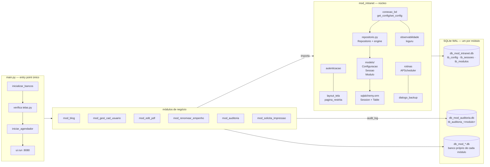

# Intranet Modular — Architecture

> Technical architecture of the Intranet Modular: single entry point (`main.py`), modular packages (`mod_*`), the `db_criador.py` / `db_manipulador.py` / `telas.py` pattern, one SQLite (WAL) database per module, centralized audit and the APScheduler jobs (per-module backups, 1-minute cleanups, folder monitor and audit pruning).

---

# Intranet Modular — Arquitetura

> Arquitetura técnica da Intranet Modular: entry point único (`main.py`), pacotes modulares (`mod_*`), padrão `db_criador.py` / `db_manipulador.py` / `telas.py`, banco SQLite (WAL) por módulo, auditoria centralizada e agendadores APScheduler (backups por módulo, cleanups de 1 min, monitor de pasta e poda da auditoria).

## Sumário

1. [Visão geral](#visao-geral)
2. [Entry point: `main.py`](#entry-point-mainpy)
3. [Pacotes de módulo (`mod_*`)](#pacotes-de-modulo-mod_)
4. [Padrão interno de um módulo](#padrao-interno-de-um-modulo)
5. [Bancos de dados (um por módulo, WAL)](#bancos-de-dados-um-por-modulo-wal)
6. [Autenticação e sessões](#autenticacao-e-sessoes)
7. [Guarda de página e layout](#guarda-de-pagina-e-layout)
8. [Agendadores (APScheduler)](#agendadores-apscheduler)
9. [Auditoria LGPD (banco exclusivo)](#auditoria-lgpd-banco-exclusivo)
10. [Observabilidade (loguru)](#observabilidade-loguru)
11. [Documentação embutida (`/documentacao`)](#documentacao-embutida-documentacao)
12. [Estrutura de diretórios (Fase 0)](#estrutura-de-diretorios-fase-0)

## Visão geral

```text
┌────────────────────────────── main.py (único entry point) ──────────────────────────────┐
│  inicializar_bancos()  →  verifica telas.py  →  iniciar_agendador()  →  ui.run(8080)     │
└───────────────┬──────────────────────────────────────────────┬──────────────────────────┘
                │                                              │
   ┌────────────▼───────────┐                     ┌────────────▼───────────┐
   │ mod_intranet (núcleo)  │                     │ Módulos de negócio      │
   │ autenticacao · layout  │◄── importa ────────►│ mod_blog, mod_gest_*,   │
   │ conexao_bd · rotinas   │                     │ mod_edit_pdf,           │
   │ observabilidade · etc. │                     │ mod_renomear_*,         │
   └────────────┬───────────┘                     │ mod_auditoria,          │
                │                                 │ mod_solicita_impressao  │
   db_mod_intranet.db (WAL)                       └─────────┬───────────────┘
   tb_config · tb_sessoes · tb_modulos                      │ cada um com seu
                                                            ▼ db_mod_*.db (WAL)
   db_mod_auditoria.db (WAL) — trilha LGPD, UMA TABELA POR MÓDULO
   (tb_auditoria_<modulo>), gravada via audit_log → registrar_auditoria
```



## Entry point: `main.py`

`main.py` (raiz) é o **único ponto de entrada** — a aplicação não possui outro script de inicialização. Fluxo no boot:

1. **`inicializar_bancos()`** (`main.py:17-18`) — cria o banco central e os bancos dos módulos **antes** de qualquer import de módulo (ordem crítica; ver [Configurações](configuracoes.md#bootstrap-inicializar_bancos)).
2. **Telemetria OTel** (opcional, `otel_ativo`) — auto-start da stack Docker ou conexão a servidor dedicado; instrumenta a app e sincroniza credenciais do Grafana (`main.py:20-60`).
3. **Valida `telas.py`** — aborta com `RuntimeError` se algum `mod_*` não tiver `telas.py` (`main.py:65-67`).
4. **Prepara favicon** — copia o favicon nativo para `assets/favicon_atual.ico` (arquivo vivo, troca sem restart) (`main.py:103-112`).
5. **Registra as rotas** de página NiceGUI (`@ui.page`) e rotas auxiliares FastAPI (`@app.get`) — ver [Referência de API](api_referencia.md); slugs customizados re-registrados por `rotas_modulos.montar_rotas_ativas()` (`main.py:452-453`).
6. **`iniciar_agendador()`** (`main.py:71-75`) — delega ao `rotinas.iniciar_agendador()`.
7. **Observabilidade** — `observabilidade.configurar()` + `instalar_excepthook()` (`main.py:457-459`).
8. **Documentação** — `construir_e_montar_documentacao()` (`main.py:468-469`): build MkDocs `docs/` → `site/` e mount em `/documentacao` (falha nunca derruba o servidor).
9. **`ui.run(...)`** (`main.py:471-478`) — `reload=False`, `show=False`, porta `8080`, `storage_secret` placeholder.

## Pacotes de módulo (`mod_*`)

Cada funcionalidade é um **pacote próprio** na raiz:

| Pacote | Banco | `telas.py` | Papel |
|:---|:---|:---:|:---|
| `mod_intranet/` | `db_mod_intranet.db` | ✗ (rotas no `main.py`) | núcleo: autenticação, config, layout, rotinas, observabilidade |
| `mod_gest_cad_usuario/` | `db_mod_gest_cad_usuario.db` | ✓ | usuários, perfis, papéis, sessões |
| `mod_blog/` | `db_mod_blog.db` | ✓ | postagens/comentários |
| `mod_edit_pdf/` | `db_mod_edit_pdf.db` | ✓ | edição de PDFs |
| `mod_renomear_empenho/` | `db_mod_renomear_empenho.db` | ✓ | empenhos/FTS5 |
| `mod_auditoria/` | `db_mod_auditoria.db` (uma tabela por módulo) | ✓ | trilha LGPD + visualizador |
| `mod_solicita_impressao/` | `db_mod_solicita_impressao.db` | ✓ | solicitação de impressão |

Subpacotes/fluxos relevantes do núcleo:

- `mod_intranet/autenticacao.py` — login/sessões/permissões (bcrypt, `tb_sessoes`, `tb_modulos`).
- `../mod_intranet/telas.py` — guarda `pagina_restrita` + layout de 4 partes.
- `../mod_intranet/bd_conexao.py` — camada mais baixa (banco central, `get_config`/`set_config`).
- `../mod_intranet/bd_manipulador.py` — auditoria (`audit_log`) e rastreabilidade.
- `mod_intranet/rotinas.py` — agendadores e backups.
- `mod_intranet/observabilidade.py` — loguru por módulo.
- `mod_intranet/tela_configuracoes.py` — personalização (`/configuracoes`).
- `mod_intranet/documentacao.py` — build/mount do MkDocs.
- `mod_intranet/contexto.py` — ContextVar com IP/UA por request.
- `mod_intranet/email_util.py` — SMTP (cartão E-mail).
- `mod_intranet/dialogo_backup.py` — diálogo de backup do header.
- `mod_intranet/aba_modulo.py` — cabeçalho/abas padronizadas das telas (cabeçalho com cores resolvidas pelo tema do módulo via `cabecalho(chave_modulo=...)` — a borda de destaque é a mesma cor dos botões) + helpers de tela (`menu_modulo`, `campo_busca`, `barra_acoes`).
- `mod_intranet/ui_comum.py` — fábrica central de componentes de UI (paleta `CORES`, `botao`/`botao_icone`, `dialogo_card`, rodapés padrão); destino da migração dos `ui.button` crus e hexes soltos dos módulos.

## Padrão interno de um módulo

```text
mod_<nome>/
  __init__.py
  telas.py            # OBRIGATÓRIO: expõe mostrar_tela(usuario_logado, perfil)
  manipulador_bd.py   # acesso ao db_mod_<nome>.db (WAL) — criador vigente das tabelas
  criador_bd.py       # LEGADO/MORTO: aponta para o banco central — NÃO confiar nem executar
  (outros: monitor, organizador, src/...)
```

| Arquivo | Responsabilidade |
|:---|:---|
| `telas.py` | UI NiceGUI; `mostrar_tela(usuario_logado, perfil)`; revalida papel antes de qualquer escrita |
| `db_manipulador.py` | schema (`init_db*`), queries e regras de negócio; conexão WAL; auditoria via `audit_log` |
| `db_criador.py` | **legado/morto** em todos os módulos — usa a conexão do banco central e esquemas divergentes; nunca executar (o padrão real é `manipulador_bd.init_db*`) |

> `mod_auditoria` **tem** `db_manipulador.py` (banco exclusivo `db_mod_auditoria.db`, uma tabela por módulo) — o visualizador em `telas.py` lê esse banco via `buscar_logs()`; a escrita é feita indiretamente pelos demais módulos via `audit_log` → `registrar_auditoria`.

## Bancos de dados (um por módulo, WAL)

- Cada banco é um **arquivo SQLite separado** na raiz (`db_mod_*.db`).
- Toda conexão aplica `PRAGMA journal_mode=WAL` (+ `synchronous=NORMAL` no central e na auditoria).
- **Convenção:** consultar um banco somente pelo `manipulador_bd` do seu próprio módulo (evitar cross-query). Exceções conhecidas e documentadas: a limpeza cruzada LGPD da exclusão de usuário (`mod_gest_cad_usuario` varre bancos vizinhos para anonimizar/excluir dados — ver [Módulo de Gestão de Usuários](modulos/gest_cad_usuario.md)) e a escrita de auditoria (`audit_log` no núcleo grava no banco exclusivo de auditoria via `registrar_auditoria`).
- O banco **central** (`db_mod_intranet.db`) guarda `tb_config`, `tb_sessoes` e `tb_modulos` (a antiga `tb_auditoria` central foi migrada e removida — ver [Auditoria](#auditoria-lgpd-banco-exclusivo)).
- **SQLAlchemy em TODOS os bancos (06/09):** o mapa `MODULOS_BD` (`repositorio.py:57-65`) registra os 7 bancos (`intranet`, `blog`, `editar_pdf`, `usuarios`, `empenhos`, `auditoria`, `solicita_impressao`); `engine(chave)`/`sessaodb(chave)`/`Repositorio(chave_db=...)` operam em qualquer um deles — ver [Arquitetura de acesso a dados do núcleo](#arquitetura-de-acesso-a-dados-do-nucleo-backend-duplo-0809).
- **Backend duplo controlado pelo sistema (08/09):** além do SQLite, o sistema agora suporta **PostgreSQL opcional** — a chave `banco_tipo` em `tb_config` central (`'sqlite'` padrão | `'postgres'`) seleciona o backend. No Postgres, **um SCHEMA por módulo** dentro do banco `intranet` preserva o isolamento "um banco por módulo" e evita colisão de nomes de tabela (ex.: `tb_solicitacoes`). SQLite continua o padrão. Ver [Backend duplo (08/09)](#arquitetura-de-acesso-a-dados-do-nucleo-backend-duplo-0809) abaixo.

### Arquitetura de acesso a dados do núcleo — backend duplo (08/09)

O `mod_intranet` utiliza **SQLAlchemy 2.0 ORM + Dataclasses** como arquitetura piloto, propagável aos demais módulos. Desde 08/09 o acesso a dados é **duplo e controlado pelo sistema**: **SQLite** (padrão) ou **PostgreSQL** (opcional), selecionado por `banco_tipo` na `tb_config` central.

```
mod_intranet/
  models/              ← dataclasses + SQLAlchemy Table metadata
    __init__.py        3 tabelas: tb_config, tb_sessoes, tb_modulos
                       3 dataclasses: Configuracao, Sessao, Modulo
                       mapeamento via registry.map_imperatively()
  repositorio.py       ← classe Repositorio (CRUD tipado via Session ORM);
                         engine()/sessaodb(chave) roteiam para o Postgres
                         quando banco_tipo='postgres'
  banco_conexao.py     ← backend duplo: conexao(chave), config_backend(),
                         salvar_backend(), SCHEMAS (um schema por módulo),
                         sgbd_ativo(), obter_engine_modulo(chave)
  conexao_bd.py        ← delega get_config/set_config para Repositorio
                         fallback sqlite3 raw em caso de falha
  autenticacao.py      ← todas as operações de sessão e módulo via Repositorio
  manipulador_bd.py    ← garante_rastreabilidade via Repositorio
```

**Camadas:**

| Camada | Arquivo | Responsabilidade |
|:---|:---|:---|
| **Models** | `models/__init__.py` | dataclasses `Configuracao`, `Sessao`, `Modulo` + `Table` SQLAlchemy + `metadata` + `registry.map_imperatively()` |
| **Engine** | `repositorio.py:engine(chave)` | **um engine POR banco** (`MODULOS_BD`, cacheado por chave em `_engines` + `_lock`); event listener para pragmas WAL + `synchronous=NORMAL` + `foreign_keys=ON`; **criação condicional** — `metadata.create_all` + log só quando o ARQUIVO do banco não existe (módulos ≠ intranet nunca rodam `create_all`: schema é do `init_db` de cada módulo) |
| **Session factory** | `repositorio.py:sessaodb(chave)` | `sessionmaker(bind=engine, expire_on_commit=False)` por banco, factories cacheadas em `_SessionFactories` |
| **Repository** | `repositorio.py:Repositorio` | CRUD tipado (dataclass returns) para `tb_config`, `tb_sessoes`, `tb_modulos`; context manager com `fechar()` automático; vinculável a qualquer banco via `Repositorio(chave_db="blog")` |
| **Helpers genéricos** | `Repositorio.consultar/executar/ultimo_id` | SQL cru fail-soft no banco vinculado: `consultar(sql, params) -> list[dict]` (SELECT, rows como dicts), `executar(sql, params) -> rowcount` (DML + commit, rollback em falha), `ultimo_id()` (`last_insert_rowid`) — para migrar gradualmente o SQL cru dos módulos |
| **Delegação** | `bd_conexao.py` | `get_config`/`set_config` delegam para `Repositorio` com fallback sqlite3 raw |

**Multi-banco e criação condicional (06/09):**

| Função | Local | Comportamento |
|:---|:---|:---|
| `MODULOS_BD` | `repositorio.py:57-65` | mapa chave→arquivo dos 7 bancos: `intranet`→`db_mod_intranet.db`, `blog`→`db_mod_blog.db`, `editar_pdf`→`db_mod_edit_pdf.db`, `usuarios`→`db_mod_gest_cad_usuario.db`, `empenhos`→`db_mod_renomear_empenho.db`, `auditoria`→`db_mod_auditoria.db`, `solicita_impressao`→`db_mod_solicita_impressao.db` |
| `caminho_db(chave)` | `repositorio.py:80` | caminho do banco; chave desconhecida → central (fail-soft) |
| `engine(chave="intranet")` | `repositorio.py:98` | **roteia para o backend ativo:** com `banco_tipo='postgres'` delega a `banco_conexao.obter_engine_modulo(chave)` (schema do módulo no banco `intranet`); senão SQLite — criação condicional: banco existente → nada é criado nem logado; banco central novo → `metadata.create_all` uma vez; banco de módulo novo → arquivo criado na primeira conexão (schema via `init_db` do módulo) |
| `sessaodb(chave="intranet")` | `repositorio.py:158` | Session por banco (factory cacheada); roteia para o Postgres quando o backend é `postgres` |
| `garantir_bancos()` | `repositorio.py:177` | percorre `MODULOS_BD`, cria engine de cada banco e força a primeira conexão quando o arquivo está ausente; retorna `{chave: criado}` |
| `inicializar_bancos()` | `mod_intranet_inicializacao_bd.py:13` | passo 0 do boot chama `garantir_bancos()` ANTES dos `init_db` dos módulos |

**Backend duplo (08/09):**

O PostgreSQL é ativado pelo admin em `/configuracoes` → card **"Banco de dados — SQLite ou PostgreSQL"** (ícone `storage`): select `banco_tipo` + campo DSN `postgres_url`, salvos via `banco_conexao.salvar_backend`. O `banco_tipo` é lido **DIRETO do arquivo SQLite central** (`_ler_config_sqlite` — `banco_conexao.py:57`) — seletor de backend autoritativo no boot, sem recursão. Alteração exige **reiniciar o servidor**.

| Função | Local | Comportamento |
|:---|:---|:---|
| `SCHEMAS` | `banco_conexao.py:248` | mapa chave→schema no Postgres: `intranet`→`intranet`, `blog`→`blog`, `usuarios`→`usuarios`, `auditoria`→`auditoria`, `editar_pdf`→`editar_pdf`, `empenhos`→`empenhos`, `solicita_impressao`→`solicita_impressao` — **um schema por módulo** dentro do banco `intranet` |
| `schema_modulo(chave)` | `banco_conexao.py:262` | schema do módulo (fallback: `intranet`) |
| `obter_engine_modulo(chave)` | `banco_conexao.py:267` | engine Postgres para o banco `intranet` com `search_path` = schema do módulo; `CREATE SCHEMA IF NOT EXISTS` + `SET search_path` no connect, com commit para sobreviver ao rollback do pool |
| `conexao(chave)` | `banco_conexao.py:488` | devolve uma conexão DBAPI para o backend ativo: sqlite (arquivo do módulo, WAL) ou postgres (proxy psycopg2 com tradução — ver abaixo) |
| `conexao_central()` | `banco_conexao.py:518` | conexão do banco central seguindo o backend ativo |
| `sgbd_ativo()` | `banco_conexao.py:138` | `'sqlite'`\|`'postgres'` (fail-soft: valor inválido cai em `sqlite`) |
| `config_backend()` | `banco_conexao.py:115` | dict `{banco_tipo, postgres_url}` lido do SQLite central |
| `salvar_backend(banco_tipo, postgres_url)` | `banco_conexao.py:128` | grava `banco_tipo`/`postgres_url` no arquivo SQLite central (exige restart para aplicar) |
| `definir_banco_tipo(valor)` / `definir_postgres_url(url)` | `banco_conexao.py:100/110` | gravam as chaves no SQLite central |

**Tradução SQLite→Postgres no proxy psycopg2** (`_PrepararCursor`, `banco_conexao.py:340`):

- `?` → `%s`; `datetime('now','localtime')` → `LOCALTIMESTAMP` (com cast `::text` em `DEFAULT` de coluna TEXT).
- DDL SQLite→Postgres (`_ddl_postgres`, `banco_conexao.py:307`): `AUTOINCREMENT` removido, `INTEGER PRIMARY KEY` → `SERIAL PRIMARY KEY`, `BLOB` → `BYTEA`, `DATETIME` → `TIMESTAMP`, remoção de `FOREIGN KEY ... REFERENCES ...`.
- `INSERT OR IGNORE` → `ON CONFLICT DO NOTHING`; `INSERT OR REPLACE` → `ON CONFLICT`.
- `PRAGMA`/`sqlite_master`/FTS5 (`CREATE VIRTUAL TABLE`/`CREATE TRIGGER`) ignorados (sem efeito/resultado no Postgres).
- `PRAGMA table_info` → `information_schema.columns`.
- `lastrowid` via `RETURNING id` com SAVEPOINT (não aborta transação em tabela sem coluna `id`); SAVEPOINT por statement para falha isolada não desfazer a transação.

**Modelo de credenciais PostgreSQL:**

| Papel | Usuário | Senha | Uso |
|:---|:---|:---|:---|
| Operações normais | `klayton` | `klayton` | Queries do aplicativo |
| Operações administrativas | `master` | `master` | Criação de banco, migrations |

> **08/09:** com o backend duplo ativo, o `postgres_url` (DSN) vive no arquivo SQLite central e **as credenciais da URL são usadas como estão** (container `intranet/intranet`). O antigo padrão `klayton/klayton` + `master/master` (chaves `banco_usuario`/`banco_senha`/`banco_admin_*`) é o modelo legado de credenciais do núcleo; o container Docker fornece o usuário `intranet`/`intranet`.

Chaves em `tb_config`: `banco_tipo`, `postgres_url` (principais — ver [Configurações](configuracoes.md#card-banco-de-dados-sqlite-ou-postgresql-0809)).

**Fail-soft:** se SQLAlchemy não estiver instalado, `engine()` retorna `None` e `Repositorio` opera em modo degradado (retorna `padrao`/`False`/`[]`). `bd_conexao.py` aplica fallback sqlite3 raw em qualquer exceção.

> **Propagação:** ao criar `db_manipulador.py` de um novo módulo, espelhe o padrão — `models/` com dataclasses + `Table` + `map_imperatively()`, `repositorio.py` com `Repositorio` local e `autenticacao.py`/`db_manipulador.py` migrados para usar `Repositorio`. Ver [Padrões de Codificação](padroes_codificacao/index.md).

## Autenticação e sessões

- **bcrypt** para hash de senhas (`verificar_senha`/`gerar_hash_senha` — `autenticacao.py:294-299`).
- Login grava **sessão revogável** em `tb_sessoes` com `cookie_hash = sha256(...)[:16]` via `secrets` (`registrar_login` — `autenticacao.py:361-391`); cookie HTTP-Only definido no nível de framework (NiceGUI/Starlette).
- Guarda de página revalida a sessão a cada request (`sessao_ativa` — `autenticacao.py:394-410`); sessão encerrada pelo admin derruba o navegador na próxima interação.
- **Rastreabilidade**: ContextVar do NiceGUI captura IP (prioriza `X-Forwarded-For`), user-agent, rótulo de dispositivo e MAC best-effort (Linux) em cada request (`mod_intranet/contexto.py`).

## Guarda de página e layout

`pagina_restrita(titulo_modulo, chave_modulo)` (`layout_tela.py:32`) é usada por **todas** as rotas de módulos do `main.py`:

1. Sem usuário → redireciona `/login`.
2. Revalida existência/situação ativa do usuário no banco.
3. Revalida `sessao_ativa` (sessões antigas sem hash são adotadas).
4. Valida `validar_acesso_modulo(nome, chave)` — sem permissão: audita `acesso_negado`, notifica e redireciona `/`.
5. Monta o **layout de 4 partes**: header (hambúrguer, backup, "Meu Perfil", badge de perfil, logout), drawer lateral (módulos liberados), rodapé com versões, área principal.
6. Se `precisa_trocar_senha`, abre o diálogo persistente de troca obrigatória.

## Agendadores (APScheduler)

`rotinas.iniciar_agendador()` (`mod_intranet/rotinas.py:177-233`) — `BackgroundScheduler(daemon=True)`:

| Job | Intervalo | Descrição |
|:---|:---|:---|
| `backup:<chave>` (1 por módulo) | `backup_horas:<chave>` (default **12 h**, mín. 1 h) | copia o banco do módulo para `backup/`, retendo as **10 cópias mais recentes**; reagendável sem restart (`reagendar_backup`) |
| `cleanup_pdf` | **1 min** | expira arquivos do editor PDF (`expirar_antigos(cfg_expiracao_min())`, default 10 min); fallback `limpar_editor_pdf(minutos=10)` |
| `cleanup_solicita` | **1 min** | remove rascunhos de impressão não confirmados e impressos vencidos do servidor |
| `poda_auditoria` | **24 h** | remove registros das tabelas por módulo de `db_mod_auditoria.db` mais antigos que `auditoria_retencao_dias` (default 90) |
| `monitor_empenho` | `empenhos_monitor_intervalo_seg` (default **60 s**) | varredura automática das pastas monitoradas de empenhos (`rodar_monitor("sistema")`) |

> **Ajuste fino:** o `MAPA_BACKUPS` (`rotinas.py:16-22`) controla quais bancos são copiados em cada job de backup (intranet, usuarios, blog, editar_pdf, auditoria, empenhos, solicita — expandido em 06/09 com auditoria e solicita_impressao).

## Auditoria LGPD (banco exclusivo)

- **`audit_log(usuario, modulo, acao, descricao, hash_arquivo, ip, user_agent)`** (`mod_intranet/manipulador_bd.py:58-83`) é a função única de escrita — ela preenche IP/UA do contexto HTTP e delega a `registrar_auditoria` (`mod_auditoria/manipulador_bd.py:99-124`).
- **Banco exclusivo** `db_mod_auditoria.db` (WAL): cada módulo produtor tem a SUA tabela `tb_auditoria_<modulo>` (criada automaticamente e registrada em `tb_auditoria_meta`) — novos módulos passam a auditar sem editar o módulo de auditoria.
- Colunas de rastreabilidade LGPD: `usuario`, `modulo`, `acao`, `descricao`, `timestamp` (horário local, RF-08), `hash_arquivo`, `ip`, `user_agent`, `client_hostname`; índices por `modulo`, `usuario` e `timestamp`.
- Todos os módulos auditam suas ações relevantes: criação/edição/exclusão, autenticação (login/logout/falha), configurações, permissões (inclusive `acesso_negado`), operações com arquivos (com **hash SHA-256**).
- **Migração idempotente** do legado central: `migrar_dados_existentes()` (`mod_auditoria/manipulador_bd.py:273-324`) copia a antiga `tb_auditoria` do banco central para as tabelas por módulo, marca `auditoria_migracao_concluida` e remove a tabela legada.
- **Poda automática**: job diário `poda_auditoria` (`rotinas.py:74-103`) chama `podar_registros(dias)` em todas as tabelas (`auditoria_retencao_dias`, default 90).
- Visualização: módulo `mod_auditoria` (só `administrador_geral`) — ver [Módulo de Auditoria](modulos/auditoria.md).

## Observabilidade (loguru)

- `mod_intranet/observabilidade.py` configura sinks de arquivo em `logs/` com rotação/retenção/compressão e captura exceções não tratadas (`excepthook`).
- Console (stderr) conforme `log_console`: `auto` (só via python, nunca no executável), `sempre` (arquivo + terminal) ou `nunca` (só arquivo).
- `get_logger("<modulo>")` rotula o logger para o arquivo dedicado (`blog_<data>.log`, ...); core em `intranet_<data>.log`.
- Configurável em runtime pela administração (`log_ativo`, `log_nivel`, `log_rotacao`, `log_retencao`, `log_console`, `log_otel_envio`, `log_otel_nivel`); bridge loguru→OTel (Loki) com filtro de nível.
- Telemetria OTel com endpoint local ou remoto (`otel_endpoint`, env `OTEL_ENDPOINT` tem prioridade; `otel_ativo`, `otel_auto_start_stack`); URL do Grafana configurável (`grafana_url`). Troca de endpoint/OTel exige restart.

## Documentação embutida (`/documentacao`)

- `mod_intranet/documentacao.py` executa `python -m mkdocs build` (docs/ → site/) e monta `site/` como rota estática FastAPI (`app.mount("/documentacao", StaticFiles(...))`).
- O build roda no boot (`main.py:330-331`) e **falhas nunca derrubam o servidor** (apenas avisam nos logs).
- Timeout do `subprocess.run`: **120s** (aumentado de 60s em 06/09 para instalações com grande volume de documentação).
- Tema do MkDocs: **`readthedocs`** (definido em `mkdocs.yml` — não alterar para `material`).

## Estrutura de diretórios (Fase 0)

Raiz do projeto (scaffold base — Fase 0 do `PLANO.md`):

| Pasta | Finalidade |
|:---|:---|
| `assets/` | recursos estáticos; `favicon_atual.ico` é o "arquivo vivo" do favicon (troca via upload sem restart, cache-busted por `favicon_versao()`) |
| `assets/css/` | estilos CSS customizados do sistema |
| `backup/` | backups dos bancos por módulo (APScheduler, retenção das 10 cópias mais recentes — `PASTA_BACKUP` em `mod_intranet/rotinas.py`) |
| `logs/` | arquivos de log por módulo (loguru — rotação/retenção/compressão) |
| `site/` | build estático do MkDocs (`docs/` → `site/`), servido em `/documentacao` |
| `mod_*/` | núcleo `mod_intranet/` + módulos de negócio (`telas.py` obrigatório) — **as pastas operacionais dos módulos vivem DENTRO de cada `mod_*`** (regra de ouro do AGENTS.md) |
| `mod_renomear_empenho/doc/` | pasta monitorada de empenhos (`_PASTA_MONITORADA_PADRAO` — `mod_renomear_empenho/manipulador_bd.py:25`) |
| `mod_renomear_empenho/organizadorPasta/` | saída do organizador físico do renomear empenho (caixas/subpastas — `PASTA_ORGANIZADOR`) |
| `mod_renomear_empenho/quarentena/` | PDFs com erro de leitura/corrupção na fila de quarentena (`PASTA_QUARENTENA`) |
| `mod_edit_pdf/editorPDF/` | arquivos temporários do Editor de PDF (expiração automática, default 10 min — `PASTA_EDITOR`/`PASTA_EDITOR_PDF`) |
| `main.py`, `requirements.txt`, `mkdocs.yml`, `db_mod_*.db` | entry point único, dependências, build da doc e bancos SQLite (WAL) por módulo (incl. `db_mod_auditoria.db` — trilha LGPD) |

> Pastas operacionais **dentro dos módulos** (`mod_edit_pdf/editorPDF/`, `mod_renomear_empenho/doc/`,
> `organizadorPasta/`, `quarentena/`) existem com `.gitkeep` no repositório e também são
> garantidas em runtime pelas rotinas (`os.makedirs(..., exist_ok=True)`);
> `backup/` e `logs/` continuam **na raiz** — `logs/` e `site/` são criados/geridos em runtime pelo aplicativo.

> Pendências conceituais conhecidas: `db_criador.py` legado em todos os módulos (não confiar); `db_manipulador.py` do núcleo foi reconstruído de `*.pyc` quando ausente como fonte (ver [Análise do Núcleo](analise_mod_intranet.md)).