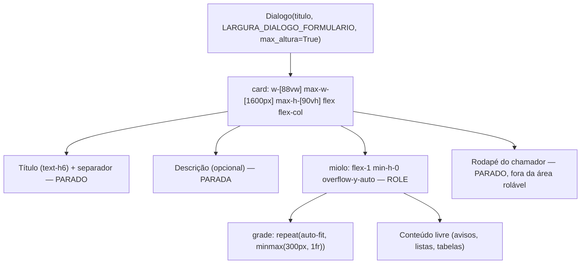

# Form Dialog Pattern — `ui_comum.dialogo_formulario`

> EN — Shared form-dialog base: at least 80% of the viewport wide (`w-[88vw]`, capped at 1600px), a 90vh height cap with **internal** scrolling and a `repeat(auto-fit, minmax(300px, 1fr))` field grid. Applied to 23 dialogs across 7 files, plus the two first-access credential dialogs that reuse the same constants. Confirmations ("excluir?", "remover contato?") and 1–2 field sheets were deliberately **left narrow** — see the classification rule below, because that decision is the one that gets lost.

---

# Diálogo de Formulário — `ui_comum.dialogo_formulario`

> Base compartilhada dos diálogos de **formulário** da intranet: largura de pelo
> menos 80% da viewport (`w-[88vw]`, teto de 1600px), teto de altura de 90vh com
> **rolagem interna** e grade de campos `repeat(auto-fit, minmax(300px, 1fr))`.
> Aplicada a 23 diálogos em 7 arquivos, mais os dois diálogos de troca de
> credenciais do primeiro acesso, que reaproveitam as mesmas constantes.
> Confirmações ("excluir?", "remover contato?") e fichas de 1–2 campos foram
> deixadas **estreitas de propósito** — ver a regra de classificação abaixo,
> porque essa decisão é a que se perde se não estiver escrita.
>
> Código: `mod_intranet/ui_comum.py` (`LARGURA_DIALOGO_FORMULARIO`,
> `CSS_GRADE_CAMPOS`, `CSS_GRADE_AVISOS`, `dialogo_formulario`).

---

## 1. O problema que a base resolve

Os diálogos de formulário da intranet abriam com **largura fixa pequena**
(`w-96` = 384px, `w-[420px]`, `w-[560px]`, `w-[620px]`, `w-full max-w-[820px]`) e,
na maioria, com `max_altura=False` — **sem teto de altura**.

O sintoma é sempre o mesmo, e é sempre o mesmo erro de leitura:

| Sinal | O que a pessoa vê |
|:---|:---|
| Cartão estreito, formulário com 3+ campos | Uma coluna de 384px com os campos empilhados um embaixo do outro |
| `max_altura=False` + conteúdo mais alto que a janela | **Quem rola é a PÁGINA INTEIRA**, não o diálogo |
| Consequência | A barra de rolagem aparece **no meio do formulário**, longe do botão "Salvar" e do dedo de quem está num monitor de altura curta |

Não é "responsividade" no sentido de *breakpoint*. É o conteúdo **deixar de
transbordar a janela e passar a caber nela**.

!!! danger "O detalhe que faz o teto funcionar (ou não)"
    Com `max-h-[90vh]` sozinho **o teto é simplesmente ignorado**: o filho flex
    não encolhe abaixo da altura do seu conteúdo, o `overflow-y` não pega e a
    rolagem escapa para a página. O que fecha o problema é o **`min-h-0` do
    miolo** — ele autoriza o filho a encolher. Remova o `min-h-0` e o diálogo
    volta ao sintoma original sem nenhum aviso.

## 2. A regra de classificação — formulário × confirmação

!!! warning "Documento normativo — esta é a decisão que se perde"
    A pergunta que decide **não é "o diálogo tem poucos campos?"**, é
    **"o diálogo é um formulário ou uma confirmação?"**. Todo diálogo de
    formulário da intranet passou a usar `dialogo_formulario`. Confirmações e
    fichas curtas continuam em `dialogo_card` com largura fixa.

| Tipo | O que é | Fábrica | Largura |
|:---|:---|:---|:---|
| **Formulário** | Vários campos (≥3), blocos informativos, botão no pé | **`dialogo_formulario`** | `w-[88vw] max-w-[1600px]`, teto 90vh, rolagem interna |
| **Confirmação** | "Excluir?", "Remover contato?", "Excluir ramo?", "Recusar pedido?" — 0–2 campos e um aviso | `dialogo_card` | fixa (`w-[380px]`, `w-[420px]`, `w-[520px]`, `w-[560px]`), `max_altura=False` |
| **Mídia** | Diálogo cujo corpo é uma imagem/vídeo (ex.: ampliação de notícia) | `dialogo_card` | `w-full max-w-[94vw]`, `max_altura=False` — **a mídia define a altura** |

!!! tip "Por que a confirmação NÃO vai a 88vw"
    Um "excluir?" com 88vw de largura é um **retrocesso de usabilidade**: a
    confirmação existe para ser lida e respondida em segundos, e um cartão de
    1400px com duas frases nela no meio joga fora o alinhamento dos campos, o
    botão fica longe do texto e o olho perde o alvo. O **formulário** é o
    contrário: tem muitos campos, e o espaço existe para economizarem cliques.
    Tratar os dois com a mesma receita é o erro — por isso a regra está
    escrita aqui e não só no código.

!!! info "Onde a classificação está registrada no código"
    O comentário de bloco `# ============ DIÁLOGO DE FORMULÁRIO: LARGURA,
    ALTURA E ROLAGEM ============` (`ui_comum.py:316-341`) explica o mesmo
    antes de `LARGURA_DIALOGO_FORMULARIO`, e as confirmações mantidas estreitas
    aparecem na tabela da
    [§5.2](#52-mantidos-estreitos-de-proposito-18-chamadas-de-dialogo_card).

## 3. A base compartilhada

Três constantes e um *context manager*, todos em `mod_intranet/ui_comum.py`:

```python
# ui_comum.py:342
LARGURA_DIALOGO_FORMULARIO = "w-[88vw] max-w-[1600px]"

# ui_comum.py:347-351 — 300px por causa do telefone: a linha DDI (190px fixos)
# + número precisa de ~300px de célula; com 260px sobrariam 60px para o número.
CSS_GRADE_CAMPOS = ("display: grid; grid-template-columns: "
                    "repeat(auto-fit, minmax(300px, 1fr)); gap: 1rem; "
                    "align-items: start;")

# ui_comum.py:353-356 — blocos informativos são texto corrido, não campo:
# 320px evita que fiquem espremidos ao lado das três colunas do formulário.
CSS_GRADE_AVISOS = ("display: grid; grid-template-columns: "
                    "repeat(auto-fit, minmax(320px, 1fr)); gap: 1rem; "
                    "align-items: start;")
```

### 3.1 Assinatura

```python
# ui_comum.py:359
@contextmanager
def dialogo_formulario(titulo="", *, chave_modulo="intranet", largura=None,
                       descricao="", sem_descricao=False):
    """Abre um diálogo de FORMULÁRIO largo, com teto de altura e rolagem interna."""
```

| Parâmetro | Padrão | O que faz |
|:---|:---|:---|
| `titulo` | `""` | rótulo `text-h6` + separador (mesmo tratamento de `dialogo_card`) |
| `chave_modulo` | `"intranet"` | estilo do cartão (`tema_modulo.estilo_cartao`) e tema dos botões |
| `largura` | `None` | sobrescreve `LARGURA_DIALOGO_FORMULARIO` **só** quando o diálogo exigir outro teto (padrão: usar o padrão) |
| `descricao` | `""` | parágrafo abaixo do título |
| `sem_descricao` | `False` | dispensa a descrição (mesmo efeito de `descricao=""`) |

Devolve **`(dlg, card, miolo, grade)`**:

| Slot | O que é | Uso |
|:---|:---|:---|
| `dlg`, `card` | como em `dialogo_card` | abrir/fechar; `card` já é `flex flex-col` |
| `miolo` | coluna rolável — `w-full flex-1 min-h-0 overflow-y-auto`, com `role="region" tabindex="0" aria-label="Conteúdo do formulário"` | **tudo que for criado dentro dela rola** |
| `grade` | div com `CSS_GRADE_CAMPOS`, `role="group" aria-label="Campos do formulário"` | campos lado a lado; para corpo de lista/tabela, ignore `grade` e crie direto dentro de `miolo` |

### 3.2 O esqueleto



!!! danger "`miolo` e `grade` saem ANTES do `yield` — por desenho"
    Se o `yield` estivesse dentro de `with grade:`, o **rodapé** que o chamador
    cria depois do `with` cairia **dentro de uma célula da grade** e rolaria
    junto com o formulário — o botão "Salvar" sumiria embaixo. Por isso os dois
    slots são fechados **antes** do `yield`: ao entrar no `with dialogo_formulario`,
    o slot corrente já é o **card**, que é onde o rodapé tem de nascer.

### 3.3 Como usar

```python
from mod_intranet import ui_comum
from mod_intranet.ui_comum import dialogo_formulario

def _dlg_novo_contato():
    try:
        with dialogo_formulario("Novo contato", chave_modulo=CHAVE) as (
                dlg, card, miolo, grade):
            with grade:                       # 1. campos — grade auto-fit
                sel_unidade = ui.select(opcoes, label="Unidade *").classes("w-full")
                inp_nome = ui.input("Nome *").props("outlined dense").classes("w-full")
                campo_tel = _campo_telefone("Telefone *", "lista-novo-contato")

            with miolo:                       # 2. avisos/listas — rola junto
                lbl = ui.label("").classes("text-caption text-grey-6")
                ...

            # 3. rodapé — NASCE NO CARD, ancorado na base, fora da rolagem
            #    (`rodape_dialogo` já aplica `compacto=True` e o "Cancelar";
            #     o 3º item da tupla são kwargs extras do `botao`)
            ui_comum.rodape_dialogo(dlg, [("Salvar", _salvar, {"icone": "save"})],
                                    chave_modulo=CHAVE)
        dlg.open()
    except Exception:
        log.exception("_dlg_novo_contato falhou")
        notificar("Erro ao abrir o novo contato.", type="negative")
```

Três passos, sempre nesta ordem: **campos na `grade` → conteúdo livre no
`miolo` → rodapé direto no card.**

!!! tip "`grade` e `miolo` podem ser reentrados"
    Os dois são contextos do NiceGUI e podem ser abertos mais de uma vez no
    mesmo diálogo (o `mod_intranet/telas.py` faz isso: `with grade:` para os
    campos e `with miolo:` logo depois para os avisos e o rodapé do bloco
    informativo).

## 4. Os dois diálogos que reaproveitam as constantes sem usar a base

`mod_intranet/telas.py` tem dois diálogos de troca de credenciais do primeiro
acesso que **mantêm `dialogo_card`** e reusam as constantes da base:

```python
# mod_intranet/telas.py:714-716
LARGURA_DIALOGO_TROCA = ui_comum.LARGURA_DIALOGO_FORMULARIO
CSS_GRADE_CAMPOS_TROCA = ui_comum.CSS_GRADE_CAMPOS
CSS_GRADE_AVISOS_TROCA = ui_comum.CSS_GRADE_AVISOS
```

| Diálogo | Linha | Por que não é `dialogo_formulario` |
|:---|:---|:---|
| `_dialogo_troca_credenciais_completo` | `telas.py:959` | Monta o **mesmo esqueleto** (card `flex flex-col`, miolo `min-h-0 overflow-y-auto`, rodapé ancorado) mas com **duas** grades: `CSS_GRADE_CAMPOS_TROCA` para os 7 campos e `CSS_GRADE_AVISOS_TROCA` para os dois blocos informativos lado a lado. A base tem uma grade só. |
| `_dialogo_troca_credenciais_minimo` | `telas.py:764` | Fallback do diálogo completo: **precisa do mesmo layout**, porque um fallback que estoura a tela em máquina de instalação não é fallback de ninguém. |

Nada aqui é um segundo padrão: largura, teto, rolagem interna e as duas grades
vêm **das mesmas constantes** de `ui_comum`.

## 5. Inventário aplicado — e o que ficou estreito

### 5.1 Convertidos (23 chamadas de `dialogo_formulario`)

| Arquivo | Qtd. | Diálogos |
|:---|---:|:---|
| `mod_estoque/telas.py` | 11 | o que está em uso, convites pendentes, entrada de material, transferência, entrega para a sala, pedido de recolhimento, novo almoxarifado, ajustes do almoxarifado, cadastrar item, nova tarefa de depósito, chamar servidor |
| `mod_gest_cad_usuario/telas.py` | 4 | novo usuário, editar usuário, duplicar usuário, sessões |
| `mod_intranet/telas.py` | 3 | Meu Perfil, troca de senha obrigatória, seus telefones |
| `mod_lista_telefonica/telas.py` | 2 | novo contato, nova unidade |
| `mod_lista_telefonica/telas_administracao.py` | 1 | reordenar (comutar) |
| `mod_tecnico/telas.py` | 1 | listar arquivos |
| `mod_intranet/dialogo_backup.py` | 1 | backup do módulo |

Mais os **2** diálogos de troca de credenciais do
[§4](#4-os-dois-dialogos-que-reaproveitam-as-constantes-sem-usar-a-base) que
reaproveitam as constantes — **25 diálogos com o layout novo**.

Os campos **não mudaram de posição lógica nem de ordem no DOM**: a correção é de
LAYOUT. Os `data-testid` foram preservados, o que mantém o Playwright e os
scripts standalone (`assets/test/`) funcionando sem alteração.

### 5.2 Mantidos estreitos de propósito (18 chamadas de `dialogo_card`)

| Arquivo | Qtd. | Diálogos |
|:---|---:|:---|
| `mod_lista_telefonica/telas_administracao.py` | 6 | editar unidade, excluir ramo, mover, elevar/rebaixar, editar contato, transferir |
| `mod_estoque/telas.py` | 4 | atender pedido de recolhimento, recusar pedido de recolhimento, baixa da entrega, novo almoxarifado (aviso de organograma indisponível) |
| `mod_lista_telefonica/telas.py` | 4 | ligar (ficha do contato), editar contato, remover contato, editar unidade |
| `mod_gest_cad_usuario/telas.py` | 3 | redefinir senha, excluir usuário, exclusão definitiva |
| `mod_agregador_noticias/telas.py` | 1 | ampliação da notícia — **mídia**, a imagem define a altura |

!!! note "Contagem conferida no código"
    A classificação **não** foi feita por contagem de campos nem por lista
    automática: cada diálogo foi classificado um a um. Os números acima saem de
    uma varredura AST de `mod_*/*.py` por chamada a `dialogo_formulario` /
    `dialogo_card` (23 + 20 chamadas, sendo 2 de `dialogo_card` as do
    [§4](#4-os-dois-dialogos-que-reaproveitam-as-constantes-sem-usar-a-base)).
    Ao reler este inventário, **conferir no código** — a lista é consequência
    da regra, não a fonte dela.

## 6. Checklist para abrir um diálogo novo

- [ ] É **formulário** (≥3 campos/avisos) ou **confirmação** (0–2 campos)? A resposta decide a fábrica — ver [§2](#2-a-regra-de-classificacao-formulario-confirmacao).
- [ ] Formulário → `with ui_comum.dialogo_formulario(...) as (dlg, card, miolo, grade):`; **não** `dialogo_card`.
- [ ] Campos dentro de `with grade:`; avisos/listas dentro de `with miolo:`.
- [ ] Rodapé **fora** dos dois `with` (nasce no card, ancorado na base).
- [ ] `data-testid` preservado em cada campo (Playwright depende dele).
- [ ] Confirmação → `dialogo_card` com `largura="w-[380px]"`/`"w-[420px]"` e `max_altura=False`.
- [ ] `try/except Exception` + `notificar(..., type="negative")` + `log.exception` (AGENTS.md §3.2) — nunca deixar o `dlg` meio montado.
- [ ] Sem JavaScript direto (AGENTS.md §5).

## 7. Ver como está no código

```bash
# 1. As constantes e a base
grep -n "LARGURA_DIALOGO_FORMULARIO\|CSS_GRADE_CAMPOS\|CSS_GRADE_AVISOS" mod_intranet/ui_comum.py

# 2. Quem usa a base (deve devolver 23 chamadas em mod_*/)
grep -rc "dialogo_formulario(" mod_*/telas.py mod_*/telas_administracao.py mod_intranet/dialogo_backup.py

# 3. As confirmações que seguem estreitas (conferir a razão de cada uma)
grep -rn "dialogo_card(" mod_*/telas.py mod_*/telas_administracao.py

# 4. O min-h-0 do miolo — sem ele o teto de 90vh é ignorado
grep -n "min-h-0 overflow-y-auto" mod_intranet/ui_comum.py
```

**Referências relacionadas:**
[Convenções de Código](convencoes_codigo.md#componentes-de-ui-padronizados-mod_intranetui_comumpy) ·
[Padrões de Codificação](padroes_codificacao/index.md#8-componentes-de-ui-padronizados-mod_intranetui_comumpy) ·
[Módulos (resumo) — Intranet](modulos/intranet.md) ·
[Registro de Mudanças](registro_de_mudancas/index.md)
