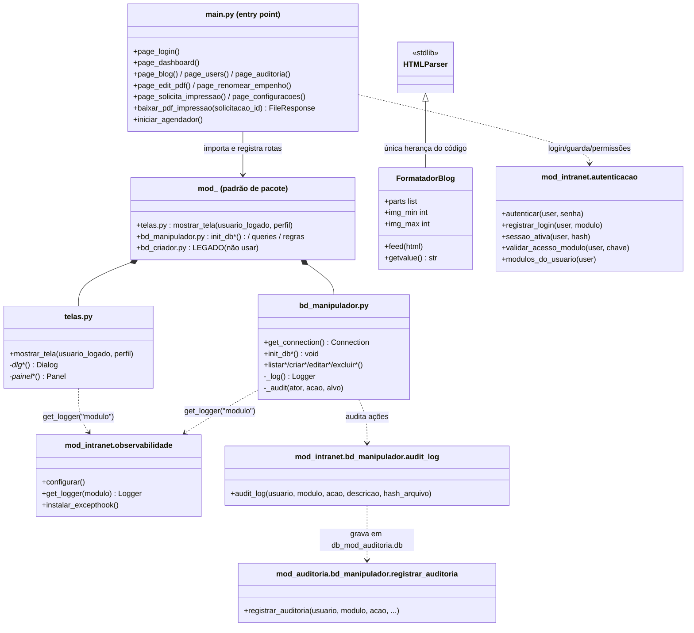

# Intranet Modular — System Requirements

> Requirements audit of the Intranet Modular: technical requirements to run the system (Linux/Windows host, Python 3.12, NiceGUI 3.15 with local Tailwind, SQLite WAL, APScheduler, nh3, PDF libraries, bcrypt, loguru, MkDocs `readthedocs`) PLUS the functional requirements per module and the non-functional requirements (security, persistence, local CSS frameworks, loguru, try/except, configurability without restart, responsiveness) — each one with its REAL status verified against the executable code (implemented / partial / not implemented). Nothing aspirational.

---

# Intranet Modular — Requisitos do Sistema

> Auditoria de requisitos da Intranet Modular: requisitos técnicos para rodar o sistema (hospedeiro Linux/Windows, Python 3.12, NiceGUI 3.15 com Tailwind local, SQLite WAL, APScheduler, nh3, bibliotecas de PDF, bcrypt, loguru, MkDocs `readthedocs`) MAIS os requisitos funcionais por módulo e os não funcionais (segurança, persistência, frameworks CSS locais, loguru, try/except, configurabilidade sem restart, responsividade) — cada um com o status REAL verificado no código executável (implementado/parcial/não implementado). Nada aspiracional.

## Sumário

1. [Requisitos técnicos (ambiente)](#requisitos-tecnicos-ambiente)
2. [Requisitos funcionais por módulo (status real)](#requisitos-funcionais-por-modulo-status-real)
3. [Requisitos não funcionais (status real)](#requisitos-nao-funcionais-status-real)
4. [Diagramas](#diagramas)
   - [Fluxo de uso (login → navegação → ações)](#fluxo-de-uso)
   - [Modelo de dados (erDiagram)](#modelo-de-dados)
   - [Estrutura de classes dos módulos (classDiagram)](#estrutura-de-classes)

> Em conflito entre documentação e código, prevalece o **código executável** (`requirements.txt`, `mkdocs.yml`, `main.py`, `mod_*/`). Status verificados por leitura do código em 06/09/2026.

## Requisitos técnicos (ambiente)

| Categoria | Exigência | Status |
|:---|:---|:---:|
| SO | Linux (recomendado) ou Windows | ✅ Implementado |
| Python | **3.12** | ✅ Implementado |
| Framework | **NiceGUI 3.15** (`ui.run` com `reload=False`, `show=False`, porta `8080` — `main.py:471-478`) | ✅ Implementado |
| Banco | SQLite (stdlib) em **modo WAL** (`PRAGMA journal_mode=WAL` em toda conexão) | ✅ Implementado |
| UI | Tailwind CSS servido localmente pelo NiceGUI (**sem CDN**) | ✅ Implementado |
| Internet | necessária apenas na instalação das dependências; em operação, o sistema roda **sem internet** (rede interna) | ✅ Implementado |
| OCR (opcional) | binário **Tesseract** no SO (`apt install tesseract-ocr`, `por+eng`) — usado no fallback de extração de empenhos escaneados | ⚠️ Opcional (degrada para quarentena sem ele) |

### Dependências Python

Fonte: `requirements.txt` (raiz).

| Dependência | Versão mínima | Uso |
|:---|:---|:---|
| `nicegui` | `3.15.0` | framework web (páginas, componentes, Tailwind local) |
| `apscheduler` | `>=3.10,<4` | agendadores (backups, cleanups, monitor de pasta, poda) |
| `nh3` | `>=0.2` | sanitização HTML do Blog (gravação e renderização) |
| `pdfplumber` | `>=0.11` | extração de texto de PDF (fallback) |
| `pikepdf` | `>=9.0` | manipulação PDF (metadados, redução leve) |
| `pymupdf` | `>=1.24` | extração de texto, contagem de páginas, rasterização |
| `pytesseract` | `>=0.3` | OCR de PDFs escaneados (requer binário `tesseract` no SO) |
| `pypdf` | `>=5.0` | manipulação PDF (redução leve/fallback) |
| `bcrypt` | `>=5.0.0` | hash de senhas |
| `loguru` | `>=0.7.3` | observabilidade/logs por módulo |
| `mkdocs` | `>=1.6.1` | build da documentação embutida |
| `mkdocs-material` | `>=9.7.7` | presente no requirements; **o tema ativo é `readthedocs`** (ver `mkdocs.yml`) |

### Dependências de desenvolvimento (dev-only, equipe com internet)

> Não vão para produção. O runtime intranet opera sem internet; estas
> ferramentas rodam só nas máquinas dev. Fonte: `requirements-dev.txt`.
> Detalhe em `ferramentas/graphify.md`.

| Ferramenta | Uso | Status |
|:---|:---|:---:|
| `graphifyy[sql,postgres,pdf]` (`>=0.9.0`) | grafo de conhecimento (`query/path/explain`), skill `/graphify` + plugin OpenCode | ✅ Instalado (dev) |
| `GEMINI_API_KEY` (opcional) | passada semântica de `docs/`; sem ela, o agente host assume | ⚠️ Opcional |

### Armazenamento

- **SQLite (padrão) ou PostgreSQL opcional** — backend duplo controlado por `banco_tipo` em `tb_config` central (`sqlite` padrão | `postgres`, `postgres_url` DSN) via `mod_intranet/banco_conexao.conexao(chave)`; no Postgres **um DATABASE `db_mod_<chave>` por módulo** (espelha `db_mod_<chave>.db`), preservando isolamento "um banco por módulo" (ver [Configurações](configuracoes.md#card-banco-de-dados-sqlite-ou-postgresql-0809) e [Arquitetura](arquitetura.md#arquitetura-de-acesso-a-dados-do-nucleo-backend-duplo-0809)).
- **Modo WAL obrigatório** (SQLite): cada conexão executa `PRAGMA journal_mode=WAL` (+ `synchronous=NORMAL` no central/auditoria); no Postgres o proxy traduz DDL (`AUTOINCREMENT`→`SERIAL`, `?`→`%s`, `INSERT OR IGNORE`→`ON CONFLICT DO NOTHING`, `GROUP_CONCAT`→`STRING_AGG`, datas normalizadas).
- **Um banco por módulo** na raiz (SQLite): `db_mod_intranet.db`, `db_mod_gest_cad_usuario.db`, `db_mod_blog.db`, `db_mod_edit_pdf.db`, `db_mod_renomear_empenho.db`, `db_mod_auditoria.db`, `db_mod_solicita_impressao.db`, `db_mod_tecnico.db`, `db_mod_filas.db`, `db_mod_lista_telefonica.db` — 10 bancos (`MODULOS_BD` em `repositorio.py:57-68`; cada módulo com `CrudBase`/`banco_conexao.conexao(chave)`, nunca `sqlite3` cru cross-banco).
- Pastas de arquivos: na raiz — `assets/` (+ `assets/css/frameworks/` 18 frameworks), `backup/` (retenção 10 por módulo), `logs/` (loguru), `site/` (docs compiladas); **dentro dos módulos** — `mod_edit_pdf/editorPDF/`, `mod_renomear_empenho/doc/` (empenhos), `mod_renomear_empenho/quarentena/`, `mod_renomear_empenho/organizadorPasta/`, `mod_tecnico/software/` + `mod_tecnico/backup/YYYYMMDD_HHMM_nomePc_ip/` (owner-isolated), `mod_solicita_impressao/solicitacaoImpressao/`, `mod_blog/img_postagens/`.

### Rede e interface

- **Tailwind CSS local**: o NiceGUI embute/serve o `tailwindcss.min.js` localmente — exigência para rede interna.
- **Frameworks CSS embarcados**: 18 frameworks em `assets/css/frameworks/` (Bootstrap, Bulma, DaisyUI, Pico, Picnic, Water etc.), servidos localmente em `/css/frameworks/*` (sem CDN) via `tema_css.montar_rotas_static()` (`main.py:81-85`); injeção **por página** via `tema_css.injetar_framework()` — nunca global; drawer 19/09 validado com Tailwind+Quasar.
- **Portas**: **site/aplicação `8080`** (`porta_site`, `main.py:476`) e **documentação `8000`** (`porta_documentacao`, separada — `documentacao.iniciar_servidor` `ThreadingHTTPServer` em thread daemon servindo `site/`; `ativacao.config_persistida()` persiste ambas; CLI `--portasite`/`--portadocumentacao`).
- **Documentação**: MkDocs `readthedocs` (`mkdocs.yml`) build `docs/` → `site/` no boot (`documentacao.construir_e_montar_documentacao`), servida em `/documentacao` via mount FastAPI na `:8080` e também no servidor dedicado `:8000` (`mod_intranet/documentacao.py`).

## Requisitos funcionais por módulo (status real)

> Numeração herdada do roadmap (`analise.md`/`PLANO.md`); o código executável prevalece. Status verificados no código em 06/09/2026.

### Núcleo (`mod_intranet`) — resumo (detalhe em `analise_mod_intranet.md`)

| Requisito | Situação |
|:---|:---:|
| Login bcrypt + sessão revogável amarrada a cookie (`tb_sessoes` com IP/UA/dispositivo/MAC) | ✅ Implementado |
| Guarda de página `pagina_restrita` (revalida usuário, sessão e permissão a cada request) | ✅ Implementado |
| Troca obrigatória de senha no 1º acesso (diálogo persistente) + "Meu Perfil" (dados + senha) | ✅ Implementado |
| Cadastro de módulos em `tb_modulos` (nome/ícone/rota/ordem/ativo; indispensáveis não desativáveis) | ✅ Implementado |
| URL (slug) de página editável com re-registro ao vivo (`rotas_modulos`) — sem restart | ✅ Implementado |
| Painel central `/configuracoes` (aparência, textos, e-mail/SMTP, módulos, observabilidade, documentação) | ✅ Implementado |
| Backups por módulo (APScheduler, intervalo individual, retenção 10 cópias) | ✅ Implementado |
| Observabilidade loguru (arquivo por módulo, rotação/retenção, console `auto/sempre/nunca`, bridge OTel→Loki) | ✅ Implementado |
| Telemetria OTel (stack local via Docker ou remota; Grafana com sync de credenciais) | ✅ Implementado |
| Documentação embutida `/documentacao` (build MkDocs no boot; falha nunca derruba o servidor) | ✅ Implementado |
| Favicon customizável por upload (arquivo vivo, cache-busting, sem restart) | ✅ Implementado |
| CSS frameworks embarcados locais (`/css/frameworks/*`, injeção por página) | ✅ Implementado |

### Gestão de Usuários (`mod_gest_cad_usuario`)

| Requisito | Situação |
|:---|:---:|
| Soft CRUD completo (criar, editar, renomear, bloquear/restaurar, excluir lógico com motivo, excluir definitivo LGPD) | ✅ Implementado |
| Perfis globais (`comum`, `administrador_modulo`, `administrador_geral`) + papéis por módulo (`tb_acesso_usuario`) | ✅ Implementado |
| Senha provisória com troca obrigatória; política de tamanho mínimo configurável (`usuarios_senha_min`) | ✅ Implementado |
| Nome de exibição/social (Decreto 8.727/2016) usado como tratamento | ✅ Implementado |
| Busca instantânea em todos os campos + palavras-chave de estado (provisório/bloqueado/sessão/excluído) | ✅ Implementado |
| Lista paginada (10/20/50/100), filtros situação/perfil, ordenação A→Z/numérica, exibição compacta com tooltip | ✅ Implementado |
| Duplicar usuário (herda perfil global + acessos por módulo) | ✅ Implementado |
| Sessões ativas: visualização (IP/dispositivo/MAC), encerramento individual/em massa, histórico por usuário | ✅ Implementado |
| Limpeza cruzada LGPD na exclusão definitiva (Blog, editorPDF, empenhos anonimizados; auditoria preservada) | ✅ Implementado |
| Proteções: vedado agir sobre a própria conta; `master` não renomeável/excluível; último admin geral protegido (RF-26) | ✅ Implementado |
| Aba Administração: aparência (`usuarios_*` com padrão próprio do módulo) + `usuarios_senha_min` | ✅ Implementado |
| Geração ALEATÓRIA de senha provisória pelo sistema | ❌ Não implementado (admin digita a senha) |

### Blog (`mod_blog`)

| Requisito | Situação |
|:---|:---:|
| CRUD de postagens com soft delete + publicar/despublicar/republicar | ✅ Implementado |
| Sanitização nh3 na gravação E na renderização, com whitelist configurável (`blog_tags_permitidas`) | ✅ Implementado |
| Aceita `http`/`https`, URLs relativas e `data:` para imagens (`url_schemes`/`url_relative`) | ✅ Implementado |
| Formatação rica: títulos centralizados/negrito, imagens à esquerda com largura configurável, texto justificado | ✅ Implementado |
| Markdown leve (`#`, `**negrito**`, `- item`) convertido para HTML | ✅ Implementado |
| Editor com pré-visualização (criar e editar) | ✅ Implementado |
| Modo de exibição histórico OU publicação única (config local `blog_modo_exibicao`) | ✅ Implementado |
| Gestão de postagens despublicadas com republicar (aba Administração) | ✅ Implementado |
| Somente-leitura para `comum` (UI esconde + backend valida em toda escrita) | ✅ Implementado |
| Censura de conteúdo — palavras bloqueadas (`mod_intranet/censura.py` `conteudo_palavras_bloqueadas`, `titulo_bloqueado` `lower+NFD` sem acentos, `criar/atualizar` bloqueia `None/False` antes de `nh3`, card `blog-palavras-bloqueadas` + `Salvar censura` + `limpar_censuradas` no agregador) | ✅ Implementado |
| Comentários (só admins escrevem; leitura para todos) | ✅ Implementado |
| Feed do Blog no dashboard `/` (RF-09) | ✅ Implementado |

### Editor de PDF (`mod_edit_pdf`)

| Requisito | Situação |
|:---|:---:|
| Upload múltiplo com pré-checagem do lote e recusas nominais com motivo | ✅ Implementado |
| Operações: reduzir (leve/agressivo), juntar, cortar, dividir (4 modos), verificar, ZIP, excluir | ✅ Implementado |
| Seleção ordenada (badges "#") respeitada pelo Juntar/Reduzir/Cortar | ✅ Implementado |
| Cotas em 4 níveis (global, por usuário, por lote, estoque de uploads) — todas configuráveis sem restart | ✅ Implementado |
| Expiração automática (job 1 min, critério mtime; devolve cota e audita) + "Expirar agora" | ✅ Implementado |
| Auditoria com SHA-256 (upload e operações; hashes de origem/destino) | ✅ Implementado |
| Menu de contexto por linha (Baixar/Excluir) + downloads individuais | ✅ Implementado |
| Aba Administração (cotas, limites, textos da tela, aparência, manutenção) — só admin geral | ✅ Implementado |

### Renomear Empenhos (`mod_renomear_empenho`)

| Requisito | Situação |
|:---|:---:|
| Extração de texto tolerante a escaneados (`pymupdf → pdfplumber → OCR → pikepdf`) | ✅ Implementado |
| Regex dinâmicas persistidas (`tb_regex_regras`, com `campo_destino` para FTS) — sem restart | ✅ Implementado |
| Campos de busca configuráveis por regex (`tb_campos_busca`: ficha/empenho/parcela/ano…) | ✅ Implementado |
| Tipos especiais EC/EE/EG/AE detectados pelo conteúdo e nomeados (`EC_0024.pdf`…) | ✅ Implementado |
| Renomeação sequencial com template configurável (`{contador}`, `{empenho}`, `{parcela}`…) | ✅ Implementado |
| Monitor multi-pasta (local + rede/UNC), automático (RF-40, intervalo configurável) + manual | ✅ Implementado |
| Quarentena com motivo e reprocessamento (regex aplicada na hora) | ✅ Implementado |
| Pesquisa FTS5 (32 colunas, RF-41) com fallback LIKE | ✅ Implementado |
| Organizador físico (~200 pág/pasta, 4 pastas/caixa configuráveis) + capas/matriz + validação (RF-44) | ✅ Implementado |
| Ferramentas de PDF embutidas: cortar/mesclar/reduzir (RF-45, reusa `mod_edit_pdf`) | ✅ Implementado |
| Solicitações comum→admin (e-mail SMTP central ou ZIP; lotes; recusa com motivo) (RF-39/RF-003) | ✅ Implementado |
| Navegação protegida anti-travessia (só PDFs, raízes monitoradas + organizador) | ✅ Implementado |
| Trilha por arquivo (`tb_arquivos_auditoria` + `tb_eventos_arquivos`) com SHA-256 | ✅ Implementado |
| Tipo especial "EX" (citado na referência standalone) | ❌ Não portado |

### Auditoria (`mod_auditoria`)

| Requisito | Situação |
|:---|:---:|
| Banco exclusivo `db_mod_auditoria.db` com UMA TABELA POR MÓDULO (`tb_auditoria_<modulo>`) | ✅ Implementado |
| Descoberta automática de módulos produtores (navegação dinâmica por tabela) | ✅ Implementado |
| Filtros: usuário (LIKE), módulo/tabela, ação (categorias coloridas + texto livre), hora, intervalo de datas | ✅ Implementado |
| Paginação server-side (`LIMIT ? OFFSET ?`, `auditoria_limite`) | ✅ Implementado |
| Exportação CSV da página corrente (respeita campos/ordem do auditor) | ✅ Implementado |
| Campos/ordem de exibição por auditor (persistido em `auditoria_campos:<usuario>`) | ✅ Implementado |
| Cores por categoria de ação (`CORES_ACAO`) | ✅ Implementado |
| Poda automática diária (`auditoria_retencao_dias`, default 90 — LGPD) | ✅ Implementado |
| Migração idempotente do legado central (`migrar_dados_existentes`) | ✅ Implementado |
| Aba Observabilidade (dashboards Grafana) quando a stack OTel está no ar | ✅ Implementado |
| Acesso exclusivo do `administrador_geral` (RF-35) com `acesso_negado` | ✅ Implementado |

### Solicitação de Impressão (`mod_solicita_impressao`)

| Requisito | Situação |
|:---|:---:|
| Upload múltiplo (até 10 PDFs) com rascunhos expiráveis e contagem regressiva | ✅ Implementado |
| Contagem de páginas (PyMuPDF, fallback pdfplumber) + fórmula de contabilização exata | ✅ Implementado |
| Cotas mensais hierárquicas (secretaria → setor; excedente permitido e marcado) | ✅ Implementado |
| Consumo descontado somente na impressão confirmada; reset manual (e virada de mês por `mes_referencia`) | ✅ Implementado |
| Autorização por responsável vinculado (pode ser usuário `comum`) ou admin do módulo | ✅ Implementado |
| Fluxo de status completo (pendente → aguardando → autorizado → impresso; recusado/cancelado) | ✅ Implementado |
| Impressão dual: JS `printSolicitacao` (impressora padrão A4/A3) ou download com marca d'água | ✅ Implementado |
| Marca d'água configurável (texto com placeholders, posição, opacidade, fonte, cor, rotação) | ✅ Implementado |
| Cadastros: secretarias, setores, responsáveis, cotas (relatório mensal com barras) | ✅ Implementado |
| Configurações: impressoras padrão, aviso de presença, prazos de rascunho/exclusão, padrões do formulário | ✅ Implementado |
| Limpeza automática (job 1 min): rascunhos vencidos + arquivos de impressos vencidos | ✅ Implementado |
| Notificação por e-mail de eventos de cota | ❌ Não implementado (por design — sem SMTP neste fluxo) |
| Cotas padrão do organograma 1000/200 (12 secretarias genéricas `ORGANOGRAMA_BASE` do `mod_lista_telefonica`) + migração `UPDATE` idempotente | ✅ Implementado (19/09/2026) |

### Técnico (`mod_tecnico`) — novo 18/09/2026

| Requisito | Situação |
|:---|:---:|
| Banco `db_mod_tecnico.db` (`tb_backup`/`tb_backup_arquivo`) + pastas `software/` (download) + `backup/YYYYMMDD_HHMM_nomePc_ip` (owner-isolation) | ✅ Implementado |
| Software multi-seleção + zip recursivo (limite `tecnico_max_zip_mb` 1024) com `webkitdirectory` preservado | ✅ Implementado |
| Backup 1-clique `webkitdirectory` (cria `YYYYMMDD_HHMM_nomePc_ip`, sanitiza `[^a-zA-Z0-9_-]` → `_`, owner-isolation, admin geral vê todos) | ✅ Implementado |
| LGPD `remover_vinculos_usuario`/`renomear_usuario` + auditoria `tb_auditoria_tecnico` | ✅ Implementado |
| Administração `/admin/tecnico` (aparência + `tecnico_max_zip_mb` + painel backup) | ✅ Implementado |

### Filas — TV (`mod_filas`) — multi-filas 09/2026

| Requisito | Situação |
|:---|:---:|
| Banco `db_mod_filas.db` (`tb_fila` + `tb_fila_etapa` + `tb_chamada` + `tb_midia` + `tb_config_filas`) + seed `Geral A000` + 3 etapas padrão + `PASTA_MIDIA` `mod_filas/midia` | ✅ Implementado |
| `criar_fila` por local (`endereco/prefixo/senha_inicio/fim` `fim=0` infinito, `criado_por`, `tv_grupo`) + `listar_filas_visiveis` isolamento por criador vs `administrador_geral` + `atualizar/excluir` + `excluir_todas_filas` (exceto Geral) | ✅ Implementado |
| `gerar_senha(fila_id, ator, paciente_nome, etapa_nome)` + `_proxima_senha` infinito (`fim=0`) + `avancar_chamada` sequencial + `ultima_chamada_tv` (`fila_id`/`tv_grupo` `IN`) | ✅ Implementado |
| Painel `/filas` multi-filas isolado (criar + card por fila + etapas + `Chamar próximo` + histórico isolado + `Avançar`) + `Excluir todas` | ✅ Implementado |
| TV `/tv` (`?grupo=` compartilhada) + `/tv/{fila_id}` (isolada) full-screen `h-screen bg-black`, ícone padrão intranet, auto-refresh 3s `AudioContext` bip + `speechSynthesis pt-BR` só novo `id`, playlist `/midia_filas` (áudio elevador/vídeo propaganda, 40s rotação quando ociosa, pausada ao chamar) + carrossel notícias censura-filtrado | ✅ Implementado |
| LGPD `remover`/`renomear` (`criado_por` + `chamado_por`) + auditoria `tb_auditoria_filas` | ✅ Implementado |
| Administração `/admin/filas` 2 cards (Filas por local + Mídia TV global `/midia_filas`, upload sanitizado + `uuid6`, `Ativar/Desativar`, `↑/↓`) | ✅ Implementado |
| Censura filtrada na TV (`listar_para_tv` `conteudo_palavras_bloqueadas`) | ✅ Implementado |

### Lista Telefônica (`mod_lista_telefonica`) — novo 19/09/2026

| Requisito | Situação |
|:---|:---:|
| Banco `db_mod_lista_telefonica.db` (`tb_unidade` `secretaria\|setor\|subsetor` + `tb_contato` alfabético `COLLATE NOCASE`) + `ORGANOGRAMA_BASE` 12 secretarias genéricas | ✅ Implementado |
| Organograma expansível `Secretaria→Setor→Subsetor` (selects cascata `clearable`, `disabled` até pai) + contatos alfabéticos | ✅ Implementado |
| Busca global normalizada sem acentos (`_norm` NFKD + `re.findall`) sobre unidades e contatos | ✅ Implementado |
| Telefone clicável `tel:` (`re.sub(r"[^0-9+]", "")`) + `ui.link(target="tel:...")` + diálogo "Ligar agora" (`window.location.href`) no celular | ✅ Implementado |
| Admin: criar/mover/elevar/rebaixar/reordenar/comutar/excluir ramo (cascata `_coletar_ramo_ids` + FK CASCADE) + incluir via usuários (busca `on_value_change` por login/nome/e-mail) | ✅ Implementado |
| LGPD `remover_vinculos_usuario`/`renomear_usuario` + auditoria `tb_auditoria_lista_telefonica` | ✅ Implementado |
| Administração `/admin/lista_telefonica` (aparência + 2 cards + painel backup) + export `ORGANOGRAMA_BASE` para `solicita_impressao` 1000/200 | ✅ Implementado |

### Agregador de Notícias (`mod_agregador_noticias`) — 19/09/2026 + censura 09/2026

| Requisito | Situação |
|:---|:---:|
| Banco `db_mod_agregador_noticias.db` (`tb_noticia` 11 colunas, `data_publicacao` real via `_parse_data_pub`, `data_coleta`, índices `tema/fonte/data`) + seeds `tb_config` (`habilitado 0`, `intervalo 60`, `temas_json`, `fontes_json`, `hora_reinicio 06:00`) | ✅ Implementado |
| Coleta scrapy-like `httpx+parsel` Google/BBC/JFP/RSS + pesquisa termo livre + `UA Mozilla` + `timeout 12s` + deduplicação `_norm_tit` NFKD + `SELECT url` antes de `INSERT OR IGNORE` | ✅ Implementado |
| Habilitado flag + intervalo 10–360 clamp + termo livre + fontes/temas `json` configuráveis sem restart | ✅ Implementado |
| Hora reinício `06:00` configurável + reinício diário `CronTrigger` `reiniciar_banco` `DELETE` + `Zerar agora` (`agregador-reiniciar-agora`) — sem backup | ✅ Implementado |
| Paginação 12 + **busca lado a lado filtro tema** (`pagina` `por_pagina=12` `total_pag` `offset`, `ORDER BY COALESCE(data_publicacao, data_coleta) DESC`, botões `agregador-primeira/anterior/proxima/ultima`, **busca `agregador-busca` `debounce 300` `placeholder "Buscar palavra…"` NFKD 500 `titulo/descricao/fonte/tema` lado a lado filtro tema, sem badge `Coleta:` + botão `Ver puro Noticia` `agregador-ver-puro` → `/agregador-noticias-puro`**) + grid responsivo **3 colunas desktop → 2 tablet (max-width 1024px) → 1 celular (max-width 640px) via `.grid-noticias {display:grid; grid-template-columns: repeat(3,1fr)}` + media queries, cards `min-height 160px max-height 220px` (`.card-noticia`) baseado na média de 91 notícias (título média 79 mediana 75, descrição 34, 87.9% imagem, 24% fonte_icon)** + cards (**ícone fonte `16×16` `contain` + `30x30` `cover` lado a lado antes do título**, `badge tema`, `ui.link new_tab`, `descricao`, `_tempo_relativo` real) + **tela pura** `telas_puro.py` (`/agregador-noticias-puro` `intro-overlay` + `about` `info-list` 12 notícias `COALESCE DESC`, `assets/noticia/` `base.css`/`vendor.css`/`main.css`/`font-awesome`/`micons`/`js`/`images` via `main.py:818` `@app.get("/assets/noticia/{caminho:path}")`) | ✅ Implementado |
| `listar_para_tv(limite=10)` `LIMIT*3` filtrado por censura + carrossel TV 7s/120s + `habilitado` placeholder | ✅ Implementado |
| Censura: `inserir_noticia` descarta se `titulo_bloqueado` + `listar_para_tv` filtra `LIMIT*3` → `titulo_bloqueado` + `limpar_censuradas()` remove já coletadas (`titulo_bloqueado` `lower+NFD` substring, `conteudo_palavras_bloqueadas`) — card `agregador-palavras-bloqueadas` + `agregador-limpar-censuradas` + `agregador-salvar-censura` | ✅ Implementado |
| Admin 5 cards (Coleta + Fontes + Temas + Censura + Reinício diário) — `agregador-habilitado`/`agregador-intervalo`/`agregador-termo`/`agregador-hora-reinicio` + `agregador-add-fonte` + `agregador-palavras-bloqueadas` | ✅ Implementado |
| `coletar_todas(ator, forcar)` + `limpar_antigas(24)` + `reiniciar_banco` + `reconfigurar_agregador_noticias()` (`CronTrigger hora`) + auditoria só `definir_*`/`reiniciar_banco` | ✅ Implementado |

## Requisitos não funcionais (status real)

| Requisito | Evidência no código | Status |
|:---|:---|:---:|
| **Segurança — autenticação** | bcrypt (`autenticacao.py:294-299`); falha de login audita `login_falha`; usuário bloqueado não entra | ✅ |
| **Segurança — sessões revogáveis** | `cookie_hash` sha256+secrets por sessão (`registrar_login`); guarda revalida `sessao_ativa` a cada request; bloqueio/exclusão/redefinição derrubam sessões vivas | ✅ |
| **Segurança — permissões** | `validar_acesso_modulo` no choke point `pagina_restrita` + revalidação do papel dentro de cada tela (dupla camada); `acesso_negado` auditado | ✅ |
| **Segurança — XSS** | nh3 na gravação e renderização do Blog (whitelist configurável); escape em comentários | ✅ |
| **Segurança — anti-travessia** | `pasta_navegavel`/`raizes_navegacao` no renomeador; `_path_real` resolve `..`/`~` | ✅ |
| **Segurança — storage_secret** | placeholder `intranet-secret-2026-mude-isto` em `main.py:474` — **precisa ser trocado em produção** | ⚠️ Parcial (placeholder) |
| **Persistência SQLite/WAL** | `PRAGMA journal_mode=WAL` em todos os bancos; `synchronous=NORMAL` no central/auditoria; um banco por módulo | ✅ |
| **Postgres (backend duplo opcional, 08/09)** | `mod_intranet/banco_conexao.conexao(chave)` roteia por `banco_tipo` (`sqlite` padrão \| `postgres`, `postgres_url` em `tb_config`; `_ler_config_sqlite`/`salvar_backend`); no Postgres um `DATABASE db_mod_<chave>` por módulo (espelha `.db`), proxy traduz `?`→`%s`, DDL SQLite→Postgres, `INSERT OR IGNORE`→`ON CONFLICT`, `GROUP_CONCAT`→`STRING_AGG`, `PRAGMA`/FTS5 ignorados, `lastrowid` via `RETURNING id` + SAVEPOINT; `repositorio.engine/sessaodb` roteiam; card admin "Banco de dados — SQLite ou PostgreSQL" (`config-aplicar-banco`, sem reload, exige restart); container `assets/docker/postgres/docker-compose.yml` (`postgres:16-alpine`, `intranet/intranet`, `:5432`, healthcheck) | ✅ Opcional (SQLite padrão) |
| **Frameworks CSS locais** | `assets/css/frameworks/` servido em `/css/frameworks/*` (Bulma, DaisyUI, Pico, Picnic — sem CDN); injeção por página via `tema_css.injetar_framework()` | ✅ |
| **Loguru padronizado** | `_FMT` com `{module}:{function}:{line}`; arquivo por módulo (`logs/<modulo>_<data>.log`); rotação/retenção/compressão; excepthook global | ✅ |
| **try/except (fail-soft)** | Handlers de UI e acessos a BD protegidos nos módulos; falhas registradas com loguru; renderização nunca derruba a tela | ⚠️ Parcial (pontos legados restantes, ex.: `print` em fallbacks) |
| **Configurabilidade sem restart** | Chaves em `tb_config` (central) e `tb_configuracoes_modulo`/`tb_config` locais; temas, cotas, prazos, pastas, textos e intervalos aplicados a cada leitura; jobs reagendáveis ao vivo | ✅ |
| **Responsividade** | Grids Tailwind fluidos (`grid-cols-1 sm:grid-cols-2 …`), telas em área cheia (`w-full`), cards com `flex-wrap`/`min-w` — 360–1440 px | ✅ |
| **Desempenho — paginação** | Lista de usuários paginada client-side; auditoria com paginação server-side (`LIMIT/OFFSET` + índices); FTS5 para busca textual | ✅ |
| **Desempenho — timers** | Editor PDF atualiza a cada 5 s; auditoria a cada 30 s; limpezas a cada 1 min; monitor de empenhos configurável (padrão 60 s) | ✅ |
| **Retenção LGPD** | Poda diária da auditoria (`auditoria_retencao_dias`); poda de sessões (`sessao_retencao`, padrão 50); exclusão definitiva com limpeza cruzada | ✅ |
| **Backups** | 1 job por módulo (intervalo individual `backup_horas:<chave>`, padrão 12 h), retenção das 10 cópias mais recentes | ✅ |
| **Operação sem internet** | Tailwind/frameworks locais; sem CDN; documentação embutida | ✅ |
| **Auditoria com hash** | SHA-256 em operações com arquivos (editor PDF, empenhos, impressão) | ✅ |

## Diagramas

### Fluxo de uso

```mermaid
flowchart TD
    A[Navegador] -->|GET /login| B[Página de Login]
    B -->|usuário + senha| C[autenticar<br/>bcrypt + usuário ativo?]
    C -->|falha| B
    C -->|ok| D[registrar_login<br/>tb_sessoes + cookie_hash]
    D --> E[Dashboard /<br/>boas-vindas + resumo admin + feed do Blog]
    E --> F{Menu lateral<br/>Home isolado + alfabética<br/>+ Administração + trio Blog→Usuários→Auditoria → Docs/Sair<br/>19/09/2026}
    F --> G[/blog]
    F --> H[/users]
    F --> I[/edit-pdf]
    F --> J[/renomear-empenho]
    F --> K[/solicita-impressao<br/>cotas 1000/200]
    F --> L[/tecnico]
    F --> M[/filas]
    F --> N[/lista-telefonica<br/>organograma + tel:]
    F --> O[/auditoria<br/>só admin geral]
    F --> P[/tv pública<br/>sem guarda]
    G & H & I & J & K & L & M & N & O & P --> Q[pagina_restrita<br/>revalida usuário + sessão + permissão<br/>/tv sem guarda]
    Q -->|sem permissão| R[acesso_negado + volta ao /]
    Q -->|ok| S[Ações do módulo<br/>CRUD · operações · configurações]
    S --> T[audit_log<br/>db_mod_auditoria.db<br/>tb_auditoria_&lt;modulo&gt;]
    S --> U[notificar<br/>toast com notificacao_timeout]
    E -->|logout| V[registrar_logout + /login]
```

### Modelo de dados

```mermaid
erDiagram
    tb_config {
        TEXT chave PK
        TEXT valor
    }
    tb_sessoes {
        INTEGER id PK
        TEXT usuario
        TEXT modulo
        DATETIME login_timestamp
        DATETIME logout_timestamp
        TEXT cookie_hash
        TEXT ip
        TEXT user_agent
        TEXT dispositivo
        TEXT mac
    }
    tb_modulos {
        INTEGER id PK
        TEXT chave UK
        TEXT nome
        TEXT icone
        TEXT rota
        INTEGER ativo
        INTEGER nativo
        INTEGER ordem
    }
    tb_usuarios {
        INTEGER id PK
        TEXT user_nome UK
        TEXT user_senha
        TEXT user_email
        TEXT user_fone
        TEXT user_perfil
        INTEGER user_ativo
        DATETIME data_cadastro
        INTEGER user_deletado
        TEXT user_nome_completo
        TEXT user_motivo_exclusao
    }
    tb_acesso_usuario {
        INTEGER id PK
        TEXT user_nome FK
        TEXT modulo_chave
        TEXT papel
        TEXT liberado_por
        DATETIME data_liberacao
    }
    tb_postagens {
        INTEGER id PK
        TEXT titulo
        TEXT conteudo
        TEXT autor
        DATETIME data_criacao
        DATETIME data_atualizacao
        INTEGER ativo
    }
    tb_comentarios {
        INTEGER id PK
        INTEGER postagem_id FK
        TEXT autor
        TEXT conteudo
        DATETIME data_criacao
    }
    tb_arquivos {
        INTEGER id PK
        TEXT nome_arquivo
        TEXT usuario
        INTEGER tamanho_bytes
        TEXT operacao
        DATETIME data_operacao
        INTEGER ativo
    }
    tb_cota_disco {
        TEXT usuario PK
        INTEGER total_usado_bytes
        DATETIME atualizado_em
    }
    tb_empenhos {
        INTEGER id PK
        TEXT nome_arquivo_original
        TEXT nome_arquivo_final
        INTEGER numero_empenho
        INTEGER parcela
        TEXT tipo_especial
        TEXT ficha
        TEXT ano
        TEXT usuario
        TEXT status
        TEXT caminho_arquivo
    }
    tb_quarentena {
        INTEGER id PK
        TEXT nome_arquivo
        TEXT motivo
        TEXT caminho_atual
        INTEGER processado
    }
    tb_regex_regras {
        INTEGER id PK
        TEXT nome_regra UK
        TEXT padrao_regra
        TEXT campo_destino
        INTEGER ativo
    }
    tb_campos_busca {
        INTEGER id PK
        TEXT campo UK
        TEXT rotulo
        TEXT padrao_regra
        INTEGER ativo
    }
    tb_arquivos_auditoria {
        INTEGER id PK
        TEXT nome_original
        TEXT nome_renomeado
        TEXT numero_empenho
        TEXT status
        TEXT hash_sha256_origem
        TEXT hash_sha256_destino
        TEXT usuario
    }
    tb_eventos_arquivos {
        INTEGER id PK
        INTEGER arquivo_id FK
        TEXT tipo
        TEXT detalhe
        TEXT usuario
        DATETIME timestamp
    }
    tb_solicitacoes_emp {
        INTEGER id PK
        INTEGER empenho_id FK
        TEXT arquivo_caminho
        TEXT solicitante_email
        TEXT status
        TEXT lote_id
        TEXT metodo_envio
        TEXT caminho_zip
        TEXT motivo_recusa
    }
    tb_solicitacoes_imp {
        INTEGER id PK
        TEXT usuario_solicitante
        TEXT arquivo_servidor
        TEXT hash_arquivo
        INTEGER qtd_copias
        TEXT tamanho_papel
        TEXT cor
        INTEGER frente_verso
        INTEGER secretaria_id FK
        INTEGER setor_id FK
        INTEGER paginas_contabilizadas
        TEXT status
        INTEGER cota_excedida
        TEXT autorizado_por
        TEXT impresso_por
        DATETIME excluir_arquivo_em
    }
    tb_secretarias {
        INTEGER id PK
        TEXT nome
        TEXT sigla
        INTEGER cota_paginas_mensal
        INTEGER ativo
    }
    tb_setores {
        INTEGER id PK
        TEXT nome
        INTEGER secretaria_id FK
        INTEGER cota_paginas_mensal
        INTEGER ativo
    }
    tb_responsaveis_autorizacao {
        INTEGER id PK
        TEXT user_nome
        INTEGER secretaria_id FK
        INTEGER setor_id FK
        INTEGER ativo
    }
    tb_cotas_impressao {
        INTEGER id PK
        INTEGER secretaria_id FK
        INTEGER setor_id
        INTEGER cota_paginas
        TEXT mes_referencia
    }
    tb_consumo_cota {
        INTEGER id PK
        INTEGER secretaria_id FK
        INTEGER setor_id
        TEXT mes_referencia
        INTEGER paginas_usadas
    }
    tb_auditoria_modulo {
        INTEGER id PK
        TEXT usuario
        TEXT modulo
        TEXT acao
        TEXT descricao
        TEXT hash_arquivo
        TEXT ip
        TEXT user_agent
        TEXT client_hostname
        DATETIME timestamp
    }
    tb_auditoria_meta {
        TEXT modulo PK
        TEXT nome
        TEXT criada_em
    }

    tb_usuarios ||--o{ tb_acesso_usuario : "user_nome"
    tb_postagens ||--o{ tb_comentarios : "postagem_id (CASCADE)"
    tb_empenhos ||--o{ tb_eventos_arquivos : "arquivo_id (via auditoria)"
    tb_arquivos_auditoria ||--o{ tb_eventos_arquivos : "arquivo_id (CASCADE)"
    tb_empenhos |o--o| tb_solicitacoes_emp : "empenho_id"
    tb_secretarias ||--o{ tb_setores : "secretaria_id (CASCADE)"
    tb_secretarias ||--o{ tb_responsaveis_autorizacao : "secretaria_id (CASCADE)"
    tb_setores ||--o{ tb_responsaveis_autorizacao : "setor_id (CASCADE)"
    tb_secretarias ||--o{ tb_solicitacoes_imp : "secretaria_id (SET NULL)"
    tb_setores |o--o{ tb_solicitacoes_imp : "setor_id (SET NULL)"
    tb_secretarias ||--o{ tb_cotas_impressao : "secretaria_id (CASCADE)"
    tb_secretarias ||--o{ tb_consumo_cota : "secretaria_id"
    tb_auditoria_meta ||--|| tb_auditoria_modulo : "uma tabela por módulo"
```



> Notas: `tb_config` (central) e as `tb_config` locais (blog) / `tb_configuracoes_modulo` (impressão) são tabelas chave-valor sem FK. `tb_auditoria_modulo` representa o padrão `tb_auditoria_<modulo>` (uma tabela física por módulo produtor, em `db_mod_auditoria.db`). `tb_indexador_pesquisa_fts5` (32 colunas) é uma virtual table FTS5 alimentada por `reindexar_empenho()` — omitida do diagrama por ser derivada de `tb_empenhos` + texto extraído.

### Estrutura de classes

O projeto é **funcional/procedural** — não há classes de domínio. O "modelo de classes" real é o padrão de pacote por módulo, mais as duas únicas classes do código:



> `bd_criador.py` é legado/morto em todos os módulos (aponta para o banco central com esquemas divergentes) — o padrão real é `bd_manipulador.init_db*()`. Detalhes em [Arquitetura](arquitetura.md#padrao-interno-de-um-modulo).
